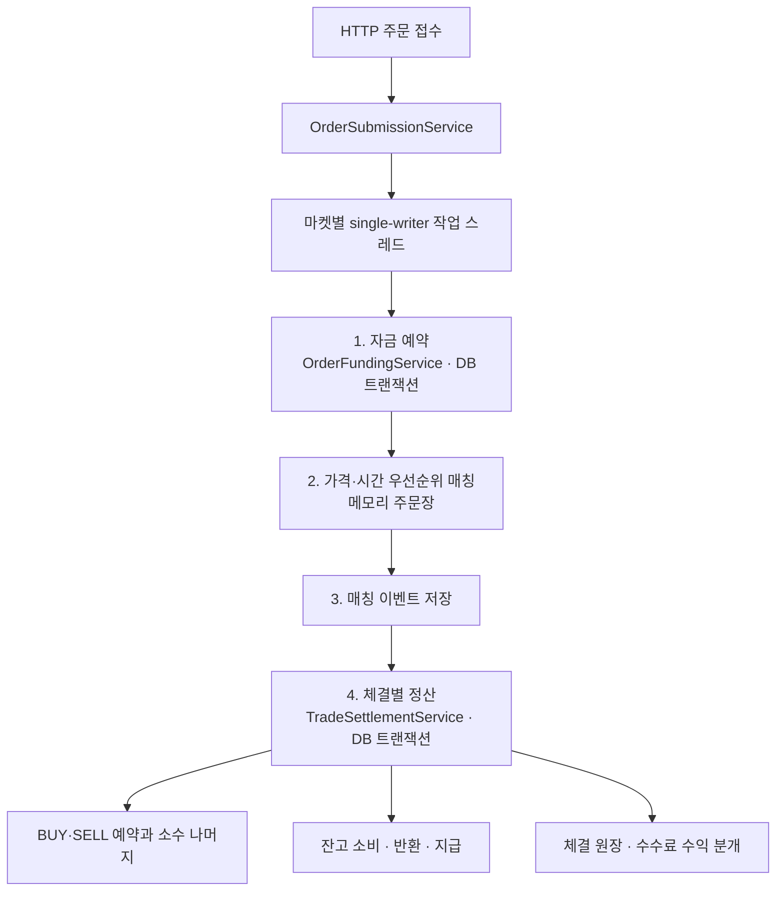

# Exchange Core

**Kotlin으로 구현하는 현물 거래 코어 — 주문 접수부터 자금 예약, 매칭, 수수료 정산, 체결 원장까지.**

[](https://github.com/0Chord/coin-exchange/actions/workflows/build-and-test.yml)


가격·시간 우선순위 매칭과 거래 전후의 자금 정합성을 직접 구현하는 백엔드 프로젝트입니다.
금액 계산은 순수 도메인으로 분리하고, 저장과 트랜잭션은 실제 PostgreSQL을 사용한 테스트로 검증합니다.

> **현재 범위:** LIMIT/GTC 주문의 접수·체결·취소, 주문별 누적 maker/taker 수수료, 체결 단위 복식부기.
> 최신 통합 브랜치는 `feature/phase-2/integration`입니다. 실행 가능한 검증 경로는 아래의 통합 테스트이며, 운영용 거래소 배포는 아직 범위에 포함되지 않습니다.

[빠르게 검증하기](#빠르게-검증하기) · [주문 처리 흐름](#주문-처리-흐름) · [핵심 설계](#핵심-설계) · [코드 읽는 순서](#코드-읽는-순서) · [현재 경계와 다음 작업](#현재-경계와-다음-작업)

## 빠르게 검증하기

**준비:** JDK 25, 실행 중인 Docker. Gradle은 저장소의 Wrapper를 사용합니다.
PostgreSQL은 Testcontainers가 생성·종료하므로 테스트용 DB를 따로 설치하거나 연결 정보를 입력할 필요가 없습니다.

```bash
git clone --branch feature/phase-2/integration https://github.com/0Chord/coin-exchange.git
cd coin-exchange

# 전체 모듈 빌드와 테스트 — GitHub Actions와 동일한 검증 명령
./gradlew build --no-daemon --continue --stacktrace --rerun-tasks
```

처음 실행할 때는 Gradle 의존성과 PostgreSQL 컨테이너 이미지 다운로드가 필요합니다.

### 핵심 시나리오만 실행하기

```bash
# 주문 HTTP 접수 → 예약 → 매칭 → 정산 → 원장, 미체결 BUY/SELL 취소
./gradlew :app-api:test --tests 'com.exchange.core.api.order.OrderLifecycleE2ETest' --no-daemon --rerun-tasks

# 분할 체결, maker/taker 전환, 부분 체결 후 예약 해제, 정산 실패와 롤백
./gradlew :app-api:test --tests 'com.exchange.core.api.order.TradeSettlementServiceTest' --no-daemon --rerun-tasks

# DB 없이 금액·수수료·예약 계산 검증
./gradlew :domain-fee:test :domain-order:test --no-daemon --rerun-tasks
```

검증 기준 시점인 **2026-09-12**에 전체 **243개 테스트**가 통과했습니다. 최신 실행 결과는 상단 CI 배지와 [Actions](https://github.com/0Chord/coin-exchange/actions/workflows/build-and-test.yml)에서 확인할 수 있습니다.
로컬 HTML 결과는 각 모듈의 `build/reports/tests/test/index.html`에 생성됩니다.

| 검증 계층 | 확인하는 내용 | 대표 테스트 |
| --- | --- | --- |
| 순수 도메인 | 가격·시간 우선순위, 금액 경계, 수수료 누적, 예약 유지 | [MatchingEngineTest](domain-matching/src/test/kotlin/com/exchange/core/matching/MatchingEngineTest.kt), [OrderFillSettlementCalculatorTest](domain-order/src/test/kotlin/com/exchange/core/order/OrderFillSettlementCalculatorTest.kt) |
| PostgreSQL 통합 | 동결·정산의 원자성, 소수 나머지 저장, 수수료 원장, 실패 시 롤백 | [TradeSettlementServiceTest](app-api/src/test/kotlin/com/exchange/core/api/order/TradeSettlementServiceTest.kt) |
| HTTP 경계 E2E | 주문 접수부터 예약·매칭·정산, 미체결 주문 취소와 반환 | [OrderLifecycleE2ETest](app-api/src/test/kotlin/com/exchange/core/api/order/OrderLifecycleE2ETest.kt) |

HTTP 경계는 MockMvc로 호출하지만 서비스나 저장소를 mock으로 대체하지 않습니다. 실제 Spring Bean과 PostgreSQL을 사용합니다. 분할 체결·역할 전환·실패 후 재시도는 정산 서비스 통합 테스트의 검증 범위입니다.

## 주문 처리 흐름



**원자성의 경계는 체결 한 건입니다.** 같은 체결의 양쪽 예약·잔고·원장은 함께 커밋하거나 롤백합니다.
자금 예약, 매칭 이벤트 저장, 체결 정산은 각각 별도 단계이므로 주문 접수 전체가 하나의 DB 트랜잭션인 것은 아닙니다.

취소는 매칭 엔진에서 주문 제거에 성공한 뒤 남은 예약을 해제합니다. BUY는 남은 거래대금·수수료 예약액을, SELL은 남은 base 자산을 반환합니다.

## 핵심 설계

### 1. 가격·시간 우선순위와 마켓별 직렬 처리

- 가격 레벨은 `TreeMap`, 같은 가격 안의 주문은 `LinkedHashMap`으로 관리해 가격 우선순위와 FIFO를 표현합니다.
- 마켓별 단일 작업 스레드에서 사전 예약 → 매칭 → 후속 저장·정산을 순서대로 실행합니다.
- 예약 이후 엔진 처리나 후속 저장에 실패하면 해당 마켓의 추가 명령을 차단합니다. 이 차단은 자동 복구를 의미하지 않습니다.

관련 코드: [OrderBook](domain-matching/src/main/kotlin/com/exchange/core/matching/OrderBook.kt), [PriceLevel](domain-matching/src/main/kotlin/com/exchange/core/matching/PriceLevel.kt), [MarketCommandProcessor](domain-matching/src/main/kotlin/com/exchange/core/matching/MarketCommandProcessor.kt)

### 2. 실제 잔고와 주문별 예약의 책임 분리

- `Balance`는 사용자·자산별 `available`과 `hold`를 관리합니다.
- `OrderReservation`은 전체 hold 중 특정 주문에 속한 거래대금·수수료 예약액을 추적합니다.
- BUY는 거래대금과 최대 maker/taker 수수료를 미리 예약하고, SELL은 base 수량을 예약한 뒤 판매대금에서 수수료를 차감합니다.
- 조건부 잔고 UPDATE와 예약 행의 `FOR UPDATE` 잠금을 사용합니다. 자금 예약·예약 해제·체결 정산마다 필요한 변경을 같은 트랜잭션에 묶습니다.

관련 코드: [OrderFundingService](app-api/src/main/kotlin/com/exchange/core/api/order/OrderFundingService.kt), [OrderReservation](domain-order/src/main/kotlin/com/exchange/core/order/OrderReservation.kt), [PostgresBalanceStore](app-api/src/main/kotlin/com/exchange/core/api/ledger/persistence/PostgresBalanceStore.kt)

### 3. 체결 분할에 흔들리지 않는 누적 수수료

금액·수량은 정수 최소 단위로, 수수료율은 백만분율 정수로 표현합니다. 수수료 중간 연산에는 `BigInteger`를 사용하고 소수 부분은 `FeeRemainder`에 보관합니다.

```text
이번 수수료 분자 = 이번 체결대금 × 이번 maker/taker 요율 정수 + 이전 나머지 분자
이번 청구 수수료 = 분자 ÷ 1,000,000의 몫
다음 소수 나머지 = 분자 ÷ 1,000,000의 나머지
```

예를 들어 최소 금액 단위가 1원일 때, 255원을 1% 요율로 한 번에 체결하든 `51 + 51 + 51 + 102`원으로 나누어 체결하든 청구 수수료는 총 2원입니다.
나누어 체결하면 청구액은 `0 → 1 → 0 → 1`원이 되고, 최종 소수 나머지는 0.55원입니다. 나머지는 실제 동결 잔고와 구분합니다.

BUY는 부분 체결 후에도 `올림(남은 지정가 대금 × 최대 요율 + 새 소수 나머지)`를 유지하고 초과분만 반환합니다. 전량 체결되면 미사용 예약액을 모두 반환합니다.
요율이 바뀌는 체결에서는 각 체결 당시 maker/taker 요율을 적용하며, 이미 계산한 나머지에 새 요율을 다시 곱하지 않습니다.

관련 코드: [TradingFeeCalculator](domain-fee/src/main/kotlin/com/exchange/core/fee/TradingFeeCalculator.kt), [TradingFeeReserveCalculator](domain-fee/src/main/kotlin/com/exchange/core/fee/TradingFeeReserveCalculator.kt), [OrderFillSettlementCalculator](domain-order/src/main/kotlin/com/exchange/core/order/OrderFillSettlementCalculator.kt)

### 4. 체결 원장과 수수료 수익 기록

- 체결별 `LedgerTransaction`에 양쪽 주문의 분개를 함께 기록합니다.
- 거래별·자산별 DEBIT/CREDIT 합계가 일치하는지 검증합니다. 서로 다른 자산의 금액을 합쳐 균형을 판단하지 않습니다.
- 구매자와 판매자에게 청구한 수수료는 `SYSTEM:{asset}:FEE_REVENUE` 계정에 기록합니다.
- 원장 저장 후 잔고 지급에 실패해도 원장·예약·잔고·소수 나머지가 함께 롤백되는지 실제 DB에서 확인합니다.

관련 코드: [LedgerTransaction](domain-ledger/src/main/kotlin/com/exchange/core/ledger/LedgerTransaction.kt), [TradeSettlementService](app-api/src/main/kotlin/com/exchange/core/api/order/TradeSettlementService.kt)

## 모듈 구성

| 모듈 | 책임 |
| --- | --- |
| [`domain-common`](domain-common) | 식별자와 가격·수량·금액 value class |
| [`domain-matching`](domain-matching) | 주문장, 매칭 엔진, 마켓별 명령 처리 |
| [`domain-order`](domain-order) | 주문 예산·예약과 체결 정산 계획 |
| [`domain-fee`](domain-fee) | 등급·상품별 maker/taker 정책, 누적 수수료와 예약액 계산 |
| [`domain-ledger`](domain-ledger) | 잔고, 자산별 균형을 검증하는 원장 모델, 저장소 포트 |
| [`app-api`](app-api) | Spring Bean 조립, HTTP API, 트랜잭션, PostgreSQL 어댑터 |
| [`benchmark-jmh`](benchmark-jmh) | 명령 생성·매칭·마켓 프로세서용 JMH 벤치마크 |

도메인 계산과 저장소 포트를 분리하고 application service는 명시적인 `@Bean`으로 조립합니다.
매칭 이벤트는 JPA로, 잔고·예약·원장은 JDBC로 저장하며 스키마 변경은 Flyway로 관리합니다.

## 코드 읽는 순서

1. [OrderLifecycleE2ETest](app-api/src/test/kotlin/com/exchange/core/api/order/OrderLifecycleE2ETest.kt): 요청을 넣었을 때 무엇이 바뀌는지 확인합니다.
2. [OrderSubmissionService](app-api/src/main/kotlin/com/exchange/core/api/order/OrderSubmissionService.kt): 예약·매칭·정산을 연결하는 흐름을 봅니다.
3. [MatchingEngine](domain-matching/src/main/kotlin/com/exchange/core/matching/MatchingEngine.kt): 체결과 잔량 처리 규칙을 봅니다.
4. [OrderFillSettlementCalculator](domain-order/src/main/kotlin/com/exchange/core/order/OrderFillSettlementCalculator.kt): 실제 사용액·반환액·다음 예약액을 계산합니다.
5. [TradeSettlementServiceTest](app-api/src/test/kotlin/com/exchange/core/api/order/TradeSettlementServiceTest.kt): 분할 체결과 실패 상황에서 DB 정합성을 확인합니다.

### HTTP 계약

| 요청 | 역할 |
| --- | --- |
| `POST /api/markets/{marketId}/orders` | LIMIT/GTC 주문 접수와 체결 결과 반환 |
| `DELETE /api/markets/{marketId}/orders/{orderId}?userId=...` | 미체결 잔량 취소와 예약 해제 |

요청·응답 구조는 [MatchingDtos](app-api/src/main/kotlin/com/exchange/core/api/matching/MatchingDtos.kt), 호출 예시는 위 E2E 테스트에 있습니다.
테스트 마켓은 계산을 읽기 쉽게 `baseAssetScale = 0`으로 설정합니다. 가격·수량은 항상 마켓의 최소 단위 규칙과 함께 해석해야 합니다.

## 현재 경계와 다음 작업

구현 여부와 운영 수준의 보장을 구분합니다.

| 항목 | 현재 상태 / 다음 작업 |
| --- | --- |
| 주문 유형 | LIMIT/GTC 지원. IOC와 MARKET 주문은 다음 범위 |
| 거래대금 최소 단위 | 표현할 수 없는 소수 대금은 거절. 부분 체결도 안전하도록 가격·수량 단위 정책과 사전 검증 보완 필요 |
| 독립 서버 실행 | 통합 테스트에서 DB·마켓·수수료 정책을 구성. 기본 `application.yaml`만으로 운영 서버를 기동하는 구성은 미완성 |
| 원장·대사 | 체결과 수수료를 기록. 입금·초기 잔고·예약·해제까지 포함한 잔고 재구성과 자동 대사는 미구현 |
| 장애·중복 요청 | 실패 시 마켓 중단과 체결 DB 롤백 검증. 주문장 재시작 복구·자동 재시도·이미 커밋된 정산의 멱등 응답은 별도 과제 |
| 처리량·운영 | JMH 측정 코드 보유. 운영 성능 수치는 아직 제시하지 않으며, bounded queue·backpressure·인증·조회 API 보완 예정 |
| 수수료 정책 확장 | 등급·상품별 정책 모델 보유. 월간 거래량 집계에 따른 VIP 자동 적용과 선물 거래 연결은 미구현 |

`V6`는 기존 주문 예약의 수수료 나머지를 0으로 초기화하며 과거 체결의 나머지를 복원하지 않습니다. 기존 활성 주문이 있는 환경에서는 별도 전환 정책이 필요합니다.

JMH 측정은 `./gradlew :benchmark-jmh:jmh`로 실행할 수 있습니다. 결과를 비교할 때는 JVM·하드웨어·데이터셋·워밍업 조건을 함께 기록해야 하며, 매칭 코어 처리량과 DB를 포함한 주문 처리량은 구분합니다.
