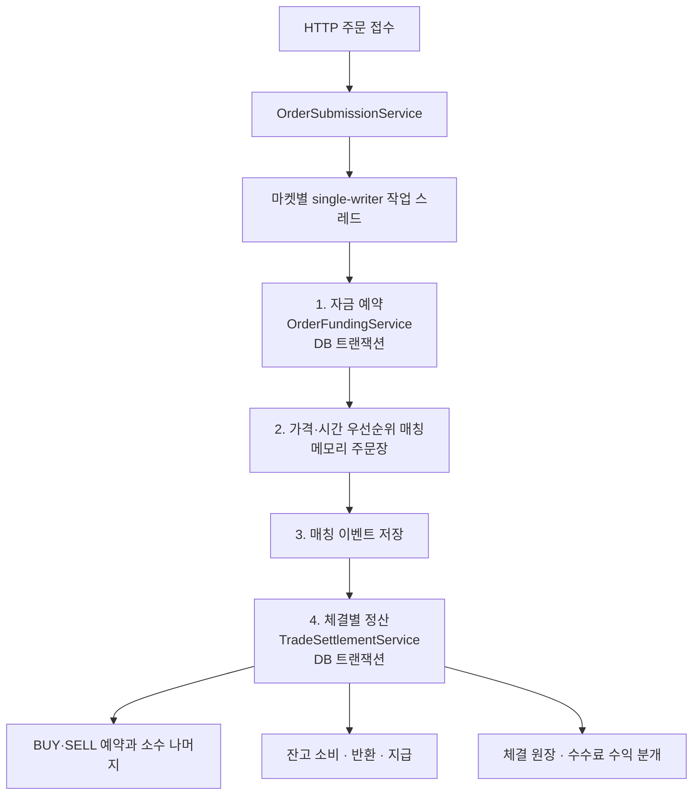

# Exchange Core

[](https://github.com/0Chord/coin-exchange/actions/workflows/build-and-test.yml)

매수·매도 주문을 받아 가격과 접수 순서에 따라 체결하고, 잔고와 수수료를 정산하는 현물 거래 백엔드입니다.
매칭 엔진은 Kotlin으로 직접 구현했습니다. Spring Boot는 HTTP 요청과 트랜잭션을 담당하고, PostgreSQL에는 잔고·주문 예약·매칭 이벤트·체결 원장을 저장합니다.

현재 LIMIT/GTC 주문의 접수·체결·취소가 연결되어 있습니다. 같은 주문이 여러 번 나뉘어 체결되어도 수수료의 소수 나머지를 이어 계산하고, 체결 한 건의 양쪽 잔고와 원장을 같은 DB 트랜잭션에서 변경합니다.
아직 배포된 거래소는 아닙니다. 실제 동작은 아래 통합 테스트로 확인할 수 있고, IOC/MARKET 주문과 장애 후 주문장 복구는 남은 작업입니다.

사용 기술: Kotlin 2.3.21 · Java 25 · Spring Boot 4.1.0 · PostgreSQL 16 · Flyway · JUnit Jupiter · Testcontainers · JMH 1.37

[거래 예시](#주문-한-건-따라가기) · [처리 흐름](#주문-처리-흐름) · [설계](#핵심-설계) · [실행](#빠르게-검증하기) · [코드 안내](#코드-읽는-순서) · [성능 측정](#성능-측정) · [남은 작업](#현재-경계와-다음-작업)

## 주문 한 건 따라가기

[OrderLifecycleE2ETest](app-api/src/test/kotlin/com/exchange/core/api/order/OrderLifecycleE2ETest.kt)의 전량 체결 시나리오입니다.
실제 BTC 시세가 아니라 계산을 확인하기 위한 테스트 값입니다. 이 테스트는 BTC 수량의 소수 자릿수를 0으로 두며, maker 수수료는 0.5%, taker 수수료는 1%입니다.

BTC-KRW에서 BTC는 사고파는 자산(`base`), KRW는 대금을 지불하는 자산(`quote`)입니다.
`available`은 주문에 쓸 수 있는 잔고, `hold`는 이미 주문에 묶인 잔고입니다.

1. 판매자는 BTC 10개 중 **2개를 90,000원에 매도**합니다. 상대 주문이 없으므로 주문장에 대기하고, BTC 잔고는 `available 8 / hold 2`가 됩니다.
2. KRW 1,000,000원을 가진 구매자가 **2개를 100,000원에 매수**합니다. 지정가 대금 200,000원과 최대 수수료 2,000원을 예약합니다. 매칭 전 KRW 잔고는 `available 798,000 / hold 202,000`입니다.
3. 먼저 대기한 매도 주문의 가격인 **90,000원에 2개가 체결**됩니다. 실제 대금은 180,000원입니다. 대기한 판매자가 maker, 들어와서 체결한 구매자가 taker가 됩니다.
4. 구매자는 대금과 수수료 1,800원을 지불합니다. 예약한 202,000원 중 사용하지 않은 **20,200원은 즉시 반환**합니다. 판매자는 대금에서 수수료 900원을 뺀 179,100원을 받습니다.

| 정산 후 | KRW | BTC |
| --- | ---: | ---: |
| 구매자 잔고 | 818,200원 | 2개 |
| 판매자 잔고 | 179,100원 | 8개 |
| 거래소 수수료 수익 원장 | 2,700원 | — |

양쪽 주문의 hold와 남은 예약액은 모두 0이 됩니다. KRW는 `818,200 + 179,100 + 2,700 = 1,000,000`, BTC는 `2 + 8 = 10`으로 이동 전후 합계가 같습니다.
거래소 수수료는 사용자 잔고에서 사라지는 금액이 아니라 별도 수익 계정의 원장 기록으로 남습니다. 다만 이 테스트의 초기 잔고는 SQL로 준비하므로, 이것이 입금부터 전체 잔고를 원장으로 재구성했다는 뜻은 아닙니다.

## 주문 처리 흐름



정산 트랜잭션은 체결 한 건을 묶습니다. 같은 체결의 양쪽 예약·잔고·원장은 함께 커밋하거나 롤백합니다.
자금 예약, 매칭 이벤트 저장, 체결 정산은 각각 별도 단계이므로 주문 접수 전체가 하나의 DB 트랜잭션인 것은 아닙니다.
따라서 정산 DB가 롤백되어도 앞서 바뀐 메모리 주문장이나 저장된 매칭 이벤트까지 되돌아가지는 않습니다. 이런 실패가 나면 해당 마켓의 추가 처리를 막으며, 상태 복구는 아직 구현하지 않았습니다.

취소는 매칭 엔진에서 주문 제거에 성공한 뒤 남은 예약을 해제합니다. BUY는 남은 거래대금·수수료 예약액을, SELL은 남은 base 자산을 반환합니다.

## 핵심 설계

### 1. 가격·시간 우선순위와 마켓별 직렬 처리

- 가격 레벨은 `TreeMap`, 같은 가격 안의 주문은 `LinkedHashMap`으로 관리해 가격 우선순위와 FIFO를 표현합니다.
- 마켓별 단일 작업 스레드에서 사전 예약 → 매칭 → 후속 저장·정산을 순서대로 실행합니다.
- 예약 이후 엔진 처리나 후속 저장에 실패하면 해당 마켓의 추가 명령을 차단합니다. 이 차단은 자동 복구를 의미하지 않습니다.

관련 코드: [OrderBook](domain-matching/src/main/kotlin/com/exchange/core/matching/OrderBook.kt), [PriceLevel](domain-matching/src/main/kotlin/com/exchange/core/matching/PriceLevel.kt), [MarketCommandProcessor](domain-matching/src/main/kotlin/com/exchange/core/matching/MarketCommandProcessor.kt)

### 2. 잔고와 주문별 예약을 따로 두는 이유

- `Balance`는 사용자·자산별 `available`과 `hold`를 관리합니다.
- `OrderReservation`은 전체 hold 중 특정 주문에 속한 거래대금·수수료 예약액을 추적합니다.
- 예를 들어 두 주문이 같은 KRW 잔고를 예약하면 `Balance.hold`에는 합계가 들어갑니다. 한 주문만 취소할 때 얼마를 풀어야 하는지는 해당 `OrderReservation`으로 판단합니다.
- BUY는 거래대금과 최대 maker/taker 수수료를 미리 예약하고, SELL은 base 수량을 예약한 뒤 판매대금에서 수수료를 차감합니다.
- 조건부 잔고 UPDATE와 예약 행의 `FOR UPDATE` 잠금을 사용합니다. 자금 예약·예약 해제·체결 정산마다 필요한 변경을 같은 트랜잭션에 묶습니다.

관련 코드: [OrderFundingService](app-api/src/main/kotlin/com/exchange/core/api/order/OrderFundingService.kt), [OrderReservation](domain-order/src/main/kotlin/com/exchange/core/order/OrderReservation.kt), [PostgresBalanceStore](app-api/src/main/kotlin/com/exchange/core/api/ledger/persistence/PostgresBalanceStore.kt)

### 3. 수수료는 체결마다 버리지 않고 주문별로 누적

금액·수량은 정수 최소 단위로, 수수료율은 백만분율 정수로 표현합니다. 수수료 중간 연산에는 `BigInteger`를 사용하고 소수 부분은 `FeeRemainder`에 보관합니다.

```text
이번 수수료 분자 = 이번 체결대금 × 이번 maker/taker 요율 정수 + 이전 나머지 분자
이번 청구 수수료 = 분자 ÷ 1,000,000의 몫
다음 소수 나머지 = 분자 ÷ 1,000,000의 나머지
```

예를 들어 최소 금액 단위가 1원일 때, 255원을 1% 요율로 한 번에 체결하든 `51 + 51 + 51 + 102`원으로 나누어 체결하든 청구 수수료는 총 2원입니다.
나누어 체결하면 청구액은 `0 → 1 → 0 → 1`원이 되고, 최종 소수 나머지는 0.55원입니다. 나머지는 실제 동결 잔고와 구분합니다.

BUY는 부분 체결 후에도 `올림(남은 지정가 대금 × 최대 요율 + 새 소수 나머지)`를 유지하고 초과분만 반환합니다. 전량 체결되면 미사용 예약액을 모두 반환합니다.
수수료 정책은 주문 접수 시 스냅샷으로 고정하지만 maker/taker 역할은 체결마다 정해집니다. 처음에는 taker로 일부 체결되고, 잔량이 주문장에 남아 다음에는 maker가 될 수 있습니다.
이때 각 체결의 역할에 맞는 요율을 적용하며, 이미 계산한 나머지에 새 요율을 다시 곱하지 않습니다.

관련 코드: [TradingFeeCalculator](domain-fee/src/main/kotlin/com/exchange/core/fee/TradingFeeCalculator.kt), [TradingFeeReserveCalculator](domain-fee/src/main/kotlin/com/exchange/core/fee/TradingFeeReserveCalculator.kt), [OrderFillSettlementCalculator](domain-order/src/main/kotlin/com/exchange/core/order/OrderFillSettlementCalculator.kt)

### 4. 체결 원장과 수수료 수익 기록

- 체결별 `LedgerTransaction`에 양쪽 주문의 분개를 함께 기록합니다.
- 거래별·자산별 DEBIT/CREDIT 합계가 일치하는지 검증합니다. 서로 다른 자산의 금액을 합쳐 균형을 판단하지 않습니다.
- 구매자와 판매자에게 청구한 수수료는 `SYSTEM:{asset}:FEE_REVENUE` 계정에 기록합니다.
- 원장 저장 후 잔고 지급에 실패해도 원장·예약·잔고·소수 나머지가 함께 롤백되는지 실제 DB에서 확인합니다.

관련 코드: [LedgerTransaction](domain-ledger/src/main/kotlin/com/exchange/core/ledger/LedgerTransaction.kt), [TradeSettlementService](app-api/src/main/kotlin/com/exchange/core/api/order/TradeSettlementService.kt)

## 모듈 구성

| 모듈 | 책임 |
| --- | --- |
| [`domain-common`](domain-common) | 식별자와 가격·수량·금액 value class |
| [`domain-matching`](domain-matching) | 주문장, 매칭 엔진, 마켓별 명령 처리 |
| [`domain-order`](domain-order) | 주문 예산·예약과 체결 정산 계획 |
| [`domain-fee`](domain-fee) | 등급·상품별 maker/taker 정책, 누적 수수료와 예약액 계산 |
| [`domain-ledger`](domain-ledger) | 잔고, 자산별 균형을 검증하는 원장 모델, 저장소 포트 |
| [`app-api`](app-api) | Spring Bean 조립, HTTP API, 트랜잭션, PostgreSQL 어댑터 |
| [`benchmark-jmh`](benchmark-jmh) | 명령 생성·매칭·마켓 프로세서용 JMH 벤치마크 |

도메인 모듈의 계산은 Spring이나 DB 없이 실행할 수 있습니다. `app-api`에서 application service를 명시적인 `@Bean`으로 조립하고, 저장소 인터페이스에 PostgreSQL 구현체를 연결합니다.
매칭 이벤트는 JPA로, 잔고·예약·원장은 JDBC로 저장합니다. 잔고의 조건부 UPDATE와 예약 행 잠금은 [PostgresBalanceStore](app-api/src/main/kotlin/com/exchange/core/api/ledger/persistence/PostgresBalanceStore.kt), [PostgresOrderReservationStore](app-api/src/main/kotlin/com/exchange/core/api/order/persistence/PostgresOrderReservationStore.kt)에서 직접 확인할 수 있습니다.
스키마 변경은 [Flyway migration](app-api/src/main/resources/db/migration)으로 관리합니다.

## 빠르게 검증하기

**준비:** JDK 25, 실행 중인 Docker. Gradle은 저장소의 Wrapper를 사용합니다.
PostgreSQL은 Testcontainers가 생성·종료하므로 테스트용 DB를 따로 설치하거나 연결 정보를 입력할 필요가 없습니다.

```bash
git clone --branch feature/phase-2/integration https://github.com/0Chord/coin-exchange.git
cd coin-exchange

# 전체 모듈 빌드와 테스트 — GitHub Actions와 동일한 검증 명령
./gradlew build --no-daemon --continue --stacktrace --rerun-tasks
```

처음 실행할 때는 Gradle 의존성과 PostgreSQL 컨테이너 이미지 다운로드가 필요합니다.

<details>
<summary>시나리오별 테스트 실행 명령</summary>

```bash
# 주문 HTTP 접수 → 예약 → 매칭 → 정산 → 원장, 미체결 BUY/SELL 취소
./gradlew :app-api:test \
  --tests 'com.exchange.core.api.order.OrderLifecycleE2ETest' \
  --no-daemon --rerun-tasks

# 분할 체결, maker/taker 전환, 부분 체결 후 예약 해제, 정산 실패와 롤백
./gradlew :app-api:test \
  --tests 'com.exchange.core.api.order.TradeSettlementServiceTest' \
  --no-daemon --rerun-tasks

# DB 없이 금액·수수료·예약 계산 검증
./gradlew :domain-fee:test :domain-order:test --no-daemon --rerun-tasks
```

</details>

검증 기준 시점인 **2026-09-12**에 전체 **243개 테스트**가 통과했습니다. 최신 실행 결과는 상단 CI 배지와 [Actions](https://github.com/0Chord/coin-exchange/actions/workflows/build-and-test.yml)에서 확인할 수 있습니다.
로컬 HTML 결과는 각 모듈의 `build/reports/tests/test/index.html`에 생성됩니다.

| 검증 계층 | 확인하는 내용 | 대표 테스트 |
| --- | --- | --- |
| 순수 도메인 | 가격·시간 우선순위, 금액 경계, 수수료 누적, 예약 유지 | [매칭](domain-matching/src/test/kotlin/com/exchange/core/matching/MatchingEngineTest.kt) · [정산 계산](domain-order/src/test/kotlin/com/exchange/core/order/OrderFillSettlementCalculatorTest.kt) |
| PostgreSQL 통합 | 동결·정산의 원자성, 소수 나머지 저장, 수수료 원장, 실패 시 롤백 | [정산 통합 테스트](app-api/src/test/kotlin/com/exchange/core/api/order/TradeSettlementServiceTest.kt) |
| HTTP 경계 E2E | 주문 접수부터 예약·매칭·정산, 미체결 주문 취소와 반환 | [주문 E2E 테스트](app-api/src/test/kotlin/com/exchange/core/api/order/OrderLifecycleE2ETest.kt) |

HTTP 경계는 MockMvc로 호출하지만 서비스나 저장소를 mock으로 대체하지 않습니다. 실제 Spring Bean과 PostgreSQL을 사용합니다. 분할 체결·역할 전환·실패 후 재시도는 정산 서비스 통합 테스트의 검증 범위입니다.

## 코드 읽는 순서

1. [OrderLifecycleE2ETest](app-api/src/test/kotlin/com/exchange/core/api/order/OrderLifecycleE2ETest.kt): 요청을 넣었을 때 무엇이 바뀌는지 확인합니다.
2. [OrderSubmissionService](app-api/src/main/kotlin/com/exchange/core/api/order/OrderSubmissionService.kt): 예약·매칭·정산을 연결하는 흐름을 봅니다.
3. [MatchingEngine](domain-matching/src/main/kotlin/com/exchange/core/matching/MatchingEngine.kt): 체결과 잔량 처리 규칙을 봅니다.
4. [OrderFillSettlementCalculator](domain-order/src/main/kotlin/com/exchange/core/order/OrderFillSettlementCalculator.kt): 실제 사용액·반환액·다음 예약액을 계산합니다.
5. [TradeSettlementServiceTest](app-api/src/test/kotlin/com/exchange/core/api/order/TradeSettlementServiceTest.kt): 분할 체결과 실패 상황에서 DB 정합성을 확인합니다.

테스트 환경의 DB·마켓·수수료 정책과 초기화 방식은 [`support`](app-api/src/test/kotlin/com/exchange/core/support)에서 확인할 수 있습니다.

### HTTP 계약

| 요청 | 역할 |
| --- | --- |
| `POST /api/markets/{marketId}/orders` | LIMIT/GTC 주문 접수와 체결 결과 반환 |
| `DELETE /api/markets/{marketId}/orders/{orderId}?userId=...` | 미체결 잔량 취소와 예약 해제 |

요청·응답 구조는 [MatchingDtos](app-api/src/main/kotlin/com/exchange/core/api/matching/MatchingDtos.kt), 호출 예시는 위 E2E 테스트에 있습니다.
테스트 마켓은 계산을 읽기 쉽게 `baseAssetScale = 0`으로 설정합니다. 가격·수량은 항상 마켓의 최소 단위 규칙과 함께 해석해야 합니다.

## 성능 측정

### 개발 환경의 합성 입력 벤치마크 — 실사용 처리량 아님

> 아래 숫자는 코드로 만든 주문 묶음을 메모리 매칭 코어에 넣은 JMH 측정값입니다.
> Spring 서버와 DB는 실행하지 않았습니다. **HTTP 요청 → 자금 예약 → 매칭 → 수수료 정산 → 원장 저장의 전체 처리량이 아닙니다.**

2026-09-12, 개발용 Apple M1 Pro 8코어 / 메모리 16 GiB / macOS / Corretto JDK 25.0.2에서 실행했습니다.
벤치마크마다 JVM을 3번 띄우고, 각 JVM에서 워밍업 5회 × 1초, 측정 5회 × 1초를 진행했습니다. 힙은 1 GiB, JMH 호출 스레드는 1개이며 GC 할당량도 함께 수집했습니다.

입력은 SELL 묶음 뒤에 BUY 묶음을 넣는 고정 패턴입니다. 실제 거래소 주문 로그, 여러 클라이언트의 동시 요청, 지속적인 요청 유입, 취소가 섞인 부하는 재현하지 않았습니다.

| 합성 입력 측정 경로 | 단일 마켓 환산 명령/초 | 3개 마켓 합계 환산 명령/초 |
| --- | ---: | ---: |
| 엔진 직접 호출 | 4,835,853 ± 255,806 | 5,431,570 ± 424,358 |
| 프로세서 생성 포함 | 1,430,726 ± 161,684 | 2,672,956 ± 259,857 |
| 프로세서 재사용 | 1,199,967 ± 198,416 | 2,141,241 ± 399,465 |

`±`는 JMH가 보고한 평균의 99.9% 신뢰구간 반폭입니다.
JMH 원본의 `1 op`는 주문 한 건이 아니라 배치 한 번이므로 단일 마켓은 1,000, 다중 마켓은 1,200을 곱해 환산했습니다.

직접 호출은 배치마다 엔진을 새로 만들고, 3개 마켓도 한 스레드에서 순서대로 처리합니다. 프로세서 생성 포함 경로는 작업 스레드 생성·큐 제출·완료 대기·종료 요청까지 측정합니다.
재사용 경로는 기존 작업 스레드를 사용하지만, 입력 생성도 포함되고 체결 패턴이 달라 다른 행과 단순 속도 비교는 어렵습니다. 중복 방지용 주문 ID는 계속 남으므로 장시간 메모리 사용량도 별도 검증이 필요합니다.

저장소의 JMH 기본값은 `fork 1 / 워밍업 1회 × 0.5초 / 측정 3회 × 0.5초`로 빠른 실행 확인용입니다. 위 결과는 이 기본값이 아니라 별도의 측정 옵션을 적용한 값입니다.
현재 결과는 이 입력과 환경에 대한 초기 기준값입니다. 실사용 부하를 검증하려면 별도로 HTTP·DB 경로에 동시 주문과 취소를 넣고, 처리량·지연시간·실패율을 함께 측정해야 합니다.

전체 입력 구성, 결과 해석, 실행 명령은 [JMH 측정 문서](benchmark-jmh/README.md)에 있습니다. [원본 JSON](benchmark-jmh/results/2026-09-12-core-engine.json)과 [실행 로그](benchmark-jmh/results/2026-09-12-core-engine.log)도 보관했습니다.

## 현재 경계와 다음 작업

| 항목 | 현재 상태 / 다음 작업 |
| --- | --- |
| 주문 유형 | LIMIT/GTC 지원. IOC와 MARKET 주문은 다음 범위 |
| 거래대금 최소 단위 | 표현할 수 없는 소수 대금은 거절. 부분 체결도 안전하도록 가격·수량 단위 정책과 사전 검증 보완 필요 |
| 독립 서버 실행 | 통합 테스트에서 DB·마켓·수수료 정책을 구성. 기본 `application.yaml`만으로 운영 서버를 기동하는 구성은 미완성 |
| 원장·대사 | 체결과 수수료를 기록. 입금·초기 잔고·예약·해제까지 포함한 잔고 재구성과 자동 대사는 미구현 |
| 장애·중복 요청 | 실패 시 마켓 중단과 체결 DB 롤백 검증. 주문장 재시작 복구·자동 재시도·이미 커밋된 정산의 멱등 응답은 별도 과제 |
| 처리량·운영 | 메모리 매칭 경로의 JMH 결과만 측정. HTTP·DB 포함 부하 테스트, 큐 크기 제한과 과부하 제어, 인증·조회 API는 남은 작업 |
| 수수료 정책 확장 | 등급·상품별 정책 모델 보유. 월간 거래량 집계에 따른 VIP 자동 적용과 선물 거래 연결은 미구현 |

`V6`는 기존 주문 예약의 수수료 나머지를 0으로 초기화하며 과거 체결의 나머지를 복원하지 않습니다. 기존 활성 주문이 있는 환경에서는 별도 전환 정책이 필요합니다.
