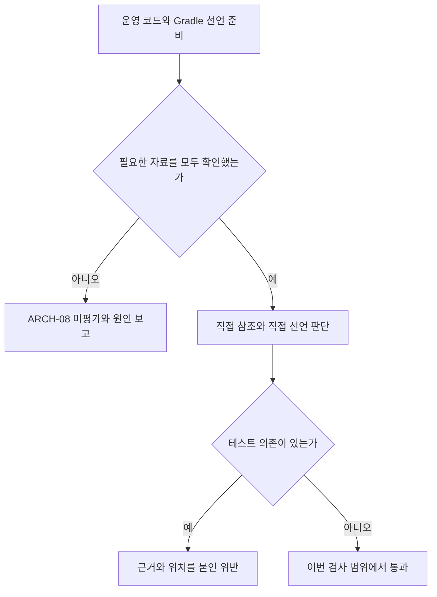

# ARCH-08 · 운영 코드의 테스트 의존을 막는 흐름

상태: **로컬 구현·검증 완료 — 구조 검사 159개 통과, 전체 build 성공**. 기준 `db26dfc`, 브랜치 `test/non-production-deps/19`. 제품의 주문·잔고·DB 코드는 바꾸지 않았다. 변경 대상은 개발 중 실행하는 구조 검사다. 이 문서는 PR에 포함하는 로컬 검증 기록이다. 원격 CI·독립 리뷰·병합의 최신 상태는 PR에서 확인한다.

**이번에 만든 것은 ‘제품 코드가 테스트 코드에 기대는 순간 알려주는 검사’다.** 두 가지를 본다. 실제 코드에서 테스트 타입을 쓰는지, 코드에 쓰지 않았어도 빌드 설정에 테스트 의존을 넣었는지다. 둘 중 하나의 입력이라도 빠졌으면 통과라고 하지 않는다.

[상세 명세](architecture-check-spec.md) · 아래 네 흐름을 먼저 보고 필요한 코드 링크를 따라 읽으면 된다. 로컬 HTML에서는 같은 파일을 펼쳐 볼 수 있다. 테스트 예제의 고의 위반과 현재 제품의 위반을 구분한다.

## PR #29 리뷰 보완 · 구성에 붙인 선택도 확인한다

[독립 리뷰의 P2](https://github.com/0Chord/coin-exchange/pull/29#discussion_r4111410768)는 ‘어떤 산출물을 가져올지 정하는 속성’을 읽는 위치가 하나 빠졌다는 문제였다. `runtimeClasspath`에 `example.kind=testing`을 지정하면 실제 Gradle은 테스트 JAR을 고를 수 있는데, 기존 수집기는 개별 의존 선언만 읽어 정상 운영 의존으로 통과시켰다.

이제 **main 구성의 기본 속성 읽기 → 개별 의존 속성으로 같은 키 덮어쓰기 → 유효 속성 판단 → 정상 선택 또는 준비 실패**로 흐른다. 두 원본과 유효 값을 진단에 남긴다. 미지원 값이 남으면 ARCH-08은 전체 미평가로 끝나고, 부분 위반 목록도 최종 결과로 내지 않는다. 일반 JVM 속성은 계속 허용한다. compile/runtime의 근거가 달라도 같은 선언의 진단은 하나로 묶고 각 구성의 근거를 모두 남긴다.

| 읽을 사례 | 기대 결과와 확인 근거 |
| --- | --- |
| runtime 구성에 사용자 속성을 붙여 테스트 JAR 선택 | 실제 `testElements`와 `lib-1-tests.jar` 안의 Helper 클래스를 확인한 뒤 `UNSUPPORTED_SELECTION` 준비 실패를 검사 |
| compile 구성의 속성만 변경 | compile만 미지원, runtime은 정상. 입력이 바뀌면 재수집하고, 같으면 UP-TO-DATE, 설정 제거 시 정상 복귀 |
| 구성의 비표준 usage를 개별 의존의 `java-api`로 덮어씀 | 실제 `apiElements` 선택과 정상 통과. 원본에 미지원 값이 있었다는 이유만으로 거절하지 않음 |
| 같은 선언의 compile/runtime 선택 근거가 다름 | 진단은 하나, 두 속성 근거는 유지. 입력 순서를 뒤집어도 같은 결과 |

수정 전 네 사례 중 세 사례가 의도한 이유로 실패했고 정상 우선순위 사례는 이미 통과했다. 첫 재현 코드의 Groovy 문법 오류는 수정했으며 행동 수준 Red로 세지 않았다. 기대값은 기존 미지원 선택 계약과 실제 Gradle 선택 결과에 근거한다. 관련 테스트 17개와 전체 구조 테스트 159개가 통과했고 전체 build도 성공했다.

읽을 코드: [속성 수집과 결합](../architecture-tests/gradle/isolation-inputs.gradle.kts), [진단 근거 보존](../architecture-tests/src/test/kotlin/com/exchange/architecture/rules/ProductionDependencyIsolation.kt). 실행 근거: [실제 Gradle 테스트](../architecture-tests/src/test/kotlin/com/exchange/architecture/IsolationGradleWiringTest.kt), [두 구성의 단일 진단 테스트](../architecture-tests/src/test/kotlin/com/exchange/architecture/IsolationDependencyContractTest.kt).

이 수정은 검증 도구와 그 테스트에 적용했다. 실제 산출물 해석·JAR 생성은 테스트용 최소 프로젝트에서만 수행하며 수집기에는 강제 해석을 추가하지 않았다. 수정 후 독립 재리뷰·원격 CI·사람의 판단은 별도 상태다.

## 1. 테스트 도우미의 소속부터 확인한다

**입력:** Gradle이 알려주는 프로젝트, main/test/JMH 같은 코드 묶음, 컴파일된 클래스의 위치.

**판단:** 운영 main은 기존 수집기가 읽고, 테스트·벤치마크 출력은 이름과 소속만 별도로 읽는다. 테스트를 운영 검사 대상으로 합치지 않는다. 이름에 Test가 들어갔다는 이유로 분류하지 않는다.

**결과:** `Helper`가 test 출력에 있으면 비운영 목적지로 기록한다. test 폴더가 아직 없으면 ‘미생성’으로 기록한다. 출력 기록 자체가 없거나 클래스 파일이 손상됐으면 준비 실패다. 같은 타입이 main과 test 양쪽에 있으면 소속이 모호하므로 준비 실패다.

기존 수집기에는 **확인된 타입의 정확한 이름만** 전달한다. 이 목록에 없는 내부 타입 참조는 여전히 누락 오류다. ‘테스트 패키지는 전부 무시’하는 예외는 만들지 않았다.

읽을 코드: [출력 소속 확인](../architecture-tests/src/test/kotlin/com/exchange/architecture/support/NonProductionTargets.kt) → [기존 수집과 연결](../architecture-tests/src/test/kotlin/com/exchange/architecture/support/ProductionScopeImporter.kt). 근거: [목록 테스트](../architecture-tests/src/test/kotlin/com/exchange/architecture/NonProductionTargetsTest.kt), [코드 연결 테스트](../architecture-tests/src/test/kotlin/com/exchange/architecture/ProductionDependencyIsolationTest.kt).

## 2. 운영 코드가 무엇을 참조하는지 본다

**정상 예제:** main의 `Normal`이 main의 `TestValue`를 사용한다. 둘 다 제품 코드이므로 ARCH-08 위반이 아니다. JDK, Kotlin 일반 값, 운영 Spring도 이름만으로 막지 않는다.

**위반 예제:** main의 `UsesHelper`가 test 출력의 `Helper`를 사용한다. 검사기는 출발 타입, 도우미의 실제 소속, 참조 형태, 가능한 소스 파일과 행을 보고한다. 검사 예제에서 이 위반을 정확히 찾으면 테스트가 통과한다.

**준비 실패 예제:** 같은 코드인데 Helper의 정의를 어디서도 확인하지 못했다. 이 경우 ‘금지 참조가 없었다’고 하지 않고 미평가로 끝낸다.

별도로 합의한 외부 도구 목록도 검사한다. 실제 JUnit 어노테이션, Kotlin Test 호출, Testcontainers 필드, JMH 어노테이션, ArchUnit 타입, Spring 테스트 어노테이션을 예제로 사용했다. 상속·배열·제네릭·파일 최상위 함수·람다·메서드 참조가 남긴 직접 의존도 확인한다. 예제 클래스는 제품 기능이 아니며 메서드를 실행하지 않는다.

읽을 코드: [코드 참조 판단](../architecture-tests/src/test/kotlin/com/exchange/architecture/rules/ProductionDependencyIsolation.kt), [도구 정책](../architecture-tests/src/test/kotlin/com/exchange/architecture/rules/TestToolPolicy.kt). 실제 예제: [고의 정상·위반 코드](../architecture-tests/src/test/kotlin/com/exchange/core/isolationfixture/IsolationFixtures.kt). 기대값 근거: [코드 테스트](../architecture-tests/src/test/kotlin/com/exchange/architecture/ProductionDependencyIsolationTest.kt).

## 3. 아직 사용하지 않은 빌드 의존도 본다

**입력:** main의 compile/runtime 구성에 직접 추가됐거나 구성 상속으로 들어온 프로젝트·라이브러리 선언. 테스트 전용 구성은 출발점에 포함하지 않는다.

| 설정 | 판단 | 이유 |
| --- | --- | --- |
| `testImplementation`에 JUnit | 허용 | 테스트를 위한 사용 |
| `runtimeOnly`에 Testcontainers | 위반 | 제품 실행 의존에 테스트 도구를 추가 |
| `implementation`에 일반 운영 프로젝트 | ARCH-08 허용 | 운영 모듈 사이의 방향은 ARCH-02가 별도로 검사 |
| 같은 운영 프로젝트의 `testFixtures` 선택 | 위반 | 운영 코드 대신 그 프로젝트의 테스트 도우미를 요청 |
| 버전만 관리하는 BOM·constraint | 검사 대상 도구 추가로 세지 않음 | 실행 타입을 넣는 선언과 구분 |
| 지원하지 않는 project variant 선택 | 준비 실패 | 선택한 대상이 정상 운영 코드라고 확인하지 못함 |

`testImplementation`이라는 이름도 면제권은 아니다. main이 그 구성을 상속하면 실제 운영 의존으로 검사한다. compileOnly·runtimeOnly도 빠뜨리지 않는다. 한 선언이 compile/runtime 양쪽에 있으면 한 진단 안에 두 근거를 보존한다.

Gradle 9.5.1의 실제 `testFixtures(project(...))`·외부 fixture 선택 정보를 읽으며 capability, 대상 구성, artifact 및 속성 선택 근거를 남긴다. main 구성 속성에 개별 의존 속성을 덮어쓴 유효 값을 판단한다. 일반 `java-api` 같은 운영 속성은 허용하고, `example.flavor=testing` 같은 미지원 사용자 속성으로 프로젝트 variant를 고르면 준비 실패로 남긴다. 다른 라이브러리의 모든 전이 의존을 펼치거나 수집 때문에 해석을 강제로 실행하지 않는다. 지연 기본 의존은 실제 모델에 나타난 시점부터 검사하므로, 이 결과가 완전한 런타임 의존 감사는 아니다.

읽을 코드: [Gradle 수집](../architecture-tests/gradle/isolation-inputs.gradle.kts) → [전달 형식 확인](../architecture-tests/src/test/kotlin/com/exchange/architecture/support/IsolationInputs.kt) → [선언 판단](../architecture-tests/src/test/kotlin/com/exchange/architecture/rules/ProductionDependencyIsolation.kt). 근거: [선언 계약 테스트](../architecture-tests/src/test/kotlin/com/exchange/architecture/IsolationDependencyContractTest.kt), [실제 Gradle 통합 테스트](../architecture-tests/src/test/kotlin/com/exchange/architecture/IsolationGradleWiringTest.kt).

## 4. 두 입력을 합쳐 실제 프로젝트에 적용한다

기존 `ProductionArchitectureTest`에 **P04**를 추가했다. P04는 자기 입력을 직접 준비하고 검사하므로 P01·P02·P03의 실행 순서를 기다리지 않는다. 기존 수집·모듈 방향 검사도 같은 검증된 비운영 목록을 이해하도록 연결했다. ARCH-01·02·06의 규칙은 유지한다.

검사에 필요한 자료 하나가 실패하면 코드·Gradle에서 일부 위반을 찾았더라도 최종 위반 목록은 비우고 전체 미평가로 보고한다. 그 상태를 위반 0건의 통과로 해석하면 안 된다.

소스셋 목록과 클래스 파일 내용을 Gradle 작업 입력으로 등록했다. 새 소스셋, 파일 생성·삭제, 같은 이름·개수에서 내용만 바뀐 경우도 이전 결과를 그대로 재사용하지 않게 한다. 제품의 모든 test/JMH 컴파일·실행을 선행 작업으로 추가하지 않는다. 다만 전체 build처럼 해당 출력의 컴파일도 함께 요청됐으면, `mustRunAfter`로 생산 작업을 먼저 끝낸 뒤 읽는다. 실제 Gradle 통합 예제로 이 순서와 독립 실행을 모두 확인했다.

읽을 코드: [실제 P04 적용](../architecture-tests/src/test/kotlin/com/exchange/architecture/ProductionArchitectureTest.kt), [빌드 연결](../architecture-tests/build.gradle.kts), [기존 ARCH-02 연결](../architecture-tests/src/test/kotlin/com/exchange/architecture/rules/ModuleDependencyDirection.kt).

## 기대값을 어떻게 확인했는가

기대값은 합의한 ‘운영→비운영 금지’와 명시 도구 목록, ‘입력 누락은 미평가’에서 정했다. 결과에서 정답을 역으로 복사하지 않았다. 위반 개수만 확인하지 않고 출발·목적지·소속·근거, 빈 최종 결과의 이유를 확인한다.

- 출력 목록 테스트: 처음 6개 모두 실패 → 구현 후 통과. 메타데이터 손상 사례도 보완했다.
- 코드 검사 테스트: 초기 8개 중 7개 실패, 정상 허용 1개 통과 → 구현 후 통과. 이후 코드·선언 결과 결합 사례를 추가했다.
- 선언 계약 테스트: 6개 중 규칙 미구현 5개 실패, 입력 형식 검사는 통과 → 구현 후 통과.
- 실제 Gradle 테스트: 정상/fixture, 테스트 구성 상속, 파일 변경 추적, 지연 의존과 명시 의존 우선을 확인한다. 이 결과를 모조 문자열 검사로 대신하지 않았다.

테스트 작성 중 경로 목록 구성과 Kotlin 메서드 참조의 생성 클래스 누락을 바로잡았다. 손상된 파일은 정확한 파일명을 보고하도록 구현을 보완했다. 통합 테스트에서는 Gradle 작업 이름을 실행 옵션으로 오인해 해석 작업이 항상 실행되던 조건을 수정했다. 이 작성 오류 자체를 제품 기능의 Red 근거로 사용하지 않았다.

기대값 검토와 구현 검증은 같은 작성 AI가 수행했다. 독립 PR 리뷰나 사람의 검토 완료를 뜻하지 않는다.

## 실행 상태와 남은 범위

최종 전체 `build`에서 **구조 검사 159개가 실제 실행됐고 실패·오류·skip은 0개**였다. 기존 제품 테스트는 이 명령에서 UP-TO-DATE로 재사용됐다. 새로 모두 실행했다고 세지 않는다.

실제 운영 적용에서는 **113개 클래스, main 구성 12개, 구성별 직접 선언 53개, 직접 코드 참조 5,090개**를 확인했고 ARCH-08 준비 오류·위반은 0건이었다. 기존 P01·02·03도 통과했다. P04 단독 1개 통과는 초기 커밋의 근거이며, 이번 수정 후에는 전체 구조 실행에 P04를 포함해 확인했다. 독립 명령의 dry-run에는 다른 제품 test/JMH 컴파일·실행이 추가되지 않았다.

| 실행 | 결과 | 보장 |
| --- | --- | --- |
| 초기 커밋의 `:architecture-tests:test --rerun-tasks` | 구조 156개 통과 | 보완 전 기준 기록 |
| 리뷰 보완 관련 테스트 선택 실행 | 17개 통과 | 소비자 속성·선택 우선순위·기존 선언·운영 적용 |
| 소비자 속성 보완 후 `build --continue` | 성공, 구조 159개 재실행 | 최종 코드의 전체 빌드 연결; 제품 테스트는 재사용 |
| `:architecture-tests:test --dry-run` | 성공 | 다른 제품 test/JMH 작업이 선행에 추가되지 않음 |
| 초기 커밋의 P04 단독 실행 | 1개 통과 | 보완 전 독립 적용 기록; 현재 P04는 전체 159개에 포함 |

로컬 기본 보고서에는 현재 전체 구조 159개 실행 결과가 보인다. 이 보고서와 XML은 로컬에 별도로 보존했고, 원격 검토용 집계·명령·소스 해시는 아래 JSON에 포함했다. 원본 로컬 로그 경로는 실행 당시 기록이며 저장소 첨부물이 아니다. 원격 실행 보고서는 PR의 CI 아티팩트에서 확인한다. [실행 기록과 소스 해시](architecture-08-verification.json)에서 현재 코드와 결과의 연결을 확인할 수 있다.

이번 범위 밖: 모든 전이 의존, 파일 의존, 동적 로딩·리플렉션·재포장된 임의 복사본의 전수 추적, 테스트 품질, 거래·DB 동작의 정확성. #19 전체 완료나 ARCH-03/04/05/07 완료를 뜻하지 않는다.

사용자가 판단할 것은 세 가지다. 테스트 전용 사용은 유지되는가, 운영의 테스트 의존은 두 경로에서 막는가, 확인할 자료가 없을 때 통과를 거절하는가. 아래 코드는 그 판단의 근거이며 전부 암기할 필요는 없다.

## 실제 코드와 파일 역할

추가된 파일은 검증 도구, 검증 도구를 시험하는 테스트, 일부러 만든 예제로 나뉜다. 제품 실행 클래스는 추가하지 않았다. 위의 코드·테스트 링크는 저장소 파일로 연결된다. 로컬 HTML에서는 같은 파일의 원문에 색상·행 번호·해시를 붙인다.

<!-- ARCH08_SOURCES_START -->
HTML에서 실제 소스와 실행 근거를 표시한다.
<!-- ARCH08_SOURCES_END -->
