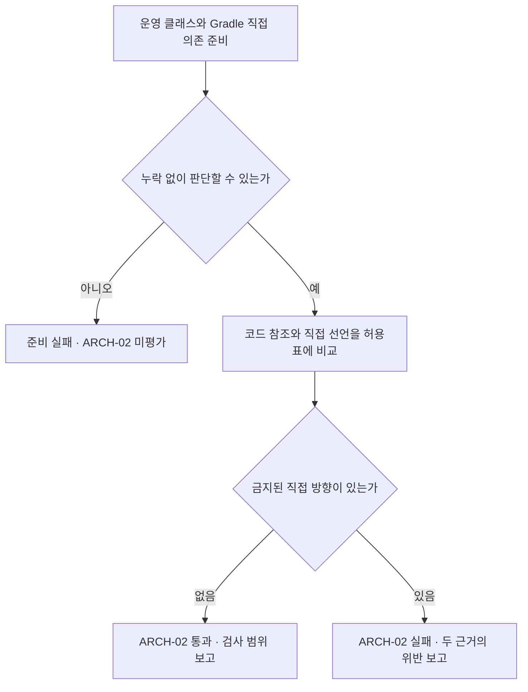

# 구조 검사 명세 — #19 · ARCH-02 구현 계약

대상: [#19 공통 구조 검사 기반 구현 및 명세 v1 적용](https://github.com/0Chord/coin-exchange/issues/19).
현재 기준은 통합 브랜치 `feature/phase-2/integration`의 **`0f709c30b446e558060416cad6e0389f9f33ad16`**이다. [PR #26](https://github.com/0Chord/coin-exchange/pull/26)의 대상 준비·ARCH-01은 병합됐다. **ARCH-02의 로컬 구현·검증을 완료했다. 구조 검사 81개, 전체 테스트 324개가 통과했다. 원격 CI·리뷰 상태는 이 문서를 포함한 PR에서 별도로 확인한다.** #19 전체 완료를 뜻하지 않는다.

## ARCH-02 · 합의한 계약

**“이 모듈이 다른 모듈을 직접 알아도 되는가?”를 검사한다.** 이미 만든 수집기를 재사용하고, 코드에 남은 참조와 Gradle에 선언한 의존을 각각 같은 허용표에 대조한다. 코드가 아직 사용하지 않는 금지 의존도 잡기 위해 두 입력이 필요하다.

| 구분 | 현재 상태와 구현 계약 |
| --- | --- |
| 확인한 사실 | PR #26에서 전용 `architecture-tests`, 모듈 등록·수집·역할 분류, ARCH-01 및 57개 기존 테스트 사례가 병합됐다. [병합 커밋 CI](https://github.com/0Chord/coin-exchange/actions/runs/36152047034)는 성공이다. ARCH-02 구현 후 기존 사례를 포함한 전체 로컬 빌드도 실행했다. |
| 유지할 합의 | 도메인 모듈의 허용 방향, 포트 선언 허용, 실행기와 순수 규칙 구분, 서버·DB 없이 실행하는 구조 검사. |
| 적용한 입력 연결 | 모든 운영 클래스의 직접 참조와 운영 main의 직접 Gradle 프로젝트 의존을 검사한다. 포트·실행기도 모듈 방향 검사에서 제외하지 않는다. |
| 바꾸지 않을 계약 | Gradle의 전이 의존만으로 위반을 만들지 않는다. 허용된 타입을 사용할 때마다 직접 Gradle 선언을 강제하지 않는다. |
| 이번 산출물 | 기존 수집 기반을 재사용한 ARCH-02 구현·실행 근거·사람을 위한 흐름 리뷰. 아래 로컬 검증 기록 참조. |

읽는 순서: **허용표 → 세 가지 예 → 처리 흐름 → 수용 사례 → 완료 기준**. 모듈은 `domain-order` 같은 Gradle 프로젝트이며, 패키지·폴더 이름과는 다르다.

### 허용·금지 방향과 범위

아래는 다른 **운영 모듈**로 향하는 직접 의존의 전체 허용 목록이다. 표에 없는 운영 모듈 방향은 금지한다. 같은 모듈 안의 클래스 참조는 허용한다. 정책은 현재 코드에서 자동 추론하지 않고 이 표를 기준으로 명시한다.

| 출발 모듈 | 허용하는 대상 모듈 | 대표 금지 방향 |
| --- | --- | --- |
| `domain-common` | 없음 | common → order |
| `domain-fee` | domain-common | fee → order |
| `domain-order` | domain-common, domain-fee | order → matching |
| `domain-ledger` | domain-common | ledger → order |
| `domain-matching` | domain-common, domain-order | matching → fee, ledger |
| `app-api` | 위의 도메인 모듈 5개 | 이 모듈 표에서는 없음. 내부 계층 경계는 별도 검사 |

`app-api` 행은 모듈 경계만 허용한다. 도메인 → app-api는 각 도메인 행에 없으므로 금지한다. 컨트롤러가 도메인·저장 구현을 직접 호출해도 된다는 뜻이 아니다. API/application/infrastructure의 세부 의존은 ARCH-03/04와 #20–21에서 다룬다.

- **코드 검사 원본:** 여섯 운영 모듈의 main 출력에 있는 모든 클래스. 포트·실행기·파일 파사드·관측되는 생성/중첩 클래스도 포함한다. ARCH-01의 순수 도메인 역할 필터를 적용하지 않는다.
- **Gradle 검사 원본:** 같은 여섯 모듈의 main 컴파일·런타임 구성에 직접 선언되거나 상위 구성에서 상속된 `ProjectDependency`. `api`, `implementation`, `compileOnly`, `runtimeOnly` 등을 빠뜨리지 않는다.
- **제외:** 테스트·fixture·JMH를 검사 출발점에 넣지 않는다. 운영 출력에 섞인 경우에는 기존 수집 오류로 거절한다. 외부 라이브러리의 사용 제한은 ARCH-01/06 등의 책임이다.
- **별도 규칙:** 운영 → `architecture-tests`/`benchmark-jmh` 역의존 금지는 ARCH-08의 책임이다. 발견한 비운영 목적지는 입력에서 보존하고 ARCH-02 평가 제외를 표시한다. 미등록 목적지를 비운영으로 추정해 통과시키지는 않는다. 기존 수집기의 내부 타입 누락 오류를 완화하지 않는다.

### 세 가지 예로 보는 경계

| 상황 | ARCH-02의 판단 | 이유 |
| --- | --- | --- |
| 매칭은 주문을 사용하고, 주문이 수수료를 사용한다 | 두 직접 방향 모두 허용 | matching → order와 order → fee가 각각 허용표에 있다. |
| 매칭 코드가 수수료 계산기 타입을 직접 사용한다 | 코드 참조 위반 | 컴파일이 가능해도 matching → fee는 허용표에 없다. |
| app-api가 주문을 통해 전달된 수수료 타입을 직접 사용한다 | 코드 방향 허용 | app-api → fee는 허용된다. 직접 Gradle 선언 여부와 동일한 질문이 아니다. |

현재 `app-api`는 Gradle에 common/order/matching/ledger를 직접 선언하고, 수수료 타입도 코드에서 사용한다. 이번 PR에서 `app-api → fee` 직접 선언을 새로 요구하지 않는다. [현재 Gradle 구성](https://github.com/0Chord/coin-exchange/blob/0f709c30b446e558060416cad6e0389f9f33ad16/app-api/build.gradle.kts), [수수료를 사용하는 주문 제출 코드](https://github.com/0Chord/coin-exchange/blob/0f709c30b446e558060416cad6e0389f9f33ad16/app-api/src/main/kotlin/com/exchange/core/api/order/OrderSubmissionService.kt).

### 기존 기반을 재사용하는 방법

| 이미 있는 부분 | ARCH-02에서의 사용 | ARCH-02에서 추가한 부분 |
| --- | --- | --- |
| `ModuleRegistration` | 발견한 JVM 프로젝트와 운영·비운영 등록을 먼저 대조 | 허용표의 출발 모듈·목적지가 등록과 일치하는지도 확인 |
| `ProductionScopeImporter.load` | 같은 main 출력을 읽고 누락·중복·혼입·미해석 내부 타입을 거절 | `classesByModule`에서 클래스 전체 이름 → 실제 소속 모듈 표를 만든다 |
| `ProductionScope` / `RoleClassifier` | 기존 ARCH-01 입력과 역할 검사는 유지 | ARCH-02는 역할 필터를 거치지 않고 모든 수집 클래스를 사용 |
| `architecture-tests/build.gradle.kts` | 운영 main 컴파일·입력 추적·테스트 실행 경로 유지 | main의 직접 프로젝트 의존 정보와 명시적인 빈 목록 전달 |
| `ProductionArchitectureTest` | 실제 운영 코드에 예제와 동일한 검사 규칙 적용 | 기존 P01을 유지하고 독립된 ARCH-02 운영 검사 P02를 추가. 두 검사는 각각 준비 조건을 확인하며 실행 순서에 의존하지 않는다 |

규칙 파일은 기존 `rules/ModuleDependencyDirection.kt`, 입력 해석은 `support/ProjectDependencies.kt`에 둔다. 새 검사 프레임워크나 별도 수집기는 만들지 않는다. ARCH-01 진단 형식을 깨지 않고 ARCH-02에 필요한 모듈·근거 종류를 표현한다.

소속 판단은 패키지 접두어가 아니라 **실제 모듈별 출력에서 수집한 클래스 목록**을 사용한다. 다른 모듈에 같은 패키지가 있어도 구분한다. 같은 클래스 이름이 두 모듈에 있거나 소속을 못 정하면 입력 준비 오류다. Gradle의 `:domain-order`와 기존 수집기의 `domain-order`는 명시적으로 대응시킨다. 중첩 프로젝트의 마지막 이름만 잘라 소속을 추측하지 않는다.

### 입력 → 판단 → 통과·실패 보고

1. **Gradle이 입력을 준비한다.** 기존 운영 main 출력과 발견·등록 목록에 더해, 각 운영 모듈의 main 컴파일·런타임 구성에서 직접 프로젝트 의존 정보를 읽는다. 외부 라이브러리 전체를 해석한 결과로 직접 의존을 추정하지 않는다.
2. **판단할 자료가 충분한지 확인한다.** 모듈 등록·수집 오류, 허용표 누락, Gradle 입력 누락·손상·알 수 없는 프로젝트가 있으면 `검사 준비 실패 / ARCH-02 미평가`로 끝낸다. 일부 정상 입력만 골라 통과시키지 않는다.
3. **코드의 직접 참조를 비교한다.** `JavaClass.directDependenciesFromSelf`가 제공하는 참조의 출발·대상 클래스를 소속 모듈로 바꾼다. 배열은 원소 타입으로 판단한다. 같은 모듈은 통과, 다른 운영 모듈은 허용표와 비교한다. 대상의 참조를 다시 따라가 전이 경로를 직접 참조로 만들지 않는다.
4. **Gradle의 직접 선언을 비교한다.** 같은 허용표로 출발·목적지 프로젝트를 비교한다. 사용하지 않는 선언도 대상이다. 목적지 프로젝트가 다시 선언한 의존은 출발 모듈의 직접 선언으로 취급하지 않는다.
5. **결과를 함께 보고한다.** 준비 오류가 없으면 두 종류의 위반을 모아 정렬한다. 어느 한쪽이 정상이더라도 다른 쪽 위반을 숨기지 않는다. 위반 0건이면 `ARCH-02 통과`, 1건 이상이면 `ARCH-02 위반`과 근거를 보고하고 테스트를 실패시킨다.



코드 예제에서 **의도한 위반을 발견하면 그 테스트는 성공**한다. 실제 운영 코드의 금지 방향을 발견하면 운영 준수 테스트는 실패한다. 컴파일 실패·입력 누락은 규칙의 탐지 성공이나 의도한 TDD Red로 세지 않는다.

### Gradle 입력을 빠뜨리지 않는 계약

`main`의 컴파일·런타임 구성 이름은 `SourceSet`에서 얻는다. 각 구성의 `hierarchy`를 순회하고 해당 구성의 직접 `dependencies` 중 `ProjectDependency`를 읽는다. `allDependencies`와 같은 구성 상속 범위를 다루면서 선언한 구성 이름을 보존한다. 다른 프로젝트가 선언한 전이 의존은 펼치지 않는다. 진단에는 출발/대상 프로젝트 경로, 검사 구성, 선언한 구성, 빌드 파일을 보존한다. 같은 선언이 컴파일·런타임 양쪽에서 보이면 묶되 어느 경로에서 발견했는지 잃지 않는다.

- 모든 운영 모듈에 컴파일·런타임 기록이 있어야 한다. **의존 0개인 정상 기록**과 **기록 자체가 빠진 상태**를 구분한다. 누락·파싱 실패 시 빈 목록으로 대체하지 않는다.
- 실제 발견 목록·등록 목록·출력 소속·정책 행을 대조한다. 새 운영 모듈에 허용표가 없으면 기본 허용/기본 제외로 처리하지 않고 준비 실패로 보고한다.
- 직렬화 방법은 구현 세부지만, 중복·모순된 기록과 모르는 프로젝트 경로를 검출해야 한다. 외부 라이브러리와 등록된 비운영 프로젝트는 구분해서 기록한다.
- 전달 정보는 기존 테스트 작업의 `inputs.property`에도 등록한다. 의존 선언만 달라져도 재평가되도록 하며, 예전 파일·결과로 대신하지 않는다. 순서는 정규화한다.
- `build.gradle.kts` 텍스트의 `project(...)` 검색은 조사 참고로만 쓴다. 별칭·공통 빌드 설정·상속 구성을 놓칠 수 있으므로 실제 검사 입력으로 사용하지 않는다.

공식 근거: [Gradle Configuration](https://docs.gradle.org/current/javadoc/org/gradle/api/artifacts/Configuration.html), [ProjectDependency](https://docs.gradle.org/current/javadoc/org/gradle/api/artifacts/ProjectDependency.html), [SourceSet](https://docs.gradle.org/current/javadoc/org/gradle/api/tasks/SourceSet.html), [ArchUnit 의존 분석](https://www.archunit.org/userguide/html/000_Index.html). 프로젝트의 Gradle 9.5.1 설치 API에서 `getAllDependencies`, `getHierarchy`, `ProjectDependency.getPath`의 존재를 확인했다. **실제 Kotlin DSL 연결·직렬화·구성 상속·입력 변경 재평가를 Gradle TestKit으로 확인했다.** 선언 구성을 보고하기 위해 `allDependencies`와 같은 구성 상속 범위를 `hierarchy`의 직접 `dependencies`로 읽는다. 전이 프로젝트 그래프를 펼치지 않는다. 버전 업그레이드는 이번 범위가 아니다.

### 사람이 읽을 보고 내용

| 결과 | 반드시 보일 내용 |
| --- | --- |
| 준비 실패 | 실패 단계, 오류 원인, 빠진 모듈/구성/타입, ARCH-02 미평가. 기존 등록·수집 오류 코드를 재사용하고 새로운 입력 오류는 구별한다. |
| 코드 참조 위반 | ARCH-02, 코드 참조라는 근거, 출발 모듈·타입, 대상 모듈·타입, 참조 설명, 가능한 소스 파일·실제 행, 허용 대상 목록, 이 명세 경로. |
| Gradle 선언 위반 | ARCH-02, 직접 프로젝트 의존이라는 근거, 출발/대상 프로젝트, 컴파일·런타임 구분과 선언 구성, 빌드 파일, 허용 대상 목록, 이 명세 경로. |
| 통과 | 검사한 모듈·클래스·직접 참조·Gradle 선언 수, 제외한 비운영 목적지, 평가한 규칙과 미평가 규칙. 위반 0건이 빈 입력을 뜻하지 않아야 한다. |

예시 문구는 “`domain-matching`의 `FeeUsingMatcher`가 `domain-fee`의 `FeeCalculator`를 직접 참조했습니다. 매칭에서 허용하는 대상은 common, order입니다.”처럼 쓴다. 이는 설명용 가상 클래스이며 현재 코드에서 발견한 위반이 아니다. 소스 행이 없는 메타데이터 참조나 Gradle 선언에는 행 번호를 지어내지 않는다. 같은 근거의 중복만 제거하고, 서로 다른 코드 참조와 Gradle 선언은 각각 남긴다.

### 정상·위반·누락 수용 사례

아래 번호는 **설계 식별자**이며 테스트 메서드의 이름이나 개수가 아니다. 실제 연결과 결과는 아래 로컬 검증 기록을 따른다. 예상 결과는 위 허용표와 입력 완전성 계약에서 먼저 정한다. 검사 구현의 허용 목록을 그대로 복사해 기대값을 만들지 않는다.

| 사례 | 준비한 입력 | 기대 결과와 근거 |
| --- | --- | --- |
| D01 같은 모듈·허용 방향 | 같은 모듈 참조, matching → order, order → fee 및 표의 나머지 허용 방향 | 위반 없음. 허용표의 모든 행을 사례로 확인한다. |
| D02 반대 방향 | common → order, ledger → order, 도메인 → app-api 등 허용표 밖 방향 | 해당 금지 방향만 위반. 운영 모듈 간 서로 다른 출발·대상 조합을 표와 대조한다. |
| D03 간접 연결과 직접 참조 | Gradle은 matching → order → fee. 코드에도 matching → order, order → fee만 존재 | 위반 없음. fee가 전이 의존에 있다는 이유만으로 matching의 직접 의존으로 만들지 않는다. |
| D04 전이 노출을 통한 우회 | D03에 matching 클래스의 fee 타입 직접 참조를 추가 | 코드 근거 matching → fee 위반. Gradle 선언 두 방향은 정상이다. |
| D05 허용된 전이 노출 사용 | app-api의 Gradle은 order만 직접 선언, 코드는 fee도 직접 사용 | 위반 없음. 허용 방향과 직접 선언의 일치 여부는 다른 계약이다. |
| D06 역할·생성 코드의 우회 | matching의 포트·실행기·실제 생성/중첩 클래스가 fee를 직접 참조 | 각각 위반. ARCH-01 역할 제외를 재사용하지 않는다. |
| D07 참조 모양과 위치 | 금지 대상이 필드, 인자/반환값, 제네릭, 상속/어노테이션, 배열 원소, 호출에 남은 예제 | 바이트코드에서 관측되는 직접 참조는 위반. 각 예제에 의도한 참조가 실제로 존재하는지 먼저 확인한다. 행 부재는 허용하되 임의 행은 금지한다. |
| D08 소속과 외부 타입 | 서로 다른 모듈에 같은 패키지의 서로 다른 타입, 일반 외부 타입 참조 | 실제 출력 소속으로 금지 방향을 잡는다. 외부 타입은 ARCH-02의 운영 모듈 방향 대상에 넣지 않는다. |
| G01 사용하지 않는 선언 | matching의 main에 fee 프로젝트 의존만 추가, 코드 참조는 없음 | Gradle 근거 위반. 코드 사용 여부와 무관하다. |
| G02 구성에 숨은 선언 | 같은 금지 선언을 compileOnly, runtimeOnly, main 구성의 사용자 정의 상위 구성에 각각 배치 | 각각 Gradle 근거 위반. main의 유효 직접 선언 경계를 확인한다. |
| G03 테스트·전이 구분 | testImplementation의 의존, matching → order → fee 간접 연결 | 테스트 전용 선언 제외, 전이 fee를 matching 직접 선언으로 세지 않음. main으로 상속됐다면 더 이상 테스트 전용이 아니다. |
| G04 빈 값과 누락 | common의 컴파일·런타임 의존 목록이 각각 빈 기록인 경우 / 한 기록을 아예 제거한 경우 | 전자는 정상, 후자는 준비 실패. 0개와 미전달은 다르다. |
| G05 실제 Gradle 연결 | 최소 임시 다중 모듈 프로젝트에서 G01–G04 구성. 실제 빌드 입력 수집 코드를 사용 | 실제 선언이 검사 입력까지 도달하고 변경 시 재평가되는지 확인. 수동 리스트만 넣는 단위 테스트로 대신하지 않는다. |
| G06 지연 기본 의존 | matching의 runtimeOnly에 `defaultDependencies`로 fee를 등록. 의존 해석 전·후를 같은 실제 수집 스크립트로 읽음 / 명시한 common 의존이 있는 경우도 비교 | 빈 runtimeOnly에만 해석 후 fee가 추가되고 ARCH-02 위반 1건. 입력이 달라지면 snapshot 재실행. common을 이미 선언했다면 기본 fee는 추가되지 않고 위반 0건, 입력도 동일. |
| S01 기존 수집 오류 | 빈 전체/모듈, 내부 참조 대상 누락, 중복 클래스/소속 | 기존 준비 오류, ARCH-02 미평가. 이미 있는 수집 회귀 테스트를 재사용하고 연결 경계만 보완한다. |
| S02 정책·등록 누락 | 발견된 새 프로젝트 미등록 / 등록된 새 운영 모듈의 정책 행 누락 / 정책에 알 수 없는 대상 | 준비 실패. 모르는 대상을 자동 허용하거나 제외하지 않는다. |
| S03 입력 손상 | Gradle 정보 없음, 파싱 실패, 상충하는 중복 기록, 알 수 없는 목적지 | 준비 실패. 위반 0건으로 둔갑하지 않는다. |
| R01 두 종류의 근거 | 코드와 Gradle에 각각 허용·금지 방향을 섞고 입력 순서를 변경 | 금지된 근거만 빠짐없이 보고, 정렬 결과 안정적, 필요한 위치·명세 연결 유지. |
| P02 실제 운영 적용 | 최신 통합 기준의 전체 운영 출력과 실제 Gradle 입력 | 위 계약을 같은 검사 함수로 평가한다. 실제 여섯 운영 모듈에서 준비 오류·위반 0건을 확인했다. 아래 실행 범위에 한정한다. |

G05는 Gradle TestKit과 실제 수집 스크립트로 구현·검증했다. 현재 저장소를 일부러 오염시키거나 검사 규칙과 별개의 모조 수집기를 만들지 않는다. Kotlin 생성 코드 사례는 이 저장소의 컴파일러로 만든 실제 `.class`를 사용한다. 모든 언어 기능을 지원한다고 확대하지 않는다.

G06은 [PR #27 독립 리뷰의 선택적 보완](https://github.com/0Chord/coin-exchange/pull/27#pullrequestreview-5324683769)에 따른 회귀 사례다. Gradle의 `defaultDependencies`는 해당 구성에 명시한 의존이 없고 의존 해석에 참여할 때 실행된다. 단순 선언 목록 순회가 이 동작을 강제하지는 않는다. 해석 전 입력을 전체 준수의 증거로 쓰지 않으며, 해석 후 동일 수집 스크립트에 선언이 나타나고 규칙까지 전달되는지 확인한다. 현재 운영 검사에서의 탐지와 모든 플러그인·실행 순서에 대한 보장은 구분한다. 이 보완은 허용표나 수집기의 의존 해석 정책을 바꾸지 않는다.

### 이번 PR의 완료 기준과 제외 범위

다음은 **이번 PR의 수용 조건**이다. 로컬 충족 근거는 아래 검증 기록에 있고, 원격 CI·리뷰는 PR에서 확인한다.

- 기존 등록·수집·ARCH-01 계약을 유지하고, 여섯 운영 모듈의 코드 직접 참조 및 Gradle 직접 선언에 ARCH-02를 실제 적용한다.
- 정상/위반 예제, 누락으로 거짓 통과하지 않는 사례, 실제 Gradle 전달 경계를 검증한다. 기대값과 실패 원인이 명세에 연결되어야 한다.
- 기존 57개 사례와 추가 사례가 통과하고, 실제 운영 검사에 준비 오류·금지 방향이 없다. 숫자만 유지하는 것을 완료 기준으로 삼지 않는다.
- 독립 명령은 기존 `./gradlew :architecture-tests:test --no-daemon --console=plain`을 사용한다. 운영 main 컴파일은 필요하지만 서버·DB·Docker·다른 모듈 테스트를 선행 실행하지 않는다. 작업 연결 변경은 `--dry-run`과 실제 실행 근거로 확인한다.
- HTML/XML은 기존 `architecture-tests/build/reports/tests/test/index.html`, `architecture-tests/build/test-results/test/`에 남긴다. 실행 커밋·범위·결과를 기록하고 새 PR의 기존 필수 CI도 통과한다. 전체 CI의 Docker 요구와 독립 구조 검사 명령은 구분한다.
- 사람에게 허용/금지/준비 실패 한 사례씩 입력부터 보고까지 설명하고, 이번 변경과 근거를 리뷰 HTML에서 연결한다.

**제외:** ARCH-06/08 구현, ARCH-03/04/05의 새 배치 강제, 이름·폴더 이동, 거래 동작·저장·동시성·주문장 소유권 변경, Trivy/PIT 도입, 새 CI 운영 정책, #19 전체 종료. 현재 코드에서 예상하지 못한 실제 금지 방향이 나오면 해당 경로와 수정/정책 재검토 이유를 먼저 제시한다. 광범위한 예외나 기준 변경으로 숨기지 않는다.

**기술적 한계:** 리플렉션·문자열 로딩·바이트코드에서 사라진 참조와 런타임 호출 순서는 보장하지 않는다. 이번 Gradle 입력은 현재의 단일 빌드 프로젝트 의존이다. composite/included build, dependency substitution, 파일 의존으로 다른 프로젝트 출력을 직접 꽂는 구성을 지원한다고 주장하지 않는다. 해당 구성 도입 시 별도 경계 설계와 수용 사례를 추가한다.

### 구현을 나눈 네 단위

| 작은 결과 | 구현한 범위 | 리뷰에서 판단할 것 |
| --- | --- | --- |
| 1. 코드의 한 방향을 구별 | D01/D04/D08 중심: 출력 소속을 사용해 matching → order는 허용하고 matching → fee는 거절 | 같은 패키지·전이 노출에도 직접 방향을 제대로 구분하는가 |
| 2. 코드 검사 경계 완성 | 나머지 모듈 조합, 역할·참조 형태, 기존 준비 오류 연결 | 순수 도메인 이외 클래스나 누락 때문에 거짓 통과하지 않는가 |
| 3. 선언만 있는 의존 검사 | G01–G06, S02–S03의 실제 Gradle 입력 연결 | 사용하지 않는 금지 선언과 누락을 실제로 잡는가 |
| 4. 운영 활성화·보고 | R01/P02, 기존 회귀, 독립 명령·CI·리뷰 근거 | 두 입력이 모두 검증됐을 때만 이번 PR 완료로 볼 수 있는가 |

합의한 허용표·책임 경계를 유지했다. 두 입력을 같은 허용표로 판단한다. 역할 전체 포함, Gradle 입력 연결과 진단 형태를 구현하고 아래 범위에서 검증했다.

Gradle 9.5.1의 실제 입력 추출·변경 추적(G05), 작성한 Kotlin 예제의 바이트코드 참조(D06/D07), 현재 운영 전체의 준수(P02)를 확인했다. 지원한다고 명시하지 않은 빌드 구성·런타임 참조는 기존 한계로 남는다. 게시·원격 CI·독립 리뷰의 상태는 PR에서 확인한다. 로컬 검증 결과를 원격 통과나 독립 리뷰 완료로 대신하지 않는다.

## ARCH-02 로컬 검증 기록

기준 `0f709c3` 위의 `test/module-deps/19` 작업 파일을 검증했다. 이 절은 위 설계 계약의 실제 구현 결과다. [쉬운 흐름 리뷰](architecture-02-review.md), `engineering/architecture-02-verification.json`의 실행 집계와 소스 SHA256을 함께 확인한다.

| 명세 | 구현·검사 위치 | 결과 |
| --- | --- | --- |
| D01–D08 | `ModuleDependencyDirection.inspectBytecode`, `ModuleDependencyContractTest` | 실제 출력 소속, 36개 방향 조합, 직접/전이 구분, 모든 역할과 작성한 참조 형태 확인 |
| G01–G04, S02–S03 | `inspectGradle`, `ProjectDependencies.read`, `ProjectDependencyContractTest` | 금지된 미사용 선언, 빈 기록/누락, 중복·미등록·모순 입력 구분 |
| G05–G06 | `gradle/project-dependencies.gradle.kts`, `GradleDependencyWiringTest` | 실제 main의 compileOnly/runtimeOnly·상속 구성, 테스트·전이 제외, 입력 변경 재평가, 중첩 프로젝트 경로·지연 기본 의존의 해석 전후와 미추가 경계 확인 |
| S01, R01 | 기존 수집 테스트 + `ModuleDependencyContractTest` | 준비 오류 시 전체 미평가, 양쪽 위반 합산·정렬, 실제 소스 17·20행과 위치 부재 구분 |
| P02 | `ProductionArchitectureTest` | 운영 6개 모듈·113개 클래스, 내부 타입 직접 참조 1,473개, main 구성 12개, 직접 프로젝트 선언 10개. 준비 오류·ARCH-02 위반 0 |

- 첫 코드 검사 Red: 3개 중 금지 사례 2개 실패. 빈 검사기가 위반을 놓쳤다는 기대 결과 불일치였다.
- Gradle 판정 Red: 8개 중 위반·누락·입력 해석 6개 실패. 컴파일/환경 오류와 구분했다. 테스트 검토 후 금지 선언 개수 어설션도 명시했다.
- 테스트 기대값은 합의된 허용표·손상 입력 계약·실제 예제에서 정했다. 같은 AI의 자체 검토이며 독립 PR 리뷰나 사람의 이해 완료가 아니다.
- 리뷰 보완 집중 실행 `./gradlew :architecture-tests:test --tests '*GradleDependencyWiringTest' --no-daemon --console=plain`: **4개 통과**, 실패·오류·skip 0. 아래 전체 빌드에서도 구조 검사 81개가 실행·통과했다.
- `./gradlew :architecture-tests:test --dry-run --no-daemon --console=plain`: 기반 커밋 `6854274`에서 확인했고 이번 보완은 작업 연결을 바꾸지 않아 그 근거를 재사용했다. 다른 운영 모듈의 `test` 작업을 선행하지 않음을 확인했다. dry-run의 SKIPPED는 실제 테스트 생략 기록이 아니다.
- `./gradlew build --no-daemon --continue --stacktrace --rerun-tasks`: **전체 324개 통과**, 실패·오류·skip 0. 기존 PostgreSQL 통합 테스트 포함. 새 원격 CI 결과가 아니라 로컬에서 CI와 같은 빌드 명령을 실행한 근거다.
- 제품 실행 코드, HTTP 계약, SQL, 주문장·실행기 동작은 바꾸지 않았다. ARCH-06/08과 #19 전체 완료는 이번 범위 밖이다. 게시·원격 CI·리뷰·병합 여부는 PR의 상태를 따른다.

추가한 G06 두 테스트는 검사 동작을 바꾸지 않는 회귀 보완이다. 첫 집중 실행에서 macOS 임시 경로 별칭 비교 1건을 보정했고 이후 4개가 통과했다. 이 실패는 검사기의 행동 수준 TDD Red가 아니다. 검토 커밋 `6854274`의 독립 리뷰와 새 두 테스트에 대한 자체 검토를 구분한다.

## 병합된 기반 — PR #26 기록

아래는 PR #26 병합 당시의 대상 준비·ARCH-01 계약이다. 그때 후속 범위였던 ARCH-02의 현재 구현·검증 상태는 위 절을 따른다.

## 목적과 경계

검사 대상이 빠진 상태에서 위반이 없다고 통과하거나, 순수 도메인이 외부 기술에 의존하는 변경을 놓치지 않게 한다.
전용 `architecture-tests` 모듈은 운영 코드를 컴파일한 `.class` 파일을 읽는다. 서버·DB·Docker를 시작하지 않으며 다른 모듈의 테스트를 선행 실행하지 않는다.

| PR #26에서 제공 | 후속 작업으로 남음 |
| --- | --- |
| 모듈 등록, 운영 클래스 수집, 역할 구분 | ARCH-02 모듈 의존 방향, ARCH-06 포트 기술 누출, ARCH-08 운영의 테스트·벤치마크 역의존 |
| ARCH-01 정상·위반 예제와 실제 운영 코드 검사 | ARCH-03/04/05 예제 검증. 운영 적용은 #20–21 |
| 독립 실행 명령, 오류의 규칙·대상·위치 표시 | #22–23의 상태·저장·실행 흐름 계약, #25의 후속 CI 운영 검증 |

거래 동작, HTTP API, `UPDATE … RETURNING`, 도메인의 검증 후 새 불변 객체 반환, 가변 주문장과 실행기의 구분은 변경하지 않는다.
구조 검사 통과는 금액 계산, 호출 순서, 동시성, DB 원자성, 시간 초과 후 롤백을 증명하지 않는다.

## 주석 기준

- 설명 주석은 한국어로 쓴다. 타입·함수 이름과 외부 API 식별자는 원래 표기를 유지한다.
- 호출자가 알아야 할 입력 조건, 반환값의 의미, 실패·부작용은 필요한 함수에 KDoc으로 남긴다. 모든 선언에 문서 주석을 붙이거나 매개변수 이름을 그대로 풀어 쓰지 않는다.
- 인라인 주석은 독립적인 수집 목록이 필요한 이유, 테스트 폴더의 상위 경로도 거절하는 이유처럼 코드만으로 놓치기 쉬운 판단을 설명한다.
- 여러 클래스에 걸친 전체 흐름과 긴 학습 설명은 리뷰 문서에 둔다. 주석의 양이나 영어 사용 여부만으로 품질을 판정하지 않고, 실제 동작과 맞는 정보를 주는지 확인한다.

## 실행 흐름

1. Gradle이 운영 여섯 모듈의 main 코드를 컴파일하고 출력 폴더를 전달한다. 실제 JVM 프로젝트 목록은 등록 목록과 독립적으로 찾는다.
2. 실제 모듈과 운영·비운영 등록을 비교한다. 미등록, 실제로 없는 모듈, 양쪽에 중복 등록한 모듈을 오류로 보고한다.
3. 수집기가 실제 파일의 클래스 이름과 ArchUnit 읽기 결과를 대조한다. 누락·중복·오염·빈 대상·읽기 실패를 오류로 보고한다.
4. 수집한 도메인 타입에서 명시한 포트·실행기를 구분한다. 새 도메인 타입은 기본 포함하고 미분류 인터페이스는 검토를 요구한다.
5. `ProductionArchitectureTest`는 등록·수집·역할 오류가 없을 때만 같은 ARCH-01 규칙을 실제 운영 코드에 적용한다.
6. 위반이 없으면 이번 활성 규칙 범위에서 통과한다. 오류나 위반이 있으면 테스트가 실패한다.

규칙 자체 테스트와 운영 준수 테스트는 별개다. 위반 예제에서 기대한 위반을 찾으면 **그 예제 테스트는 통과**한다. JUnit 테스트 메서드의 실행 순서에 의존하지 않는다.

## 수집·역할 계약

- 운영 모듈: `domain-common`, `domain-fee`, `domain-order`, `domain-ledger`, `domain-matching`, `app-api`.
- 비운영 등록: `architecture-tests`, `benchmark-jmh`. 이름만 보고 자동 제외하지 않는다.
- 모듈별 대표 타입은 입력 검증에 사용한다. 대표 타입만 읽는 방식으로 전체 클래스 수집을 대신하지 않는다.
- 테스트·fixture·JMH 출력, 그 상위 폴더, 등록한 금지 클래스가 운영 원본 집합에 섞이면 실패한다.
- 경로 별칭은 정규화한다. 별도 파일의 같은 클래스 이름과 같은 파일의 복수 모듈 소속은 각각 오류다.
- 실제 파일의 이름은 Java 25 ClassFile API로 읽고, ArchUnit 결과와 비교한다. 파일 하나를 읽지 못해도 정상으로 간주하지 않는다.
- 프로젝트 내부 직접 참조 대상이 운영 출력 목록에 없으면 실패한다. 내부 이름 범위는 `com.exchange.core.` 및 `com.exchange.architecture.`이며 새 네임스페이스 도입 시 갱신한다.
- 도메인 모듈은 기본 검사 대상이다. `app-api` 전체를 순수 도메인으로 분류하지 않는다.
- 포트: `OrderReservationStore`, `BalanceStore`, `LedgerTransactionStore`, `MatchingEventStore`, `MatchingEventPublisher`. 실제 전체 이름은 `ProductionScope`에 등록한다.
- 실행기: `MarketCommandProcessor`, `InMemoryMarketCommandProcessor`, `MarketWorker`, `MarketCommandProcessorKt`와 바이트코드의 포함 관계로 확인한 중첩 타입.
- 검토된 순수 인터페이스: `MatchingCommand`, `MatchingEvent`. 새 인터페이스를 포트로 가정하여 조용히 제외하지 않는다.
- 같은 파일에 있는 값 객체·예외를 포트와 함께 제외하지 않는다. 각 도메인 모듈의 순수 집합이 비면 실패한다.

## ARCH-01 계약

순수 도메인 역할의 타입과 그 중첩 타입을 검사한다.

| 허용 | 위반으로 보고 |
| --- | --- |
| 값 객체·계산기 간 협력, data/value class 생성 멤버 | Spring, JPA, JDBC 의존이 어노테이션·필드·인자·반환값·제네릭 등에 남음 |
| 포트 선언과 포트 타입 보유 | 등록된 외부 포트 또는 구현체의 메서드 호출·메서드 참조 |
| 별도 실행기의 동시성 제어 | 순수 타입의 HTTP·명시된 네트워크 I/O 타입 참조 |
| 역할 밖 애플리케이션·인프라의 기술 사용, URI 값 타입 | 명시된 Kafka·PostgreSQL·Hibernate 클라이언트 의존 |

기술 목록은 `DomainTechnologyIndependence`에 명시한다. JDK/Kotlin 전체를 금지하지 않는다.
Kotlin 생성 타입은 이름 패턴으로 일괄 제외하지 않는다. 중첩·람다·파일 파사드에 남은 기술 호출도 사례로 확인한다.
바이트코드로 사라진 표현, 리플렉션, 모든 간접 콜백과 모든 I/O를 추적한다고 주장하지 않는다.

위반에는 규칙 ID, 원본 모듈·타입, 참조 설명, 대상 타입, 가능한 소스 파일·행, 본 명세 경로를 제공한다.
행 정보가 없으면 정보 없음으로 남기며 추측하지 않는다. 진단은 중복을 제거하고 정렬한다.

## 실행과 근거

```sh
./gradlew :architecture-tests:test --no-daemon --console=plain
```

보고서: `architecture-tests/build/reports/tests/test/index.html`, `architecture-tests/build/test-results/test/*.xml`.
표준 `check`/`build`에도 검사 모듈이 포함된다. 기존 전체 CI의 `build`에는 다른 모듈의 Testcontainers 테스트가 있으므로 Docker가 필요하다.

| 검사 집합 | 사례 수 |
| --- | ---: |
| 모듈 등록 M01–M05 | 5 |
| 대상 수집 S01–S22 | 22 |
| 역할 분류 C01–C04 | 4 |
| ARCH-01 A01–A23 | 23 |
| Gradle 준비 W01–W02 | 2 |
| 실제 운영 적용 P01 | 1 |

실행한 정확한 커밋과 결과는 PR의 검증 기록 및 CI를 따른다. 이 문서의 사례 수 자체가 실행 성공의 증거는 아니다.

### 포트 접근의 회귀 사례

순수 도메인은 외부 포트를 선언하거나 타입으로 보유할 수 있지만, 호출하거나 메서드 참조로 꺼내서는 안 된다.
다음 세 사례는 기존 검사 동작을 유지하기 위한 테스트이며 새 금지 규칙을 추가하지 않는다.

| 사례 | 검사기에 넣는 예제 | 기대 결과와 이유 |
| --- | --- | --- |
| A21 구현체 직접 호출 | 순수 도메인이 `BalancePortImplementation.save(...)` 호출 | 포트 인터페이스만 등록해도 구현 관계를 따라 ARCH-01 위반을 보고한다. 구현체 이름으로 호출하는 우회를 막는다. |
| A22 포트 메서드 참조 | 순수 도메인이 `DomainBalancePort`의 `port::save` 반환 | 참조를 실제 실행하지 않아도 외부 작업을 꺼낸 접근으로 보고한다. 단순 타입 보유와 다르다. |
| A23 구현체 메서드 참조 | 순수 도메인이 `BalancePortImplementation`의 `port::save` 반환 | 구현체를 통한 메서드 참조도 동일한 경계 위반이다. |

세 테스트는 예제와 Kotlin이 만든 참조용 클래스의 바이트코드를 읽는다. 예제의 `persist`·`saveAction`·`save`를 실행하거나 DB에 저장하지 않는다.
입력에 해당 접근이 있는지 먼저 확인하고, 진단의 규칙·출발 타입·대상 타입·`save` 접근·소스 파일·실제 행·명세 경로를 확인한다.
기존 A03·A17은 선언·타입 보유를 허용하는 반대 사례다. 의도한 위반을 검출해야 테스트가 통과하며, 기존 구현이 계약을 충족하면 첫 실행부터 통과할 수 있다.

## 작은 단위로 읽기

먼저 **파일 두 개 중 하나를 읽지 못했다면 통과할 수 있는가** 하나를 본다.

- 입력: `ScopeValue`, `AnotherScopeValue` 파일이 있지만 일부러 첫 클래스만 반환하는 reader를 사용한다.
- 기대: 두 번째 클래스의 `INCOMPLETE_IMPORT` 오류가 있어야 한다.
- 테스트: `ImportScopeContractTest`의 S09.
- 구현: `ProductionScopeImporter.load`의 `expected - observed` 비교.
- 연결: `ProductionArchitectureTest`가 수집 오류를 확인하여 ARCH-01 이전에 실패한다.

이 사례가 파일 목록 자체의 정확성, 역할 구분, 모든 구조 규칙까지 증명하는 것은 아니다. 다른 판단은 각각 해당 테스트·구현과 대조한다.
