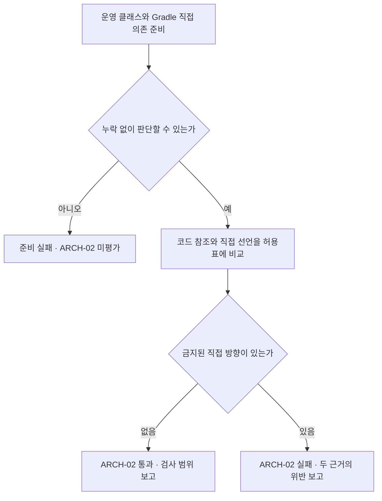

# 구조 검사 명세 — #19 · ARCH-08 상세 설계

대상: [#19 공통 구조 검사 기반 구현 및 명세 v1 적용](https://github.com/0Chord/coin-exchange/issues/19). 기준: PR #28이 병합된 통합 브랜치 `feature/phase-2/integration`의 **`db26dfcead285df9e713087d3bbba5bca0829f3f`**. 확인일: 2026-09-26.

**상태: 합의한 ARCH-08 로컬 구현·검증 완료.** 최종 전체 build에서 구조 검사 156개를 실제 실행해 실패·오류·skip 없이 통과했다. 기존 제품 테스트는 해당 build에서 UP-TO-DATE 결과를 재사용했다. 실행 당시 변경 스냅샷의 소스 해시와 명령·결과는 [검증 기록](architecture-08-verification.json)에 남긴다. 외부 테스트 도구도 명시 목록으로 검사한다는 합의를 반영했다. 기존 ARCH-01·02·06의 기록은 뒤쪽에 보존한다. [구현 흐름과 실제 코드](architecture-08-review.md)를 함께 읽을 수 있다.

## ARCH-08 · 먼저 읽을 핵심

**운영 코드가 테스트·벤치마크 코드 없이도 독립적으로 구성되는지 검사한다.** 두 근거를 함께 본다. 실제 코드에 남은 참조와, 아직 코드에서 사용하지 않아도 Gradle에 추가한 직접 의존이다.

| 사례 | 결과 | 이유 |
| --- | --- | --- |
| 주문 처리 코드가 도메인 값 사용 | ARCH-08 허용 | 운영 코드끼리의 방향은 ARCH-02가 별도로 검사 |
| 테스트 또는 JMH가 매칭 엔진 사용 | 검사 출발점에서 제외 | 제품을 검증·측정하기 위한 정상 방향 |
| 운영 코드가 테스트 도우미 또는 JMH 타입 사용 | ARCH-08 위반 | 제품이 검증·측정 코드에 기대게 됨 |
| 운영 `runtimeOnly`에 테스트 도구 추가, 코드 사용은 없음 | ARCH-08 위반 | 실행 의존에 테스트 도구를 넣은 사실도 검사 |
| 입력 목록이 빠지거나 참조 대상의 내부 소속이 불명 | 준비 실패 | 확인하지 못한 것을 위반 0건으로 표시하지 않음 |

**이번 PR의 한 결과:** 운영 여섯 모듈에 ARCH-08을 적용하고, 정상·위반·누락 예제와 실제 검사 결과를 연결한다. #19 전체 종료, 이름·폴더 이동, 거래 동작 변경은 포함하지 않는다.

## 허용·금지와 검사 범위

여기서 **main**은 제품 실행 코드, **소스셋**은 main/test처럼 용도별로 나눈 코드 묶음, **fixture**는 테스트가 재사용하는 준비 데이터·도우미 코드다. **Gradle 선언**은 이 코드가 사용할 프로젝트나 라이브러리를 빌드 설정에 적은 것이다.

- **출발점:** `domain-common`, `domain-fee`, `domain-order`, `domain-ledger`, `domain-matching`, `app-api`의 main 클래스 전체 및 main 컴파일·런타임 구성. 포트·실행기·설정·인프라도 제외하지 않는다.
- **금지 목적지:** 비운영 등록 `architecture-tests`, `benchmark-jmh`의 출력, 각 프로젝트의 main 이외 소스셋 출력(test, testFixtures, jmh 등), 아래 명시한 테스트 도구. 이름에 Test/Fixture가 있다는 이유만으로 판정하지 않는다.
- **허용:** 테스트/JMH의 운영 코드 사용, `testImplementation`·`testRuntimeOnly` 같은 테스트 전용 구성, JDK/Kotlin 일반 값과 운영 라이브러리. 단, 테스트 이름의 구성을 main이 상속하면 main 의존으로 검사한다.
- **직접성:** 바이트코드에 남은 직접 참조와 main 구성에 직접 추가되거나 구성 상속으로 포함된 선언을 검사한다. 다른 라이브러리의 모든 전이 의존을 운영 코드의 직접 선언으로 펼치지 않는다.
- **보존:** ARCH-01·02·06의 정책, 운영 대상 누락·중복·오염 거절, DB 없이 실행하는 독립 구조 검사 명령, 기존 테스트/벤치마크의 정상 사용.

### 합의한 외부 테스트 도구 정책

버전 문자열과 관계없이 다음 **구체 정책**으로 판정한다. `org.springframework.*`·`org.jetbrains.kotlin:*` 전체나 이름에 `test`가 들어간 모든 라이브러리를 금지하지 않는다. 새 도구는 사용 목적·허용 반대 사례와 함께 목록을 갱신한다. 목록 밖을 안전하다고 인증하지 않는다.

| 도구 | 바이트코드 타입 접두사 | Gradle 직접 의존 좌표 |
| --- | --- | --- |
| JUnit | `org.junit.`, `junit.` | `org.junit.jupiter:*`, `org.junit.platform:*`, `org.junit.vintage:*`, `junit:junit` |
| Kotlin Test | `kotlin.test.` | `org.jetbrains.kotlin:kotlin-test`, 같은 group의 `kotlin-test-*` |
| Testcontainers | `org.testcontainers.` | `org.testcontainers:*` |
| JMH | `org.openjdk.jmh.` | `org.openjdk.jmh:*` |
| ArchUnit | `com.tngtech.archunit.` | `com.tngtech.archunit:*` |
| Spring 테스트 지원 | `org.springframework.test.`, `org.springframework.boot.test.`, `org.springframework.boot.testcontainers.`, 현재 사용하는 `org.springframework.boot.data.jpa.test.`, `org.springframework.boot.jdbc.test.` | `org.springframework:spring-test`; Boot 목록은 아래 참조 |

Boot의 group은 `org.springframework.boot`로 한정한다. 초기 artifact 목록은 `spring-boot-test`, `spring-boot-test-autoconfigure`, `spring-boot-testcontainers`, `spring-boot-starter-actuator-test`, `spring-boot-starter-data-jpa-test`, `spring-boot-starter-kafka-test`, `spring-boot-starter-validation-test`, `spring-boot-starter-webmvc-test`, `spring-boot-starter-websocket-test`다. 기존 빌드에서 사용하는 테스트 starter와 직접 사용하는 테스트 API를 근거로 정했다. 다른 Boot 테스트 모듈의 직접 사용은 도입 시 목록을 보완한다.

의존 제약(constraint)과 버전만 관리하는 BOM은 런타임 도구 추가와 구분한다. 테스트 fixture를 명시적으로 선택한 의존은 원래 운영 프로젝트/라이브러리라도 금지한다. 외부 라이브러리의 재포장·음영 처리나 모든 테스트 도구를 자동 식별하는 기능은 아니다.

## 입력 → 판단 → 통과·실패 보고

1. **Gradle이 자료 전달:** 실제 프로젝트·운영/비운영 등록, main 클래스 출력, 소스셋별 출력 위치, main compile/runtime 직접 의존 기록을 전달한다. 구성에 의존이 0개여도 구성 기록은 있어야 한다.
2. **입력 확인:** 기존 운영 수집을 유지하고, 금지 목적지를 구분할 보조 목록을 따로 확인한다. 테스트 클래스를 운영 검사 대상으로 합치지 않는다. 목록 누락·손상·소속 모호함은 준비 실패다.
3. **코드 참조 판단:** 각 운영 클래스의 직접 참조를 실제 출력 소속 또는 명시한 외부 타입 정책과 비교한다. 인자·반환·필드·상속·어노테이션·호출·생성 코드 등에 남은 참조를 검사한다. 본문이나 테스트를 실행하지 않는다.
4. **Gradle 선언 판단:** main에 보이는 직접 선언 중 비운영 프로젝트, 테스트 fixture 선택, 명시된 외부 테스트 도구를 찾는다. 미사용 `compileOnly`·`runtimeOnly`와 상속 구성도 포함한다.
5. **한 결과로 보고:** 필요한 입력이 모두 준비되어야 ARCH-08을 평가한다. 한쪽 준비가 실패하면 전체 미평가이며 부분 위반 목록을 최종 판정으로 내지 않는다. 준비가 정상이고 금지 의존이 있으면 위반, 없으면 이번 범위에서 통과다.

| 결과 | 보여줄 내용 |
| --- | --- |
| 준비 실패 | `ARCH-08 미평가`, 자료 종류·누락/충돌/읽기 실패 대상·이유. Gradle 컴파일/해석 자체 실패는 검사 전 실패로 구분 |
| 규칙 위반 | `ARCH-08`, 코드/Gradle 근거 구분, 출발 모듈·타입/구성, 금지 대상·목적지 소속/도구, 가능한 소스 파일·행, 명세 링크 |
| 통과 | 운영 모듈·클래스 수, 확인한 소스셋/출력 상태, main 구성 수, 조사한 참조·선언 수, 위반 0, 미검증 범위 |

코드 참조와 Gradle 선언은 같은 모듈을 가리켜도 근거가 다르므로 둘 다 남긴다. 한 Gradle 선언이 compile/runtime 양쪽에 보이면 한 진단에 두 근거를 보존한다. 정렬과 중복 제거는 입력 순서에 영향받지 않으며, 위치가 없으면 `행 정보 없음`으로 표시한다.

<details markdown="1">
<summary>구현 담당자를 위한 기존 코드·자료 수집·책임 경계</summary>

### 설계 때 확인한 기존 코드와 이번 연결

- [ProductionScope](../architecture-tests/src/test/kotlin/com/exchange/architecture/support/ProductionScope.kt): 운영 6개 모듈과 비운영 모듈 등록, 필수 역할, 금지 출력 입력을 제공한다.
- [빌드 연결](../architecture-tests/build.gradle.kts): main의 classes만 선행한다. 기존 forbiddenOutputs를 유지하고 `isolation-inputs.gradle.kts`가 모듈·소스셋 소속과 파일 입력을 추가한다.
- [ProductionScopeImporter](../architecture-tests/src/test/kotlin/com/exchange/architecture/support/ProductionScopeImporter.kt): 운영 파일 목록/읽기 결과를 대조하고 내부 참조 정의가 운영 출력 또는 검증된 비운영 목적지에 없으면 `UNRESOLVED_PROJECT_TYPE`으로 거절한다.
- [기존 Gradle 수집](../architecture-tests/gradle/project-dependencies.gradle.kts): main compile/runtime의 구성 상속에서 ProjectDependency만 기록한다. 기존 형식을 보존하며 추가 `isolation-inputs.gradle.kts`에서 외부 좌표와 fixture 선택 정보를 전달한다. 일반 main과 fixture가 같은 프로젝트를 가리키면 ARCH-02에는 방향 근거를 한 번만 전달하고 ARCH-08에는 선택 차이를 보존한다.
- [ModuleDependencyDirection](../architecture-tests/src/test/kotlin/com/exchange/architecture/rules/ModuleDependencyDirection.kt): Gradle 비운영 목적지는 ARCH-02 평가에서 제외한다. 확인된 비운영 목적지는 바이트코드 방향 검사에서도 P04에 맡기고, 미확인 내부 타입은 계속 준비 오류다.
- [ProductionArchitectureTest](../architecture-tests/src/test/kotlin/com/exchange/architecture/ProductionArchitectureTest.kt): 이번에 독립 P04를 추가했다. 기존 P01·P02·P03도 검증된 비운영 목록을 함께 준비한다.

### 구현 배치와 재사용

아래 파일을 구현했다. `rules/ProductionDependencyIsolation.kt`에서 ARCH-08 판정/진단, `support/NonProductionTargets.kt`에서 비운영 출력의 소속 자료를 맡긴다. 계약 예제는 `ProductionDependencyIsolationTest`, 실제 적용은 기존 테스트 클래스의 독립 **P04**로 나눈다. 별도 검사 프레임워크나 실행 앱은 만들지 않는다.

`ProjectDependencies`의 현재 ARCH02/1 입력은 유지하고, 같은 Gradle 수집 경로에서 ARCH-08용 추가 정보(외부 좌표·fixture 선택·대상 구성·출력 소속)를 전달한다. 양쪽이 공유하는 구성/등록 검증은 중복 판정이 생기지 않는 범위에서 재사용한다. 기존 ARCH-02 사례와 진단이 바뀌면 회귀로 확인한다. 임의로 모든 의존을 해석된 전이 목록으로 교체하지 않는다.

### 출력 소속과 읽기 실패

- Gradle이 발견한 프로젝트/소스셋 전체의 메타데이터에서 기대 목록을 만든다. 실제 전달된 목록과 대조한다. 각 기록은 프로젝트 경로·소스셋·컴파일 출력 경로를 보존한다. 새 소스셋의 등록 누락을 기존 목록만으로 검사하지 않는다.
- 비운영 출력의 기존 `.class` 파일은 이름과 원래 소속을 확인하는 보조 목록으로만 읽는다. ArchUnit의 운영 클래스 집합이나 역할 집합에 섞지 않는다. 클래스 파일 이름 추출·경로 정규화 방식은 기존 수집기와 맞춘다.
- 출력 경로 기록 자체가 없는 경우와, 정상 등록됐지만 아직 컴파일되지 않아 디렉터리가 없는 경우는 다르다. 참조하지 않는 test/JMH 출력이 비어 있거나 미생성인 것은 허용하고 상태를 보고한다. 모든 테스트/JMH 컴파일을 검사 선행 조건으로 추가하지 않는다.
- 운영 참조의 실제 정의를 보조 목록으로 확인하면 비운영 목적지로 판정한다. 파일을 못 읽거나 필요한 내부 참조 정의를 찾지 못하면 준비 실패다. 이름이 `Helper`여도 실제 test 출력이면 금지하고, 이름이 `TestValue`여도 main의 정상 값이면 금지하지 않는다.
- 운영과 비운영 출력 사이에 같은 타입 이름이 충돌하여 참조 목적지 소속을 유일하게 정할 수 없으면 준비 실패다. 경로 별칭만 다른 동일 파일은 정규화한다. 깨진 클래스 파일·소속 모순·금지 출력의 운영 혼입은 실패를 유지한다.
- **기존 누락 검사와 연결:** 사전에 검증된 비운영 목적지의 정확한 타입 이름만 별도 인식한다. 그 참조는 P04의 ARCH-08 위반으로 보내고 P02의 운영 모듈 방향 대상으로 세지 않는다. 이름 접두사 전체를 내부 누락 검사에서 빼거나 `UNRESOLVED_PROJECT_TYPE` 오류를 나중에 문자열로 지우지 않는다. 확인되지 않은 내부 참조는 계속 실패시킨다. 보조 자료가 잘못되면 기존 규칙에도 불완전한 면제 목록을 전달하지 않는다.
- 소스셋 목록·경로 및 읽은 클래스 파일은 Gradle 작업 입력으로 추적한다. 파일 생성/삭제·내용 변경 시 이전 검사 결과를 재사용하지 않아야 한다. 같은 빌드에서 출력 생산 작업도 선택되면 `mustRunAfter`로 먼저 끝내고 읽는다. 이 순서 제약은 독립 검사에 그 컴파일을 추가하지 않는다. 경로의 존재 여부나 파일 개수만 입력으로 삼지 않는다.

보조 목록에 없는 외부 네임스페이스의 임의 복사본/파일 의존까지 자동으로 프로젝트 테스트 코드라고 추정하지 않는다. 현재 프로젝트 내부 접두사 `com.exchange.core.`·`com.exchange.architecture.`를 바꿀 때는 수집 정책도 갱신한다. 원본 출력 밖으로 복사·재포장된 임의 테스트 코드는 전수 탐지 보장 밖이다.

### Gradle 선언의 세부 경계

- 기존 두 main 구성의 hierarchy를 재사용한다. `implementation`, `api`, `compileOnly`, `runtimeOnly`, main이 상속한 사용자 구성과 지연 선언을 포함한다. 순수 테스트 구성은 main에 연결되지 않으면 제외한다.
- 프로젝트 경로를 끝 이름으로 축약하지 않는다. 미등록 프로젝트·구성 누락/중복·손상된 전달 형식은 준비 실패다. 외부 의존의 필수 group/name 누락도 조용히 건너뛰지 않는다.
- `testFixtures(project(...))`와 외부 모듈의 명시적인 test-fixtures 선택은 일반 main 의존과 구분한다. capability/targetConfiguration/명시적 artifact 및 attribute 선택 근거를 보존한다. 알려진 일반 JVM 운영 속성 외의 명시적 프로젝트 선택은 미지원으로 거절하며, 실제 Gradle 예제로 일반 java-api 속성과 사용자 속성의 차이를 확인한다. 표준 fixture 선택을 정확히 판별하는 API는 Gradle 9.5.1 실제 모델로 확인한다. 이름에 test가 들어간 사용자 구성은 자동으로 fixture라고 단정하지 않는다.
- 현재 코드에 없는 임의 사용자 variant·파일 의존·composite/included build·dependency substitution 전체의 지원은 약속하지 않는다. 지원하지 않는 명시적 project variant 선택이 발견되면 준수라고 표시하지 않고 미지원 선택의 준비 실패로 남긴다. 일반 운영 variant와 명시한 표준 test-fixtures는 수용 사례에서 구분한다.
- 지연 기본 의존은 해석 전후 차이와 명시 선언 우선 사례를 실제 Gradle로 확인한다. 강제 해석을 통해 없던 선언을 새로 만든 결과나, 아직 해석되지 않은 상태를 완전한 런타임 의존 감사라고 주장하지 않는다. 전이 의존·BOM·constraint·빌드 플러그인·annotation processor 전체 감사는 제외한다.

Gradle 공식 문서는 [test fixture의 소스셋·별도 선택](https://docs.gradle.org/current/userguide/java_testing.html#sec:java_test_fixtures)과 [ModuleDependency의 선택 정보](https://docs.gradle.org/current/javadoc/org/gradle/api/artifacts/ModuleDependency.html)를 설명한다. 조회된 온라인 문서는 9.8.0이며, 저장소 wrapper는 9.5.1이다. 로컬 9.5.1의 `ModuleDependency.getCapabilitySelectors`·`getRequestedCapabilities`·`getTargetConfiguration` 존재는 javap로 확인했다. 구현 중 실제 9.5.1 프로젝트에서 일반 의존과 프로젝트/외부 testFixtures의 capability 차이를 실행 확인했다. 실제 스크립트를 쓰는 `IsolationGradleWiringTest`가 회귀 근거다.

</details>

## 정상·위반·누락 수용 사례

아래 번호는 명세 연결용이며 테스트 개수/실행 결과가 아니다. 위반 예제는 정확한 위반을 검출해야 테스트가 통과하고, 실제 운영 위반은 P04를 실패시킨다. 기대값은 이 표와 별도 예제에서 정하며 검사기의 금지 목록을 그대로 복사하지 않는다.

| ID | 입력 | 기대값과 근거 |
| --- | --- | --- |
| NP-01 정상 방향 | 운영→운영 값, test/JMH→운영 엔진, 같은 패키지의 main 값 | ARCH-08 위반 0. 비운영은 출발점 제외; 다른 규칙의 허용까지 뜻하지 않음 |
| NP-02 프로젝트 테스트 참조 | 운영→다른/같은 모듈 test 도우미 또는 benchmark 출력 타입 | 출발 타입·목적지 모듈/소스셋을 담은 정확한 위반. 이름·패키지 대신 출력 소속 |
| NP-03 외부 도구 참조 | 운영의 JUnit 어노테이션, Kotlin Test 호출, Testcontainers 필드, JMH 타입, ArchUnit 타입, 명시 Spring 테스트 API | 해당 타입의 ARCH-08 위반. JDK/Kotlin 일반 타입·운영 Spring/Jackson은 ARCH-08 정상 |
| NP-04 참조 형태 | 인자·반환·배열/제네릭·상속·어노테이션·본문 호출·람다/파일 파사드·메서드 참조 | 실제 바이트코드에 남은 직접 의존을 놓치지 않음. 없어진 표현을 탐지했다고 주장하지 않음 |
| NP-05 비운영 프로젝트 선언 | 코드 사용 없이 main에 architecture-tests/benchmark 프로젝트 의존 추가 | Gradle 근거의 위반. compileOnly/runtimeOnly/상속 구성 각각 확인 |
| NP-06 외부 도구 선언 | 코드 사용 없이 main에 금지 좌표 추가; 버전만 다르게 추가 | 동일 정책 위반. 일반 kotlin-stdlib/운영 starter·버전 제약/BOM 대조는 위반 아님 |
| NP-07 테스트 전용 구성 | testImplementation/testRuntimeOnly에서 같은 도구/fixture 사용 | 위반 0. 단 main이 그 구성을 상속하면 위반 |
| NP-08 fixture 선택 | 운영→허용 운영 프로젝트의 testFixtures; 일반 main 의존 대조; 외부 test-fixtures 선택 | fixture 선택만 위반. 목적지 프로젝트가 운영이라고 통과시키지 않음 |
| NP-09 빈 값과 누락 | 의존 0인 main 구성 vs 기록 누락; 미생성 비운영 출력 vs 출력 메타데이터 누락 | 전자는 정상, 후자는 준비 실패. 운영 입력이 비면 계속 준비 실패 |
| NP-10 소속/정의 실패 | 새 미등록 프로젝트, 미해석 내부 참조, 실제 필요한 비운영 정의 누락, 손상 클래스, 중복 소속 | 전체 미평가·원인 표시·최종 위반 목록 비움. 알려진 비운영만 정확히 구분 |
| NP-11 기존 수집 경계 | 운영 출력에 테스트 파일/금지 상위 폴더 혼입; 역할 누락; 미등록 내부 타입 | 기존 준비 실패 유지. 새 ARCH-08 연결이 예외 통로가 되지 않음 |
| NP-12 같은 이름의 반대 사례 | main의 TestValue, test의 Helper, 경로 별칭, 운영/비운영 동일 타입 소속 충돌 | 이름만으로 오탐 금지; 실제 test 소속 위반; 별칭 중복 정규화; 모호한 소속은 실패 |
| NP-13 보고/결합 | 코드·Gradle 위반 동시 존재, 같은 선언의 compile/runtime 노출, 입력 순서 반전 | 두 근거 보존·동일 선언 중복 제거·안정된 정렬. 한 입력 준비 실패 시 전체 미평가 |
| NP-14 실제 Gradle 연결 | 선언/fixture 선택·소스셋 추가 및 클래스 내용/존재 변경, 지연 의존 해석 전후 | 실제 수집기 출력과 작업 입력 변경을 확인. 불변 입력은 재사용 가능, 변경은 재평가 |
| NP-15 작업 독립성 | 깨끗한 최소 빌드와 test/JMH 출력이 있는 빌드; 독립 명령 dry-run | 정상 입력의 판정 일관성. 다른 제품 test·JMH 실행·서버/DB/Docker를 추가 선행하지 않음 |
| NP-16 P04 운영 적용 | 현재 등록된 운영 전체의 코드+Gradle 입력 | 준비 오류 0·위반 0을 목표로 실제 확인. 수/내용은 실행에서 기록하며 이번 문서에 추정 통과 수를 쓰지 않음 |

NP-14는 테스트용 문자열로 Gradle 출력을 흉내 낸 결과만으로 끝내지 않는다. NP-04는 대표 실제 Kotlin 컴파일 예제를 사용하고 직접 참조가 존재하는지와 최종 진단을 함께 확인한다. 모든 JVM 생성 표현의 지원을 뜻하지 않는다.

## 작은 구현 순서와 기술 확인

| 단위 | 사용자가 확인할 작은 결과 | 검증 입력 |
| --- | --- | --- |
| 1. 자료 구분 | 운영 클래스와 비운영 목적지 자료를 섞지 않고, 알려진 비운영 참조와 진짜 누락을 구분 | NP-02, 09–12, 15 |
| 2. 코드 검사 | 정상 값은 통과하고 테스트/JMH·명시 도구 참조는 자리와 이유를 보고 | NP-01–04, 12–13 |
| 3. 선언 검사 | 코드에 쓰지 않은 main 테스트 의존·fixture 선택도 거절, 테스트 구성은 허용 | NP-05–08, 13–14 |
| 4. 운영 적용 | 독립 P04와 기존 check/build 연결, 이전 규칙 회귀·보고 확인 | NP-15–16 + ARCH-01·02·06 |

각 단위에서 테스트 작성 → 기대값 검토 → 구현 → 실행 검증을 이어간다. 자료 구분에 앞서 필요한 작은 기술 확인은 **실제 Gradle 9.5.1에서 일반 project와 testFixtures(project)의 선택 정보가 구별되는가**다. 성공 기준은 두 선언의 원래 프로젝트 경로를 유지하면서 fixture 선택만 식별하는 것. 보조 출력 입력 추적은 파일 생성/삭제와 내용만 바꾼 경우 모두 작업 재평가되는지가 성공 기준이다. 이 실험과 실제 Gradle 통합 검사를 실행해 표준 fixture의 구분 및 출력 내용/존재 변경 추적을 확인했다. 이름 추측·광범위한 면제로 대신하지 않았다. 일반 코드 참조와 기존 비운영 프로젝트 선언 검사는 이 실험과 독립적으로 명세화돼 있다.

## 이번 PR의 완료 기준과 제외

- [x] NP-01–16에 대응하는 정상·위반·누락 근거와 구현/테스트 위치를 연결한다. 필요한 Red는 기대 결과 불일치여야 하며 컴파일/환경 실패와 구분한다.
- [x] 두 입력을 같은 ARCH-08 계약으로 검사하고 P04는 다른 테스트 실행 순서에 의존하지 않는다. 준비 실패가 정상 통과로 바뀌지 않는다.
- [x] 등록/수집/역할 검사와 ARCH-01·02·06 회귀를 유지한다. 비운영 분류 추가가 미확인 내부 참조를 숨기지 않는다.
- [x] 독립 명령의 정상 실행과 작업 연결을 확인한다. 운영 코드의 고의 위반이나 예외 묵살을 남기지 않는다.
- [x] 실행 커밋·실행/미실행 명령·결과·한계를 남긴다. HTML에서 정상·위반·준비 실패 각 하나를 입력부터 결과까지 설명한다.
- [x] PR·CI·독립 리뷰·통합 결과는 실제 확인된 범위로 기록한다. #19의 ARCH-03/04/05 예제 검증과 후속 티켓을 남긴다.

실행 명령: `./gradlew :architecture-tests:test --no-daemon --console=plain --rerun-tasks`, 작업 연결 확인용 `--dry-run`. 회귀 확인은 `./gradlew build --no-daemon --continue --console=plain`이며 전체 빌드의 기존 Testcontainers/Docker 요구와 독립 구조 검사를 구분한다. HTML/XML 보고서 위치는 기존 `architecture-tests/build/reports/tests/test/index.html`, `architecture-tests/build/test-results/test/`를 유지한다. 구조 검사 재실행, 전체 build, 독립 작업 dry-run을 완료했다. P04 단독 실행도 확인했다. [검증 기록](architecture-08-verification.json)에 명령·집계·원본 코드 해시를 연결했다. 기본 테스트 보고서는 마지막 P04 단독 실행 결과이며 전체 156개 실행 보고서는 `/private/tmp/arch08-implementation/full-build-report/index.html`에 별도로 보존했다.

제외: 이름·폴더 이동, ARCH-03–05/07, SQL·거래·동시성·실행 순서 변경, CI/브랜치 보호 정책 변경, 모든 전이 라이브러리/파일 의존 감사, 리플렉션·문자열 로딩·서비스 로딩·재포장 코드의 전수 추적, 테스트 실행이나 테스트 품질의 증명. 기존 일반 라이브러리·Kotlin/JDK 전체를 금지하지 않는다.

## 합의와 구현 인계

- **합의:** 외부 테스트 도구도 현재 사용에 근거한 명시 정책으로 포함한다. 테스트/벤치마크의 정상 사용은 유지한다.
- **반영한 구조:** 보조 목적지 자료·추가 Gradle 정보·독립 P04와 네 구현 단위. 전체 제품이나 #19를 다시 설계하지 않았다.
- **확인한 기술:** Gradle 9.5.1의 실제 fixture 선택, 소스셋/파일 내용/존재 변경에 따른 재실행, 지연 기본 의존의 해석 전후 차이와 명시 선언 우선. 수집이 완전한 런타임 의존 감사라고 확대하지 않는다.
- **사실 확인:** 병합 통합 커밋 db26dfc, 기존 코드·테스트·빌드의 현재 책임, 로컬 API 선언. 기존 통합 CI도 성공 확인했지만 ARCH-08 통과 증거는 아니다.
- **진행 상태:** 사용자 구현 요청에 따라 테스트 작성·기대값 검토·구현·검증과 HTML 설명을 완료했다. PR 게시를 위한 변경과 검증 근거를 준비했다. 원격 CI·독립 리뷰·병합의 최신 상태는 PR에서 확인한다. 원격 이슈/보드 상태는 변경하지 않았다.

## 수용 사례와 실제 근거 연결

| 명세 | 구현·테스트 근거 | 확인한 경계 |
| --- | --- | --- |
| NP-01 | ProductionDependencyIsolationTest의 TestValue·운영 Spring 허용, NonProductionTargets 및 P04 | main만 출발점이며 비운영은 목적지 목록 |
| NP-02 | 같은 테스트의 Helper 소속·벤치마크 소속 사례 | 출력의 실제 소속으로 판정 |
| NP-03–04 | 같은 테스트의 실제 외부 도구 및 상속·배열·제네릭·파일 파사드·생성 클래스 사례 | 실제 컴파일된 직접 의존과 위반을 대조 |
| NP-05–08 | IsolationDependencyContractTest, IsolationGradleWiringTest | main compile/runtime·상속·fixture 선택·BOM/constraint와 테스트 전용 구성 구분 |
| NP-09–10 | NonProductionTargetsTest, IsolationDependencyContractTest, 기존 ModuleRegistrationContractTest | 빈 값·미생성과 누락·손상·등록 실패 구분 |
| NP-11–12 | ImportScopeContractTest 전체 회귀, NonProductionTargetsTest, ProductionDependencyIsolationTest | 기존 오염·역할 누락 검사 유지, 정확한 이름만 인식, 소속 충돌 거절 |
| NP-13 | ProductionDependencyIsolationTest의 결합 사례, IsolationDependencyContractTest의 역순·중복 근거 | 두 근거 보존, 정렬, 준비 실패 시 최종 위반 목록 비움 |
| NP-14 | IsolationGradleWiringTest 4개와 기존 GradleDependencyWiringTest 4개 | 실제 Gradle, 신규 소스셋, 파일 생성/내용/삭제, 지연 선언과 명시 선언 우선 |
| NP-15 | 최소 Gradle 통합 예제의 미생성/빈/실제 출력, 독립 명령 dry-run | 다른 제품 test/JMH 컴파일·실행 선행 없음 |
| NP-16 | ProductionArchitectureTest.P04 | 운영 6개 모듈·113개 클래스, main 구성 12개에 적용 |

구현은 `ProductionDependencyIsolation`, `TestToolPolicy`, `NonProductionTargets`, `IsolationInputs`, `isolation-inputs.gradle.kts`에 연결된다. ARCH-02/08의 main 구성 누락 기준은 `DependencyInputValidation`에서 공유한다. 실행 기록은 `architecture-08-verification.json`, 사람이 읽는 정상·위반·준비 실패 흐름은 `architecture-08-review.md`에 남긴다.

<!-- ARCH06_HISTORY_START -->

# 구조 검사 명세 — #19 · ARCH-06 상세 설계

대상: [#19 공통 구조 검사 기반 구현 및 명세 v1 적용](https://github.com/0Chord/coin-exchange/issues/19). 설계 기준: 통합 브랜치 `feature/phase-2/integration`의 **`d31e0fc0592a8422f8dc4801c5d17b2825a2d48e`**, [PR #27](https://github.com/0Chord/coin-exchange/pull/27) 병합 후 상태. 확인일: 2026-09-26.

합의한 상세 설계로 구현했다. 앞선 누락 두 건과 후속 P3(타입 변수 선언 범위 혼동)을 보완했다. 상위 인터페이스 static 제외 합의도 적용했다. 공개 inner의 바깥 타입 변수 누락도 보완했다. **구조 129개 통과, 전체 build 성공**. 변경 없는 제품 테스트는 기존 통과 결과를 UP-TO-DATE로 재사용했다. ARCH-06 로컬 실행과 PR·CI·독립 리뷰·사람의 코드 검토 상태는 구분한다. [실제 구현 흐름과 실행 근거](architecture-06-review.md)를 함께 본다. ARCH-01·02 완료 기록은 이 파일 뒤쪽에 보존한다.

## ARCH-06 · 먼저 읽을 핵심

**“저장·발행을 요청할 때 DB나 Spring 타입까지 알아야 하는가?”를 검사한다.** 포트는 애플리케이션이 외부 작업을 요청하는 인터페이스다. 이 인터페이스의 인자·반환값 등에 기술이 새어 나오면 실패시킨다.

| 예 | 추천하는 결과 | 이유 |
| --- | --- | --- |
| `reserve(...): Balance` | 허용 | 호출자는 도메인의 잔고 값만 받는다. |
| `append(events: List<MatchingEvent>)` | 허용 | 목록 안의 값도 도메인 이벤트다. |
| 포트가 `Connection`이나 `List<MatchingEventEntity>`를 반환 | ARCH-06 위반 | 호출자가 DB 연결이나 영속 모델을 알아야 한다. 목록으로 감싸도 같다. |
| `JpaMatchingEventStore` 내부에서 엔티티·Spring Data 사용 | ARCH-06 검사 밖 | 저장 구현이 기술을 사용하는 것은 의도한 설계다. |

흐름은 **등록된 포트 찾기 → 외부에 드러나는 타입 읽기 → 금지 타입과 비교 → 통과·위반·준비 실패 보고**다. DB에 연결하거나 포트 메서드를 실행하지 않는다.

## 확인한 코드와 유지할 계약

| 구분 | 사실·합의·추천안 |
| --- | --- |
| 확인한 사실 | `ProductionScope.roles.externalPorts`에 아래 5개 인터페이스가 등록돼 있다. 현재 선언은 도메인 값·이벤트·목록·Unit을 사용한다. P03에서도 이 5개 포트·공개 계약 11개에 같은 규칙을 적용해 준비 오류·위반 0건을 확인했다. |
| 기존 합의 | 도메인에 포트 선언을 둘 수 있다. 순수 도메인의 실제 포트 호출은 ARCH-01, 모듈 방향은 ARCH-02가 검사한다. |
| 유지할 구현 | `UPDATE … RETURNING`, DB 원자적 갱신, 불변 객체 반환, 주문장·실행기, HTTP 계약과 폴더 배치를 변경하지 않는다. |
| 현재 구현 | 기존 수집기와 명시적 포트 등록을 재사용한다. 포트 계약만 검사하고, 영속 타입은 등록과 실제 JPA 표식으로 식별한다. |
| 실행으로 확인한 범위 | Kotlin 프로퍼티·제네릭·중첩 계약, Java 와일드카드·상한·브리지, 내부/외부 상위 계약의 누락과 허용 사례를 실행했다. 모든 JVM 표현의 지원을 뜻하지 않는다. |

| 현재 대상 | 실제 선언·소속 | 확인한 요청과 결과 |
| --- | --- | --- |
| `OrderReservationStore` | `domain-order` · `com.exchange.core.order` | 예약 생성·조회·갱신. `OrderReservation`, 식별자, nullable 조회 결과 |
| `BalanceStore` | `domain-ledger` · `com.exchange.core.ledger` | reserve/release/consumeHold/credit. `Amount`·식별자를 받고 `Balance` 반환 |
| `LedgerTransactionStore` | `domain-ledger` · `com.exchange.core.ledger` | 검증된 `LedgerTransaction` 추가 |
| `MatchingEventStore` | `app-api` · `com.exchange.core.api.matching.persistence` | `List<MatchingEvent>` 저장 |
| `MatchingEventPublisher` | `app-api` · `com.exchange.core.api.matching.publish` | `List<MatchingEvent>` 발행 |

실제 정의: [포트 등록](../architecture-tests/src/test/kotlin/com/exchange/architecture/support/ProductionScope.kt), [잔고 포트](../domain-ledger/src/main/kotlin/com/exchange/core/ledger/BalanceStore.kt), [매칭 저장 포트](../app-api/src/main/kotlin/com/exchange/core/api/matching/persistence/MatchingEventStore.kt), [JPA 저장 구현](../app-api/src/main/kotlin/com/exchange/core/api/matching/persistence/JpaMatchingEventStore.kt), [Spring Data 인터페이스](../app-api/src/main/kotlin/com/exchange/core/api/matching/persistence/MatchingEventRepository.kt).

`MatchingEventRepository : JpaRepository<MatchingEventEntity, Long>`는 저장 구현 내부의 기술 도구다. 이름에 Repository가 붙었다고 외부 포트로 등록하지 않는다. 반대로 `MatchingEventStore`는 지금 `persistence` 패키지에 있지만 포트다. 패키지 이름으로 일괄 제외하면 이 대상을 놓친다.

## 허용·금지와 검사 범위

**포트의 공개 계약에 나타난 타입**을 검사한다. 함수 본문 전체의 의존을 읽는 ARCH-01 규칙을 그대로 포트에 적용하지 않는다.

| 검사하는 자리 | 경계 |
| --- | --- |
| 인자·반환값 | 선언한 공개 메서드와 상속받아 제공하는 메서드. 상위 인터페이스의 static은 제외하고, 검사 대상 자신의 static과 상속한 일반/default 메서드는 포함한다. Kotlin의 `val`/`var`도 getter·setter 계약으로 검사 |
| 공개 필드·상속 선언 | 노출된 필드와 상위 인터페이스 타입. 내부 공통 인터페이스의 계약까지 읽는다. |
| 타입 안의 타입 | `List<Entity>`, `Map<String, List<Entity>>`, 배열 원소, 와일드카드의 상·하한, 타입 변수의 모든 상한, 상속 선언의 타입 인자, `Owner<Connection>.Member<String>`의 소유 타입 인자. `List`만 보고 멈추지 않는다. |
| 직접 붙은 기술 어노테이션·선언 예외 | 포트·검사 대상 멤버·인자에 바이트코드로 남은 기술 어노테이션 및 throws 타입. 주석의 `@throws` 문장은 분석하지 않는다. |

초기 금지 정책은 다음으로 명시한다. **이 목록 밖의 모든 외부 라이브러리가 안전하다는 인증은 아니다.** 새 기술 도입 시 정책·반대 사례를 같이 검토한다.

- **기존 기술 목록 재사용:** `DomainTechnologyIndependence`에 있는 Spring, Jakarta/Javax Persistence, JDBC, HTTP·명시적 네트워크 I/O, Kafka·PostgreSQL·Hibernate 타입 판정. `java.*`나 `kotlin.*` 전체를 막지 않는다.
- **ARCH-06 추가 추천:** 계약에 붙는 `jakarta.transaction.*`·`javax.transaction.*`, 현재 저장 구현의 직렬화 도구인 `tools.jackson.databind.ObjectMapper` 노출도 금지한다. 기존 ARCH-01의 금지 범위까지 함께 확대하지 않는다.
- **영속 타입:** 현재 `com.exchange.core.api.matching.persistence.MatchingEventEntity`를 명시적으로 등록한다. 운영 출력의 `jakarta.persistence`/`javax.persistence`의 `Entity`, `Embeddable`, `MappedSuperclass` 표식이 붙은 타입도 모은다. 새 JPA 타입을 기존 명단 밖이라고 통과시키지 않는다. 등록한 타입의 정의가 없으면 준비 오류다. 비-JPA 영속 모델은 역할을 검토하여 등록한다.
- **허용 반대 사례:** `Balance`, `MatchingEvent`, `String`, 숫자·식별자, `List`/`Map`, `URI`, `Instant`, `Unit`, nullable. `CompletableFuture<Balance>` 자체는 이번 금지 목록에 없고, `CompletableFuture<Entity>`의 Entity는 위반이다. 이는 비동기 API의 설계 적합성을 승인하는 뜻이 아니다.

`Balance`를 만났다고 그 객체의 모든 필드와 호출을 끝없이 따라가지 않는다. **시그니처의 제네릭 내부는 탐색하지만 임의 DTO 내부의 객체 그래프는 펼치지 않는다.** 따라서 `Any`, raw collection, 사용자 DTO에 감춘 영속 객체, 런타임 실제 반환값은 이 규칙만으로 보장하지 못한다. 의미 리뷰·도메인 검사와 구분한다.

## 입력 → 판단 → 통과·실패 보고

1. **입력 준비:** 기존 Gradle 경로로 운영 main 출력을 수집하고 모듈 등록·읽기·역할 오류를 확인한다. 도메인만 읽지 않고 `app-api`의 두 포트도 포함한다.
2. **대상 확인:** 등록된 포트 루트가 모두 실제 인터페이스인지 확인한다. 비어 있는 등록, 사라진 포트, 정의가 없는 영속 타입, 분석에 필요한 상위 계약 누락은 `ARCH-06 미평가 / 준비 실패`다. 읽힌 일부만 통과시키지 않는다.
3. **계약 추출:** 각 포트가 노출하는 멤버와 상위 계약의 타입을 읽고, 배열·제네릭·타입 상한 안쪽을 펼친다. 타입 변수는 선언 범위를 보존한다. 공개 inner 클래스가 사용하는 바깥 변수는 실제 포함 관계를 따라 바깥부터 해석하며, static 중첩에서는 그 탐색을 끊는다. 필요한 바깥 정의가 없으면 준비 실패로 처리한다. 클래스의 `U extends T`를 메서드의 같은 이름 T로 재해석하지 않으며, 메서드가 직접 선언한 T는 그 메서드의 상한을 따른다. 순환하는 제네릭·반복 상속은 재방문을 제한한다. 어떤 루트 포트의 어떤 선언에서 노출됐는지 보존한다.
4. **판단:** 기술 정책 또는 영속 타입에 해당하면 그 노출을 위반으로 기록한다. 기술 타입의 전체 클래스 정의가 없어도 이름으로 금지 여부가 확실하면 위반을 낼 수 있다. 반대로 상위 계약을 읽어야 하는데 그 정의가 불완전하면 추측하지 않고 미평가한다.
5. **보고:** 준비 오류가 없을 때만 위반 0건을 통과로 판정한다. 위반이 있으면 실제 운영 준수 테스트를 실패시킨다. 원본 소스의 행 정보가 없으면 `행 정보 없음`으로 표시한다.

| 결과 | 보여줄 정보 |
| --- | --- |
| 준비 실패 | 문제 단계·포트/타입·이유, `ARCH-06 미평가`. API 해석 불가능과 실제 규칙 위반을 구분 |
| 규칙 위반 | `ARCH-06`, 포트의 실제 모듈·전체 이름, 멤버/상위 선언, 노출 자리, 금지 타입·이유, 가능한 파일·행, 이 명세 링크 |
| 통과 | 검사한 포트 이름·수, 읽은 계약 수, 위반 0건, 제외 범위. 빈 목록을 정상 결과로 표시하지 않음 |

가상 진단 예: “`MatchingEventStore.load` 반환값 `List<MatchingEventEntity>`에 영속 타입이 노출됐습니다. 호출자에게 도메인 값을 반환하도록 계약을 확인하세요.” 현재 코드에 `load`가 있거나 이 위반을 발견했다는 뜻은 아니다.

중복 제거 단위는 **루트 포트 + 선언 멤버 + 노출 자리 + 금지 타입**으로 잡는다. 상속 선언과 메서드처럼 서로 다른 경로는 남기고, 동일 경로를 여러 번 탐색한 결과만 합친다. 보고 순서는 입력 순서와 무관해야 한다.

<details markdown="1">
<summary>구현 담당자를 위한 재사용·Kotlin 경계</summary>

### 기존 기반을 재사용하는 방법

| 기존 부분 | 연결할 책임 |
| --- | --- |
| `ModuleRegistration` / `ProductionScopeImporter` | 기존 등록·운영 출력·누락 검사 유지. 별도 패키지 검색 수집기를 만들지 않음 |
| `ProductionScope` / `RoleClassifier` | `externalPorts`의 명시적 루트를 기준으로 검사. 분류 과정의 생성 중첩 타입을 모두 새 포트로 세지 않음. 영속 타입 등록 추가 |
| `DomainTechnologyIndependence` | 기술 타입 판정 목록만 공통 보조 객체로 추출했다. ARCH-01의 호출 검사·선택 범위·기대 결과는 그대로 유지 |
| `rules/PortContractIndependence.kt` / `PortContractReader.kt` | 포트 계약 수집·타입 판정·진단을 담당한다. 운영과 예제에서 동일 함수를 사용 |
| `PortContractRuleTest.kt`, `fixtures/portcontracts/` | 정상·위반·준비 실패의 독립 예제. 전용 테스트 소스 안에 두어 운영 출력과 구분 |
| `ProductionArchitectureTest` | 독립된 P03 진입점. 매번 준비 조건을 확인하고 실제 포트에 ARCH-06 적용. P01·P02 실행 순서에 의존하지 않음 |

예제 컴파일에 JDBC·트랜잭션·직렬화 라이브러리가 추가로 필요하면 기존 버전 관리에 맞춰 `architecture-tests`의 테스트 의존성에만 넣는다. 가짜 외부 패키지 클래스로 실제 라이브러리와 같은 검증이라고 주장하지 않는다. 새 프레임워크나 버전 업그레이드는 필요하지 않다.

현재 포트 루트는 모두 인터페이스다. 새 루트가 클래스이거나 계약이 전혀 읽히지 않으면 검사 준비 문제로 보고한다. 계약 추출은 public 멤버, 상위 인터페이스와 그 public 계약을 대상으로 한다. public 중첩 타입·companion에 노출된 계약도 포함하되 바이트코드의 포함 관계·접근 수준으로 찾는다. 이름에 `$`가 있다는 이유로 제외하지 않는다. private 메서드 본문·생성자·저장 구현체의 추가 메서드는 포트 계약으로 합치지 않는다.

상속된 제네릭은 `Store<T>`의 선언과 `Store<Entity>`의 실제 타입 인자 양쪽을 읽는다. 제한 없는 `T`/`Any`의 런타임 타입을 추측하지 않는다. 내부 상위 인터페이스의 정의가 없는 경우 기존 내부 누락 검사를 유지한다. 외부 상위 계약은 분석에 필요한 바이트코드 해석 상태를 확인하고, 해석할 수 없으면 준비 문제를 보고한다. 이미 금지된 기술 상위 타입의 내부 API 전체까지 펼칠 필요는 없다.

Kotlin getter/setter·브리지·default helper는 실제로 노출하는 시그니처를 기준으로 다룬다. 함수 본문의 호출·지역 변수는 제외한다. Kotlin metadata만 남는 프로퍼티 어노테이션, SOURCE 보존 어노테이션, 타입 별칭 이름, 모든 JVM 생성 형태를 자동 복원한다고 약속하지 않는다. 어노테이션은 직접 붙은 타입을 검사하며 속성 값·메타어노테이션을 재귀 탐색하지 않는다. 기본 메서드 본문의 외부 호출 또한 이번 ARCH-06의 보장이 아니며 리뷰에서 분리해 표시한다.

ArchUnit 1.4.2의 `JavaType.getAllInvolvedRawTypes`를 재사용하되 소유 타입의 제네릭 인자는 누락될 수 있어 이것만으로 완료 판정하지 않는다. `PortContractBytecode`가 수집된 클래스의 원본 `Signature`를 JDK 25 클래스 파일 API로 읽어 보완한다. 클래스·메서드 타입 변수의 상한과 사용 자리도 연결하고, 순환 상한은 재방문을 제한한다. `toErasure()`만 사용해 제네릭 내부 타입을 잃지 않는다. 로컬 JAR에서 해당 API와 멤버/타입 변수 API의 존재를 확인했다. 현재 Kotlin/Java 예제의 탐지·누락·한계는 PortContractRuleTest에서 실행 검증했다. [버전 고정 JavaType 공식 API](https://javadoc.io/static/com.tngtech.archunit/archunit/1.4.2/com/tngtech/archunit/core/domain/JavaType.html).

공개 중첩 선언은 원본 `InnerClasses`의 실제 외부 클래스 관계와 public 접근 수준으로 찾는다. 운영 출력에 없는 내부 타입은 준비 실패이고, 외부 타입은 상위 정의와 같은 디렉터리/JAR에서 읽는다. 해당 파일이 없으면 `UNRESOLVED_PORT_CONTRACT`, 원본 파싱·읽기 자체가 실패하면 `CONTRACT_READ_FAILURE`로 미평가한다. 객체 생성·클래스 초기화·메서드 본문 실행은 하지 않는다.

구현 근거: [JDK 25 소유 타입 Signature API](https://docs.oracle.com/en/java/javase/25/docs/api/java.base/java/lang/classfile/Signature.ClassTypeSig.html), [중첩 선언 속성 API](https://docs.oracle.com/en/java/javase/25/docs/api/java.base/java/lang/classfile/attribute/InnerClassesAttribute.html).

새 포트의 **의미를 전부 자동 발견하는 기능은 없다.** 도메인의 미분류 인터페이스는 기존 분류기가 막지만, `app-api`의 새 인터페이스가 포트인지는 리뷰와 등록이 필요하다. 새 포트를 등록한 뒤 누락되면 준비 실패해야 한다. 포트 이름·폴더 정리는 #20–21의 범위다.

</details>

## 정상·위반·누락 수용 사례

아래 식별자는 테스트를 연결할 명세 번호다. 테스트 개수나 실행 결과가 아니다. **위반 예제를 잡으면 예제 테스트는 성공하고, 실제 운영 위반을 잡으면 운영 준수 테스트는 실패한다.** 기대값은 아래 계약에서 정하며 구현의 금지 목록을 복사하여 정답을 만들지 않는다.

| 사례 | 입력 | 기대 결과·근거 |
| --- | --- | --- |
| 정상 값 전달 · PORT-01 | 도메인 값·식별자·nullable 반환, `List<MatchingEvent>`, URI/Instant, `CompletableFuture<Balance>` | 위반 0. 일반 값·컨테이너 자체를 기술로 오인하지 않음 |
| 직접 기술 노출 · PORT-02 | 별도 예제로 인자에 JDBC Connection, 반환에 Spring 타입, 공개 필드에 HTTP 클라이언트 | 해당 멤버·자리·기술 타입 위반. 한 자리 예제는 정확히 그 위반만 기대 |
| 영속 객체 노출 · PORT-03 | 등록된 비-JPA 영속 모델 또는 `MatchingEventEntity` 반환 | 해당 영속 타입 위반. 이름·패키지 대신 역할을 사용 |
| 새 JPA 모델 · PORT-04 | 명시 목록에 없는 `@Entity`/`@Embeddable`/`@MappedSuperclass` 타입 노출, 이름만 Entity인 일반 값과 비교 | 표식 있는 타입만 위반. 실제 어노테이션 읽기와 등록 누락 우회를 확인 |
| 목록·배열 내부 · PORT-05 | `List<Entity>`, `Map<String, List<Entity>>`, `Array<Connection>` | 각 예제의 내부 금지 타입을 진단. 바깥 컨테이너만 검사하는 구현을 거절 |
| 프로퍼티 · PORT-06 | `val connection: Connection`, `var entity: Entity` | getter 반환·setter 인자에서 관측된 금지 노출을 보고. Kotlin 실제 컴파일 결과와 연결 |
| 상속 · PORT-07 | 내부 상위 포트에 금지 반환, `Parent<Entity>`, 기술 인터페이스 상속 | 루트 포트와 실제 선언/상속 자리·금지 타입을 보존. 기술 상위 타입은 위반 |
| 제네릭 경계 · PORT-08 | 타입 변수의 여러 상한 중 금지 타입, 와일드카드 상·하한, 순환 상한의 정상 예 | 금지 경계만 위반. 반복 탐색 종료. Kotlin이 만들지 않는 모양은 작은 Java 예제로 확인하고 구분 |
| 선언 범위 · PORT-08 | 클래스 `U extends T`와 메서드의 같은 이름 T; 이름을 V로 바꾼 대조; 메서드 V가 클래스 U를 상한으로 사용; 클래스 정상·메서드만 기술 상한 | 클래스 변수의 의미가 변하지 않아 반환·인자·상한 위치를 빠뜨리지 않음. 메서드 직접 변수에는 클래스 상한을 적용하지 않고, 정상 클래스 반환에 메서드의 기술 상한을 섞지 않음. 정확한 진단 집합·개수 확인 |
| 바깥 변수 · PORT-08/13 | 공개 inner의 바깥 T 반환·인자·필드·메서드 상한, 다단계 중첩/이름 가림, static 경계, 상위 inner를 먼저 읽는 입력, 내부/외부 바깥 정의 누락 | 선언 위치의 의미를 유지해 각 사용 자리 보고. 일반 상한·새 변수는 오탐하지 않음. 바깥 정보만 읽는 것을 새 공개 계약으로 세지 않음. 필요한 정의 누락은 미평가이며 클래스패스 복사본으로 대체하지 않음 |
| 어노테이션·예외 · PORT-09 | 포트·getter·인자에 기술 어노테이션, 선언 예외에 SQLException, 반환에 ObjectMapper | 바이트코드에 남은 해당 노출 위반. KDoc·메타데이터만의 표현까지 탐지했다고 주장하지 않음 |
| 기술 구현과 분리 · PORT-10 | 정상 포트 + JDBC/Spring Data를 쓰는 구현체·Repository | ARCH-06 위반 0. 구현체 생성자·필드·본문을 포트 계약으로 오인하지 않음 |
| 중첩·기본 메서드 · PORT-11 | public 중첩/companion 및 외부 상위의 public 중첩 계약의 기술 반환, 기본 메서드의 정상 시그니처 + 기술 사용 본문, private 보조 메서드 | 노출 계약만 위반. 본문·private는 제외임을 별도 확인. 브리지·중복 탐색으로 같은 진단을 증식시키지 않음 |
| static 상속 경계 · PORT-11 | 다단계 부모 static·자식 자신의 static·부모 별도 등록·상속한 일반/default 메서드·상위이자 공개 중첩인 타입 | 상위 인터페이스 static을 자식의 진단·계약 수에서 제외. 자신의 static과 일반/default 상속은 유지. 부모 등록 시 부모의 위반으로만 보고. 공개 중첩 타입 자신의 static도 유지하며 방문 순서로 누락하지 않음 |
| 대상 누락 · PORT-12 | 포트 등록 0개, 등록한 포트/영속 타입 정의 제거, 클래스인 포트 루트, 읽힌 계약 없음 | 준비 실패·미평가. 위반 0건 통과가 아님 |
| 해석 실패 · PORT-13 | 기존 수집 오류, 필요한 내부/외부 상위 계약을 해석할 수 없는 입력 | 부분 결과로 통과하지 않음. 기존 누락 테스트는 재사용하고 ARCH-06 진입 연결을 보완 |
| 결과 재현 · PORT-14 | 정상·위반 포트 혼합, 순서 변경, 같은 타입의 서로 다른 노출 자리 | 명세에서 정한 진단 집합과 정확히 일치. 정렬 안정성·파일/행 정보 부재·명세 링크 확인 |
| 실제 전체 적용 · P03 | 최신 운영 출력과 실제 포트·영속 타입 등록 | 등록된 5개가 전부 포함됐음을 확인한 뒤 평가. 실제 P03에서 공개 계약 11개·준비 오류 0·위반 0 확인 |

각 위반 예제는 먼저 **의도한 멤버·타입이 실제 바이트코드 입력에 있는지** 확인한다. 컴파일 실패나 잘못된 예제 수집을 의도한 Red로 세지 않는다. 탐지가 안 되면 위반 사례를 삭제하거나 광범위하게 제외하지 말고 추출 방식·보장 차이를 보고한다.

## 이번 PR의 완료 기준과 제외 범위

- [x] PORT-01–14의 정상·위반·누락 계약을 기대 진단과 대조한다. 예제 전제 확인과 규칙 탐지 결과를 구분한다.
- [x] P03은 현재 5개 포트를 누락 없이 같은 규칙으로 검사한다. 준비 실패·규칙 위반·통과를 구분해 보고한다.
- [x] 기존 ARCH-01·02 회귀를 유지한다. 기술 목록 공통화가 기존 ARCH-01의 범위를 바꾸지 않았는지 확인한다.
- [x] 독립 검사 명령은 서버·DB·Docker 없이 수행되고, 기존 `check`/`build` 경로에도 새 테스트가 포함된다.
- [x] 실제 실행 명령·입력 커밋·변경 파일·결과·미검증 범위를 기록하고, HTML에서 정상·실패 흐름과 근거 코드/테스트를 연결한다.

제외: 저장 어댑터/Repository의 전면 구조 변경, 파일·유즈케이스 이름 이동, SQL·DB 동시성·금액 계산·롤백 검증, 임의 객체 그래프·런타임 값 추적, 새 검사 플랫폼/CI 정책, ARCH-03–05/07/08 구현, #19 전체 완료 처리.

ARCH-06 완료 뒤에도 **#19에는 ARCH-08과 ARCH-03/04/05의 예제 기반 검증이 남는다.** ARCH-03/04/05의 실제 운영 적용은 #20–21 이행과 연결한다. 번호를 건너뛴 것이 해당 규칙을 삭제했다는 뜻이 아니다.

## PR #28 리뷰 보완

`9406277` 독립 재리뷰의 P3도 반영한다. 공개 inner가 바깥 타입 변수를 쓰는 경우, 원본 InnerClasses의 실제 포함 관계를 따라 선언 환경을 연결한다. 자기 변수와 바깥 변수를 구분하고 static 경계에서 중단한다. 반환뿐 아니라 인자·필드·메서드 상한도 같은 해석을 사용한다. 상속 순서에 의존하지 않으며 필요한 내부/외부 바깥 정의 누락은 준비 실패다.

확정 누락 두 건을 회귀 테스트로 재현하고 보완했다. 소유 타입 인자는 반환·인자·필드·타입 변수 상한에서 확인하며 일반 값 반대 사례를 유지한다. 외부 중첩 계약은 디렉터리와 JAR에서 확인하고 내부 출력 누락·외부 파일 누락을 준비 실패로 확인한다.

사용자가 **상위 인터페이스의 static 제외 / 검사 대상 자신의 static 유지**로 확정했다. 일반/default 메서드는 상속 계약으로 계속 검사한다. 부모를 별도 포트로 등록하면 그 부모 자신의 static은 부모 검사에서 보고한다. 기존 공개 중첩 계약의 범위도 유지하므로, 상위로 먼저 방문한 타입이 공개 중첩으로 노출되면 그 타입 자신의 static을 빠뜨리지 않는다. static 클래스 메서드·공개 필드·본문 검사 범위까지 일괄 제외하는 변경은 아니다.

## 작은 구현 순서와 인계

| 작은 단위 | 처음 확인할 결과 | 연결 사례 |
| --- | --- | --- |
| 1. 직접 노출 | 정상 포트는 허용하고 JDBC 인자·영속 반환만 정확히 지적. 기존 수집과 기술 판정 재사용 | PORT-01–04, 10, 12 |
| 2. 숨은 계약 | 목록·프로퍼티·상속 안쪽의 금지 타입도 같은 근거로 보고. 해석 불가와 허용을 구분 | PORT-05–09, 11, 13–14 |
| 3. 실제 적용 | 별도 P03에서 5개 포트를 검사하고 ARCH-01·02 회귀 및 보고 흐름 확인 | P03 + 기존 테스트 |

각 단위는 테스트 작성 → 기대값 검토 → 최소 구현 → 실행 검증 순서로 이어간다. 위반 예제가 이미 올바르게 검출된다면 억지로 구현을 깨서 Red를 만들지 않는다. 2단위의 기술 실험은 실제 Kotlin 생성 형태·상속·제네릭 탐지가 수용 사례와 맞는지 확인하는 것이다. 실패하면 해당 계약이 미충족임을 알리고 보완하며, 조용히 보장을 줄이지 않는다.

후속 실행 예정: `./gradlew :architecture-tests:test --no-daemon --console=plain --rerun-tasks`. 보고서는 `architecture-tests/build/reports/tests/test/index.html` 및 `architecture-tests/build/test-results/test/*.xml`이다. 변경 완료 시 `./gradlew build --no-daemon --console=plain`로 회귀를 확인한다. 전체 빌드에는 기존 Testcontainers 테스트가 있으므로 Docker가 필요하며 독립 구조 검사와 구분한다. **독립 구조 검사와 전체 빌드를 실행해 통과했다.** 최종 집계는 구현 흐름과 검증 기록을 따른다.

사용자가 위 설계를 채택해 구현·검증을 요청했다. 기술 목록 보완·계약 추출 경계는 그대로 적용했다. 구현 파일은 설계의 추천 이름을 사용했으며 PortContractReader로 공개 계약 추출 책임을 분리했다. 리뷰에서 제기된 상위 인터페이스 static 범위는 사용자 합의에 따라 상속 경로에서 제외하도록 확정했다. 브리지 중복 보고 결함은 합의한 진단 키에 맞춰 수정했다.

<!-- ARCH02_HISTORY_START -->

# ARCH-02 · 병합된 설계와 실행 기록

ARCH-02는 [PR #27](https://github.com/0Chord/coin-exchange/pull/27)에서 병합됐다. 아래 구현 당시 기준은 `0f709c30b446e558060416cad6e0389f9f33ad16`이며, 구현 검증 커밋은 `3bf24c1`이다. 당시 구조 검사 81개·전체 테스트 324개 통과 기록을 보존한다. **ARCH-06 실행 결과로 재사용하지 않는다.**

## ARCH-02 · 합의한 계약

**“이 모듈이 다른 모듈을 직접 알아도 되는가?”를 검사한다.** 이미 만든 수집기를 재사용하고, 코드에 남은 참조와 Gradle에 선언한 의존을 각각 같은 허용표에 대조한다. 코드가 아직 사용하지 않는 금지 의존도 잡기 위해 두 입력이 필요하다.

| 구분 | 현재 상태와 구현 계약 |
| --- | --- |
| 확인한 사실 | PR #26에서 전용 `architecture-tests`, 모듈 등록·수집·역할 분류, ARCH-01 및 57개 기존 테스트 사례가 병합됐다. [병합 커밋 CI](https://github.com/0Chord/coin-exchange/actions/runs/36152047034)는 성공이다. ARCH-02 구현 후 기존 사례를 포함한 전체 로컬 빌드도 실행했다. |
| 유지할 합의 | 도메인 모듈의 허용 방향, 포트 선언 허용, 실행기와 순수 규칙 구분, 서버·DB 없이 실행하는 구조 검사. |
| 적용한 입력 연결 | 모든 운영 클래스의 직접 참조와 운영 main의 직접 Gradle 프로젝트 의존을 검사한다. 포트·실행기도 모듈 방향 검사에서 제외하지 않는다. |
| 바꾸지 않을 계약 | Gradle의 전이 의존만으로 위반을 만들지 않는다. 허용된 타입을 사용할 때마다 직접 Gradle 선언을 강제하지 않는다. |
| 이번 산출물 | 기존 수집 기반을 재사용한 ARCH-02 구현·실행 근거·사람을 위한 흐름 리뷰. 아래 로컬 검증 기록 참조. |

읽는 순서: **허용표 → 세 가지 예 → 처리 흐름 → 수용 사례 → 완료 기준**. 모듈은 `domain-order` 같은 Gradle 프로젝트이며, 패키지·폴더 이름과는 다르다.

### 허용·금지 방향과 범위

아래는 다른 **운영 모듈**로 향하는 직접 의존의 전체 허용 목록이다. 표에 없는 운영 모듈 방향은 금지한다. 같은 모듈 안의 클래스 참조는 허용한다. 정책은 현재 코드에서 자동 추론하지 않고 이 표를 기준으로 명시한다.

| 출발 모듈 | 허용하는 대상 모듈 | 대표 금지 방향 |
| --- | --- | --- |
| `domain-common` | 없음 | common → order |
| `domain-fee` | domain-common | fee → order |
| `domain-order` | domain-common, domain-fee | order → matching |
| `domain-ledger` | domain-common | ledger → order |
| `domain-matching` | domain-common, domain-order | matching → fee, ledger |
| `app-api` | 위의 도메인 모듈 5개 | 이 모듈 표에서는 없음. 내부 계층 경계는 별도 검사 |

`app-api` 행은 모듈 경계만 허용한다. 도메인 → app-api는 각 도메인 행에 없으므로 금지한다. 컨트롤러가 도메인·저장 구현을 직접 호출해도 된다는 뜻이 아니다. API/application/infrastructure의 세부 의존은 ARCH-03/04와 #20–21에서 다룬다.

- **코드 검사 원본:** 여섯 운영 모듈의 main 출력에 있는 모든 클래스. 포트·실행기·파일 파사드·관측되는 생성/중첩 클래스도 포함한다. ARCH-01의 순수 도메인 역할 필터를 적용하지 않는다.
- **Gradle 검사 원본:** 같은 여섯 모듈의 main 컴파일·런타임 구성에 직접 선언되거나 상위 구성에서 상속된 `ProjectDependency`. `api`, `implementation`, `compileOnly`, `runtimeOnly` 등을 빠뜨리지 않는다.
- **제외:** 테스트·fixture·JMH를 검사 출발점에 넣지 않는다. 운영 출력에 섞인 경우에는 기존 수집 오류로 거절한다. 외부 라이브러리의 사용 제한은 ARCH-01/06 등의 책임이다.
- **별도 규칙:** 운영 → `architecture-tests`/`benchmark-jmh` 역의존 금지는 ARCH-08의 책임이다. 발견한 비운영 목적지는 입력에서 보존하고 ARCH-02 평가 제외를 표시한다. 미등록 목적지를 비운영으로 추정해 통과시키지는 않는다. 기존 수집기의 내부 타입 누락 오류를 완화하지 않는다.

### 세 가지 예로 보는 경계

| 상황 | ARCH-02의 판단 | 이유 |
| --- | --- | --- |
| 매칭은 주문을 사용하고, 주문이 수수료를 사용한다 | 두 직접 방향 모두 허용 | matching → order와 order → fee가 각각 허용표에 있다. |
| 매칭 코드가 수수료 계산기 타입을 직접 사용한다 | 코드 참조 위반 | 컴파일이 가능해도 matching → fee는 허용표에 없다. |
| app-api가 주문을 통해 전달된 수수료 타입을 직접 사용한다 | 코드 방향 허용 | app-api → fee는 허용된다. 직접 Gradle 선언 여부와 동일한 질문이 아니다. |

현재 `app-api`는 Gradle에 common/order/matching/ledger를 직접 선언하고, 수수료 타입도 코드에서 사용한다. 이번 PR에서 `app-api → fee` 직접 선언을 새로 요구하지 않는다. [현재 Gradle 구성](https://github.com/0Chord/coin-exchange/blob/0f709c30b446e558060416cad6e0389f9f33ad16/app-api/build.gradle.kts), [수수료를 사용하는 주문 제출 코드](https://github.com/0Chord/coin-exchange/blob/0f709c30b446e558060416cad6e0389f9f33ad16/app-api/src/main/kotlin/com/exchange/core/api/order/OrderSubmissionService.kt).

### 기존 기반을 재사용하는 방법

| 이미 있는 부분 | ARCH-02에서의 사용 | ARCH-02에서 추가한 부분 |
| --- | --- | --- |
| `ModuleRegistration` | 발견한 JVM 프로젝트와 운영·비운영 등록을 먼저 대조 | 허용표의 출발 모듈·목적지가 등록과 일치하는지도 확인 |
| `ProductionScopeImporter.load` | 같은 main 출력을 읽고 누락·중복·혼입·미해석 내부 타입을 거절 | `classesByModule`에서 클래스 전체 이름 → 실제 소속 모듈 표를 만든다 |
| `ProductionScope` / `RoleClassifier` | 기존 ARCH-01 입력과 역할 검사는 유지 | ARCH-02는 역할 필터를 거치지 않고 모든 수집 클래스를 사용 |
| `architecture-tests/build.gradle.kts` | 운영 main 컴파일·입력 추적·테스트 실행 경로 유지 | main의 직접 프로젝트 의존 정보와 명시적인 빈 목록 전달 |
| `ProductionArchitectureTest` | 실제 운영 코드에 예제와 동일한 검사 규칙 적용 | 기존 P01을 유지하고 독립된 ARCH-02 운영 검사 P02를 추가. 두 검사는 각각 준비 조건을 확인하며 실행 순서에 의존하지 않는다 |

규칙 파일은 기존 `rules/ModuleDependencyDirection.kt`, 입력 해석은 `support/ProjectDependencies.kt`에 둔다. 새 검사 프레임워크나 별도 수집기는 만들지 않는다. ARCH-01 진단 형식을 깨지 않고 ARCH-02에 필요한 모듈·근거 종류를 표현한다.

소속 판단은 패키지 접두어가 아니라 **실제 모듈별 출력에서 수집한 클래스 목록**을 사용한다. 다른 모듈에 같은 패키지가 있어도 구분한다. 같은 클래스 이름이 두 모듈에 있거나 소속을 못 정하면 입력 준비 오류다. Gradle의 `:domain-order`와 기존 수집기의 `domain-order`는 명시적으로 대응시킨다. 중첩 프로젝트의 마지막 이름만 잘라 소속을 추측하지 않는다.

### 입력 → 판단 → 통과·실패 보고

1. **Gradle이 입력을 준비한다.** 기존 운영 main 출력과 발견·등록 목록에 더해, 각 운영 모듈의 main 컴파일·런타임 구성에서 직접 프로젝트 의존 정보를 읽는다. 외부 라이브러리 전체를 해석한 결과로 직접 의존을 추정하지 않는다.
2. **판단할 자료가 충분한지 확인한다.** 모듈 등록·수집 오류, 허용표 누락, Gradle 입력 누락·손상·알 수 없는 프로젝트가 있으면 `검사 준비 실패 / ARCH-02 미평가`로 끝낸다. 일부 정상 입력만 골라 통과시키지 않는다.
3. **코드의 직접 참조를 비교한다.** `JavaClass.directDependenciesFromSelf`가 제공하는 참조의 출발·대상 클래스를 소속 모듈로 바꾼다. 배열은 원소 타입으로 판단한다. 같은 모듈은 통과, 다른 운영 모듈은 허용표와 비교한다. 대상의 참조를 다시 따라가 전이 경로를 직접 참조로 만들지 않는다.
4. **Gradle의 직접 선언을 비교한다.** 같은 허용표로 출발·목적지 프로젝트를 비교한다. 사용하지 않는 선언도 대상이다. 목적지 프로젝트가 다시 선언한 의존은 출발 모듈의 직접 선언으로 취급하지 않는다.
5. **결과를 함께 보고한다.** 준비 오류가 없으면 두 종류의 위반을 모아 정렬한다. 어느 한쪽이 정상이더라도 다른 쪽 위반을 숨기지 않는다. 위반 0건이면 `ARCH-02 통과`, 1건 이상이면 `ARCH-02 위반`과 근거를 보고하고 테스트를 실패시킨다.



코드 예제에서 **의도한 위반을 발견하면 그 테스트는 성공**한다. 실제 운영 코드의 금지 방향을 발견하면 운영 준수 테스트는 실패한다. 컴파일 실패·입력 누락은 규칙의 탐지 성공이나 의도한 TDD Red로 세지 않는다.

### Gradle 입력을 빠뜨리지 않는 계약

`main`의 컴파일·런타임 구성 이름은 `SourceSet`에서 얻는다. 각 구성의 `hierarchy`를 순회하고 해당 구성의 직접 `dependencies` 중 `ProjectDependency`를 읽는다. `allDependencies`와 같은 구성 상속 범위를 다루면서 선언한 구성 이름을 보존한다. 다른 프로젝트가 선언한 전이 의존은 펼치지 않는다. 진단에는 출발/대상 프로젝트 경로, 검사 구성, 선언한 구성, 빌드 파일을 보존한다. 같은 선언이 컴파일·런타임 양쪽에서 보이면 묶되 어느 경로에서 발견했는지 잃지 않는다.

- 모든 운영 모듈에 컴파일·런타임 기록이 있어야 한다. **의존 0개인 정상 기록**과 **기록 자체가 빠진 상태**를 구분한다. 누락·파싱 실패 시 빈 목록으로 대체하지 않는다.
- 실제 발견 목록·등록 목록·출력 소속·정책 행을 대조한다. 새 운영 모듈에 허용표가 없으면 기본 허용/기본 제외로 처리하지 않고 준비 실패로 보고한다.
- 직렬화 방법은 구현 세부지만, 중복·모순된 기록과 모르는 프로젝트 경로를 검출해야 한다. 외부 라이브러리와 등록된 비운영 프로젝트는 구분해서 기록한다.
- 전달 정보는 기존 테스트 작업의 `inputs.property`에도 등록한다. 의존 선언만 달라져도 재평가되도록 하며, 예전 파일·결과로 대신하지 않는다. 순서는 정규화한다.
- `build.gradle.kts` 텍스트의 `project(...)` 검색은 조사 참고로만 쓴다. 별칭·공통 빌드 설정·상속 구성을 놓칠 수 있으므로 실제 검사 입력으로 사용하지 않는다.

공식 근거: [Gradle Configuration](https://docs.gradle.org/current/javadoc/org/gradle/api/artifacts/Configuration.html), [ProjectDependency](https://docs.gradle.org/current/javadoc/org/gradle/api/artifacts/ProjectDependency.html), [SourceSet](https://docs.gradle.org/current/javadoc/org/gradle/api/tasks/SourceSet.html), [ArchUnit 의존 분석](https://www.archunit.org/userguide/html/000_Index.html). 프로젝트의 Gradle 9.5.1 설치 API에서 `getAllDependencies`, `getHierarchy`, `ProjectDependency.getPath`의 존재를 확인했다. **실제 Kotlin DSL 연결·직렬화·구성 상속·입력 변경 재평가를 Gradle TestKit으로 확인했다.** 선언 구성을 보고하기 위해 `allDependencies`와 같은 구성 상속 범위를 `hierarchy`의 직접 `dependencies`로 읽는다. 전이 프로젝트 그래프를 펼치지 않는다. 버전 업그레이드는 이번 범위가 아니다.

### 사람이 읽을 보고 내용

| 결과 | 반드시 보일 내용 |
| --- | --- |
| 준비 실패 | 실패 단계, 오류 원인, 빠진 모듈/구성/타입, ARCH-02 미평가. 기존 등록·수집 오류 코드를 재사용하고 새로운 입력 오류는 구별한다. |
| 코드 참조 위반 | ARCH-02, 코드 참조라는 근거, 출발 모듈·타입, 대상 모듈·타입, 참조 설명, 가능한 소스 파일·실제 행, 허용 대상 목록, 이 명세 경로. |
| Gradle 선언 위반 | ARCH-02, 직접 프로젝트 의존이라는 근거, 출발/대상 프로젝트, 컴파일·런타임 구분과 선언 구성, 빌드 파일, 허용 대상 목록, 이 명세 경로. |
| 통과 | 검사한 모듈·클래스·직접 참조·Gradle 선언 수, 제외한 비운영 목적지, 평가한 규칙과 미평가 규칙. 위반 0건이 빈 입력을 뜻하지 않아야 한다. |

예시 문구는 “`domain-matching`의 `FeeUsingMatcher`가 `domain-fee`의 `FeeCalculator`를 직접 참조했습니다. 매칭에서 허용하는 대상은 common, order입니다.”처럼 쓴다. 이는 설명용 가상 클래스이며 현재 코드에서 발견한 위반이 아니다. 소스 행이 없는 메타데이터 참조나 Gradle 선언에는 행 번호를 지어내지 않는다. 같은 근거의 중복만 제거하고, 서로 다른 코드 참조와 Gradle 선언은 각각 남긴다.

### 정상·위반·누락 수용 사례

아래 번호는 **설계 식별자**이며 테스트 메서드의 이름이나 개수가 아니다. 실제 연결과 결과는 아래 로컬 검증 기록을 따른다. 예상 결과는 위 허용표와 입력 완전성 계약에서 먼저 정한다. 검사 구현의 허용 목록을 그대로 복사해 기대값을 만들지 않는다.

| 사례 | 준비한 입력 | 기대 결과와 근거 |
| --- | --- | --- |
| D01 같은 모듈·허용 방향 | 같은 모듈 참조, matching → order, order → fee 및 표의 나머지 허용 방향 | 위반 없음. 허용표의 모든 행을 사례로 확인한다. |
| D02 반대 방향 | common → order, ledger → order, 도메인 → app-api 등 허용표 밖 방향 | 해당 금지 방향만 위반. 운영 모듈 간 서로 다른 출발·대상 조합을 표와 대조한다. |
| D03 간접 연결과 직접 참조 | Gradle은 matching → order → fee. 코드에도 matching → order, order → fee만 존재 | 위반 없음. fee가 전이 의존에 있다는 이유만으로 matching의 직접 의존으로 만들지 않는다. |
| D04 전이 노출을 통한 우회 | D03에 matching 클래스의 fee 타입 직접 참조를 추가 | 코드 근거 matching → fee 위반. Gradle 선언 두 방향은 정상이다. |
| D05 허용된 전이 노출 사용 | app-api의 Gradle은 order만 직접 선언, 코드는 fee도 직접 사용 | 위반 없음. 허용 방향과 직접 선언의 일치 여부는 다른 계약이다. |
| D06 역할·생성 코드의 우회 | matching의 포트·실행기·실제 생성/중첩 클래스가 fee를 직접 참조 | 각각 위반. ARCH-01 역할 제외를 재사용하지 않는다. |
| D07 참조 모양과 위치 | 금지 대상이 필드, 인자/반환값, 제네릭, 상속/어노테이션, 배열 원소, 호출에 남은 예제 | 바이트코드에서 관측되는 직접 참조는 위반. 각 예제에 의도한 참조가 실제로 존재하는지 먼저 확인한다. 행 부재는 허용하되 임의 행은 금지한다. |
| D08 소속과 외부 타입 | 서로 다른 모듈에 같은 패키지의 서로 다른 타입, 일반 외부 타입 참조 | 실제 출력 소속으로 금지 방향을 잡는다. 외부 타입은 ARCH-02의 운영 모듈 방향 대상에 넣지 않는다. |
| G01 사용하지 않는 선언 | matching의 main에 fee 프로젝트 의존만 추가, 코드 참조는 없음 | Gradle 근거 위반. 코드 사용 여부와 무관하다. |
| G02 구성에 숨은 선언 | 같은 금지 선언을 compileOnly, runtimeOnly, main 구성의 사용자 정의 상위 구성에 각각 배치 | 각각 Gradle 근거 위반. main의 유효 직접 선언 경계를 확인한다. |
| G03 테스트·전이 구분 | testImplementation의 의존, matching → order → fee 간접 연결 | 테스트 전용 선언 제외, 전이 fee를 matching 직접 선언으로 세지 않음. main으로 상속됐다면 더 이상 테스트 전용이 아니다. |
| G04 빈 값과 누락 | common의 컴파일·런타임 의존 목록이 각각 빈 기록인 경우 / 한 기록을 아예 제거한 경우 | 전자는 정상, 후자는 준비 실패. 0개와 미전달은 다르다. |
| G05 실제 Gradle 연결 | 최소 임시 다중 모듈 프로젝트에서 G01–G04 구성. 실제 빌드 입력 수집 코드를 사용 | 실제 선언이 검사 입력까지 도달하고 변경 시 재평가되는지 확인. 수동 리스트만 넣는 단위 테스트로 대신하지 않는다. |
| G06 지연 기본 의존 | matching의 runtimeOnly에 `defaultDependencies`로 fee를 등록. 의존 해석 전·후를 같은 실제 수집 스크립트로 읽음 / 명시한 common 의존이 있는 경우도 비교 | 빈 runtimeOnly에만 해석 후 fee가 추가되고 ARCH-02 위반 1건. 입력이 달라지면 snapshot 재실행. common을 이미 선언했다면 기본 fee는 추가되지 않고 위반 0건, 입력도 동일. |
| S01 기존 수집 오류 | 빈 전체/모듈, 내부 참조 대상 누락, 중복 클래스/소속 | 기존 준비 오류, ARCH-02 미평가. 이미 있는 수집 회귀 테스트를 재사용하고 연결 경계만 보완한다. |
| S02 정책·등록 누락 | 발견된 새 프로젝트 미등록 / 등록된 새 운영 모듈의 정책 행 누락 / 정책에 알 수 없는 대상 | 준비 실패. 모르는 대상을 자동 허용하거나 제외하지 않는다. |
| S03 입력 손상 | Gradle 정보 없음, 파싱 실패, 상충하는 중복 기록, 알 수 없는 목적지 | 준비 실패. 위반 0건으로 둔갑하지 않는다. |
| R01 두 종류의 근거 | 코드와 Gradle에 각각 허용·금지 방향을 섞고 입력 순서를 변경 | 금지된 근거만 빠짐없이 보고, 정렬 결과 안정적, 필요한 위치·명세 연결 유지. |
| P02 실제 운영 적용 | 최신 통합 기준의 전체 운영 출력과 실제 Gradle 입력 | 위 계약을 같은 검사 함수로 평가한다. 실제 여섯 운영 모듈에서 준비 오류·위반 0건을 확인했다. 아래 실행 범위에 한정한다. |

G05는 Gradle TestKit과 실제 수집 스크립트로 구현·검증했다. 현재 저장소를 일부러 오염시키거나 검사 규칙과 별개의 모조 수집기를 만들지 않는다. Kotlin 생성 코드 사례는 이 저장소의 컴파일러로 만든 실제 `.class`를 사용한다. 모든 언어 기능을 지원한다고 확대하지 않는다.

G06은 [PR #27 독립 리뷰의 선택적 보완](https://github.com/0Chord/coin-exchange/pull/27#pullrequestreview-5324683769)에 따른 회귀 사례다. Gradle의 `defaultDependencies`는 해당 구성에 명시한 의존이 없고 의존 해석에 참여할 때 실행된다. 단순 선언 목록 순회가 이 동작을 강제하지는 않는다. 해석 전 입력을 전체 준수의 증거로 쓰지 않으며, 해석 후 동일 수집 스크립트에 선언이 나타나고 규칙까지 전달되는지 확인한다. 현재 운영 검사에서의 탐지와 모든 플러그인·실행 순서에 대한 보장은 구분한다. 이 보완은 허용표나 수집기의 의존 해석 정책을 바꾸지 않는다.

### 이번 PR의 완료 기준과 제외 범위

다음은 **이번 PR의 수용 조건**이다. 로컬 충족 근거는 아래 검증 기록에 있고, 원격 CI·리뷰는 PR에서 확인한다.

- 기존 등록·수집·ARCH-01 계약을 유지하고, 여섯 운영 모듈의 코드 직접 참조 및 Gradle 직접 선언에 ARCH-02를 실제 적용한다.
- 정상/위반 예제, 누락으로 거짓 통과하지 않는 사례, 실제 Gradle 전달 경계를 검증한다. 기대값과 실패 원인이 명세에 연결되어야 한다.
- 기존 57개 사례와 추가 사례가 통과하고, 실제 운영 검사에 준비 오류·금지 방향이 없다. 숫자만 유지하는 것을 완료 기준으로 삼지 않는다.
- 독립 명령은 기존 `./gradlew :architecture-tests:test --no-daemon --console=plain`을 사용한다. 운영 main 컴파일은 필요하지만 서버·DB·Docker·다른 모듈 테스트를 선행 실행하지 않는다. 작업 연결 변경은 `--dry-run`과 실제 실행 근거로 확인한다.
- HTML/XML은 기존 `architecture-tests/build/reports/tests/test/index.html`, `architecture-tests/build/test-results/test/`에 남긴다. 실행 커밋·범위·결과를 기록하고 새 PR의 기존 필수 CI도 통과한다. 전체 CI의 Docker 요구와 독립 구조 검사 명령은 구분한다.
- 사람에게 허용/금지/준비 실패 한 사례씩 입력부터 보고까지 설명하고, 이번 변경과 근거를 리뷰 HTML에서 연결한다.

**제외:** ARCH-06/08 구현, ARCH-03/04/05의 새 배치 강제, 이름·폴더 이동, 거래 동작·저장·동시성·주문장 소유권 변경, Trivy/PIT 도입, 새 CI 운영 정책, #19 전체 종료. 현재 코드에서 예상하지 못한 실제 금지 방향이 나오면 해당 경로와 수정/정책 재검토 이유를 먼저 제시한다. 광범위한 예외나 기준 변경으로 숨기지 않는다.

**기술적 한계:** 리플렉션·문자열 로딩·바이트코드에서 사라진 참조와 런타임 호출 순서는 보장하지 않는다. 이번 Gradle 입력은 현재의 단일 빌드 프로젝트 의존이다. composite/included build, dependency substitution, 파일 의존으로 다른 프로젝트 출력을 직접 꽂는 구성을 지원한다고 주장하지 않는다. 해당 구성 도입 시 별도 경계 설계와 수용 사례를 추가한다.

### 구현을 나눈 네 단위

| 작은 결과 | 구현한 범위 | 리뷰에서 판단할 것 |
| --- | --- | --- |
| 1. 코드의 한 방향을 구별 | D01/D04/D08 중심: 출력 소속을 사용해 matching → order는 허용하고 matching → fee는 거절 | 같은 패키지·전이 노출에도 직접 방향을 제대로 구분하는가 |
| 2. 코드 검사 경계 완성 | 나머지 모듈 조합, 역할·참조 형태, 기존 준비 오류 연결 | 순수 도메인 이외 클래스나 누락 때문에 거짓 통과하지 않는가 |
| 3. 선언만 있는 의존 검사 | G01–G06, S02–S03의 실제 Gradle 입력 연결 | 사용하지 않는 금지 선언과 누락을 실제로 잡는가 |
| 4. 운영 활성화·보고 | R01/P02, 기존 회귀, 독립 명령·CI·리뷰 근거 | 두 입력이 모두 검증됐을 때만 이번 PR 완료로 볼 수 있는가 |

합의한 허용표·책임 경계를 유지했다. 두 입력을 같은 허용표로 판단한다. 역할 전체 포함, Gradle 입력 연결과 진단 형태를 구현하고 아래 범위에서 검증했다.

Gradle 9.5.1의 실제 입력 추출·변경 추적(G05), 작성한 Kotlin 예제의 바이트코드 참조(D06/D07), 현재 운영 전체의 준수(P02)를 확인했다. 지원한다고 명시하지 않은 빌드 구성·런타임 참조는 기존 한계로 남는다. 게시·원격 CI·독립 리뷰의 상태는 PR에서 확인한다. 로컬 검증 결과를 원격 통과나 독립 리뷰 완료로 대신하지 않는다.

## ARCH-02 로컬 검증 기록

기준 `0f709c3` 위의 `test/module-deps/19` 작업 파일을 검증했다. 이 절은 위 설계 계약의 실제 구현 결과다. [쉬운 흐름 리뷰](architecture-02-review.md), `engineering/architecture-02-verification.json`의 실행 집계와 소스 SHA256을 함께 확인한다.

| 명세 | 구현·검사 위치 | 결과 |
| --- | --- | --- |
| D01–D08 | `ModuleDependencyDirection.inspectBytecode`, `ModuleDependencyContractTest` | 실제 출력 소속, 36개 방향 조합, 직접/전이 구분, 모든 역할과 작성한 참조 형태 확인 |
| G01–G04, S02–S03 | `inspectGradle`, `ProjectDependencies.read`, `ProjectDependencyContractTest` | 금지된 미사용 선언, 빈 기록/누락, 중복·미등록·모순 입력 구분 |
| G05–G06 | `gradle/project-dependencies.gradle.kts`, `GradleDependencyWiringTest` | 실제 main의 compileOnly/runtimeOnly·상속 구성, 테스트·전이 제외, 입력 변경 재평가, 중첩 프로젝트 경로·지연 기본 의존의 해석 전후와 미추가 경계 확인 |
| S01, R01 | 기존 수집 테스트 + `ModuleDependencyContractTest` | 준비 오류 시 전체 미평가, 양쪽 위반 합산·정렬, 실제 소스 17·20행과 위치 부재 구분 |
| P02 | `ProductionArchitectureTest` | 운영 6개 모듈·113개 클래스, 내부 타입 직접 참조 1,473개, main 구성 12개, 직접 프로젝트 선언 10개. 준비 오류·ARCH-02 위반 0 |

- 첫 코드 검사 Red: 3개 중 금지 사례 2개 실패. 빈 검사기가 위반을 놓쳤다는 기대 결과 불일치였다.
- Gradle 판정 Red: 8개 중 위반·누락·입력 해석 6개 실패. 컴파일/환경 오류와 구분했다. 테스트 검토 후 금지 선언 개수 어설션도 명시했다.
- 테스트 기대값은 합의된 허용표·손상 입력 계약·실제 예제에서 정했다. 같은 AI의 자체 검토이며 독립 PR 리뷰나 사람의 이해 완료가 아니다.
- 리뷰 보완 집중 실행 `./gradlew :architecture-tests:test --tests '*GradleDependencyWiringTest' --no-daemon --console=plain`: **4개 통과**, 실패·오류·skip 0. 아래 전체 빌드에서도 구조 검사 81개가 실행·통과했다.
- `./gradlew :architecture-tests:test --dry-run --no-daemon --console=plain`: 기반 커밋 `6854274`에서 확인했고 이번 보완은 작업 연결을 바꾸지 않아 그 근거를 재사용했다. 다른 운영 모듈의 `test` 작업을 선행하지 않음을 확인했다. dry-run의 SKIPPED는 실제 테스트 생략 기록이 아니다.
- `./gradlew build --no-daemon --continue --stacktrace --rerun-tasks`: **전체 324개 통과**, 실패·오류·skip 0. 기존 PostgreSQL 통합 테스트 포함. 새 원격 CI 결과가 아니라 로컬에서 CI와 같은 빌드 명령을 실행한 근거다.
- 제품 실행 코드, HTTP 계약, SQL, 주문장·실행기 동작은 바꾸지 않았다. ARCH-06/08과 #19 전체 완료는 이번 범위 밖이다. 게시·원격 CI·리뷰·병합 여부는 PR의 상태를 따른다.

추가한 G06 두 테스트는 검사 동작을 바꾸지 않는 회귀 보완이다. 첫 집중 실행에서 macOS 임시 경로 별칭 비교 1건을 보정했고 이후 4개가 통과했다. 이 실패는 검사기의 행동 수준 TDD Red가 아니다. 검토 커밋 `6854274`의 독립 리뷰와 새 두 테스트에 대한 자체 검토를 구분한다.

## 병합된 기반 — PR #26 기록

아래는 PR #26 병합 당시의 대상 준비·ARCH-01 계약이다. 그때 후속 범위였던 ARCH-02의 현재 구현·검증 상태는 위 절을 따른다.

## 목적과 경계

검사 대상이 빠진 상태에서 위반이 없다고 통과하거나, 순수 도메인이 외부 기술에 의존하는 변경을 놓치지 않게 한다.
전용 `architecture-tests` 모듈은 운영 코드를 컴파일한 `.class` 파일을 읽는다. 서버·DB·Docker를 시작하지 않으며 다른 모듈의 테스트를 선행 실행하지 않는다.

| PR #26에서 제공 | 후속 작업으로 남음 |
| --- | --- |
| 모듈 등록, 운영 클래스 수집, 역할 구분 | ARCH-02 모듈 의존 방향, ARCH-06 포트 기술 누출, ARCH-08 운영의 테스트·벤치마크 역의존 |
| ARCH-01 정상·위반 예제와 실제 운영 코드 검사 | ARCH-03/04/05 예제 검증. 운영 적용은 #20–21 |
| 독립 실행 명령, 오류의 규칙·대상·위치 표시 | #22–23의 상태·저장·실행 흐름 계약, #25의 후속 CI 운영 검증 |

거래 동작, HTTP API, `UPDATE … RETURNING`, 도메인의 검증 후 새 불변 객체 반환, 가변 주문장과 실행기의 구분은 변경하지 않는다.
구조 검사 통과는 금액 계산, 호출 순서, 동시성, DB 원자성, 시간 초과 후 롤백을 증명하지 않는다.

## 주석 기준

- 설명 주석은 한국어로 쓴다. 타입·함수 이름과 외부 API 식별자는 원래 표기를 유지한다.
- 호출자가 알아야 할 입력 조건, 반환값의 의미, 실패·부작용은 필요한 함수에 KDoc으로 남긴다. 모든 선언에 문서 주석을 붙이거나 매개변수 이름을 그대로 풀어 쓰지 않는다.
- 인라인 주석은 독립적인 수집 목록이 필요한 이유, 테스트 폴더의 상위 경로도 거절하는 이유처럼 코드만으로 놓치기 쉬운 판단을 설명한다.
- 여러 클래스에 걸친 전체 흐름과 긴 학습 설명은 리뷰 문서에 둔다. 주석의 양이나 영어 사용 여부만으로 품질을 판정하지 않고, 실제 동작과 맞는 정보를 주는지 확인한다.

## 실행 흐름

1. Gradle이 운영 여섯 모듈의 main 코드를 컴파일하고 출력 폴더를 전달한다. 실제 JVM 프로젝트 목록은 등록 목록과 독립적으로 찾는다.
2. 실제 모듈과 운영·비운영 등록을 비교한다. 미등록, 실제로 없는 모듈, 양쪽에 중복 등록한 모듈을 오류로 보고한다.
3. 수집기가 실제 파일의 클래스 이름과 ArchUnit 읽기 결과를 대조한다. 누락·중복·오염·빈 대상·읽기 실패를 오류로 보고한다.
4. 수집한 도메인 타입에서 명시한 포트·실행기를 구분한다. 새 도메인 타입은 기본 포함하고 미분류 인터페이스는 검토를 요구한다.
5. `ProductionArchitectureTest`는 등록·수집·역할 오류가 없을 때만 같은 ARCH-01 규칙을 실제 운영 코드에 적용한다.
6. 위반이 없으면 이번 활성 규칙 범위에서 통과한다. 오류나 위반이 있으면 테스트가 실패한다.

규칙 자체 테스트와 운영 준수 테스트는 별개다. 위반 예제에서 기대한 위반을 찾으면 **그 예제 테스트는 통과**한다. JUnit 테스트 메서드의 실행 순서에 의존하지 않는다.

## 수집·역할 계약

- 운영 모듈: `domain-common`, `domain-fee`, `domain-order`, `domain-ledger`, `domain-matching`, `app-api`.
- 비운영 등록: `architecture-tests`, `benchmark-jmh`. 이름만 보고 자동 제외하지 않는다.
- 모듈별 대표 타입은 입력 검증에 사용한다. 대표 타입만 읽는 방식으로 전체 클래스 수집을 대신하지 않는다.
- 테스트·fixture·JMH 출력, 그 상위 폴더, 등록한 금지 클래스가 운영 원본 집합에 섞이면 실패한다.
- 경로 별칭은 정규화한다. 별도 파일의 같은 클래스 이름과 같은 파일의 복수 모듈 소속은 각각 오류다.
- 실제 파일의 이름은 Java 25 ClassFile API로 읽고, ArchUnit 결과와 비교한다. 파일 하나를 읽지 못해도 정상으로 간주하지 않는다.
- 프로젝트 내부 직접 참조 대상이 운영 출력 목록에 없으면 실패한다. 내부 이름 범위는 `com.exchange.core.` 및 `com.exchange.architecture.`이며 새 네임스페이스 도입 시 갱신한다.
- 도메인 모듈은 기본 검사 대상이다. `app-api` 전체를 순수 도메인으로 분류하지 않는다.
- 포트: `OrderReservationStore`, `BalanceStore`, `LedgerTransactionStore`, `MatchingEventStore`, `MatchingEventPublisher`. 실제 전체 이름은 `ProductionScope`에 등록한다.
- 실행기: `MarketCommandProcessor`, `InMemoryMarketCommandProcessor`, `MarketWorker`, `MarketCommandProcessorKt`와 바이트코드의 포함 관계로 확인한 중첩 타입.
- 검토된 순수 인터페이스: `MatchingCommand`, `MatchingEvent`. 새 인터페이스를 포트로 가정하여 조용히 제외하지 않는다.
- 같은 파일에 있는 값 객체·예외를 포트와 함께 제외하지 않는다. 각 도메인 모듈의 순수 집합이 비면 실패한다.

## ARCH-01 계약

순수 도메인 역할의 타입과 그 중첩 타입을 검사한다.

| 허용 | 위반으로 보고 |
| --- | --- |
| 값 객체·계산기 간 협력, data/value class 생성 멤버 | Spring, JPA, JDBC 의존이 어노테이션·필드·인자·반환값·제네릭 등에 남음 |
| 포트 선언과 포트 타입 보유 | 등록된 외부 포트 또는 구현체의 메서드 호출·메서드 참조 |
| 별도 실행기의 동시성 제어 | 순수 타입의 HTTP·명시된 네트워크 I/O 타입 참조 |
| 역할 밖 애플리케이션·인프라의 기술 사용, URI 값 타입 | 명시된 Kafka·PostgreSQL·Hibernate 클라이언트 의존 |

기술 목록은 `DomainTechnologyIndependence`에 명시한다. JDK/Kotlin 전체를 금지하지 않는다.
Kotlin 생성 타입은 이름 패턴으로 일괄 제외하지 않는다. 중첩·람다·파일 파사드에 남은 기술 호출도 사례로 확인한다.
바이트코드로 사라진 표현, 리플렉션, 모든 간접 콜백과 모든 I/O를 추적한다고 주장하지 않는다.

위반에는 규칙 ID, 원본 모듈·타입, 참조 설명, 대상 타입, 가능한 소스 파일·행, 본 명세 경로를 제공한다.
행 정보가 없으면 정보 없음으로 남기며 추측하지 않는다. 진단은 중복을 제거하고 정렬한다.

## 실행과 근거

```sh
./gradlew :architecture-tests:test --no-daemon --console=plain
```

보고서: `architecture-tests/build/reports/tests/test/index.html`, `architecture-tests/build/test-results/test/*.xml`.
표준 `check`/`build`에도 검사 모듈이 포함된다. 기존 전체 CI의 `build`에는 다른 모듈의 Testcontainers 테스트가 있으므로 Docker가 필요하다.

| 검사 집합 | 사례 수 |
| --- | ---: |
| 모듈 등록 M01–M05 | 5 |
| 대상 수집 S01–S22 | 22 |
| 역할 분류 C01–C04 | 4 |
| ARCH-01 A01–A23 | 23 |
| Gradle 준비 W01–W02 | 2 |
| 실제 운영 적용 P01 | 1 |

실행한 정확한 커밋과 결과는 PR의 검증 기록 및 CI를 따른다. 이 문서의 사례 수 자체가 실행 성공의 증거는 아니다.

### 포트 접근의 회귀 사례

순수 도메인은 외부 포트를 선언하거나 타입으로 보유할 수 있지만, 호출하거나 메서드 참조로 꺼내서는 안 된다.
다음 세 사례는 기존 검사 동작을 유지하기 위한 테스트이며 새 금지 규칙을 추가하지 않는다.

| 사례 | 검사기에 넣는 예제 | 기대 결과와 이유 |
| --- | --- | --- |
| A21 구현체 직접 호출 | 순수 도메인이 `BalancePortImplementation.save(...)` 호출 | 포트 인터페이스만 등록해도 구현 관계를 따라 ARCH-01 위반을 보고한다. 구현체 이름으로 호출하는 우회를 막는다. |
| A22 포트 메서드 참조 | 순수 도메인이 `DomainBalancePort`의 `port::save` 반환 | 참조를 실제 실행하지 않아도 외부 작업을 꺼낸 접근으로 보고한다. 단순 타입 보유와 다르다. |
| A23 구현체 메서드 참조 | 순수 도메인이 `BalancePortImplementation`의 `port::save` 반환 | 구현체를 통한 메서드 참조도 동일한 경계 위반이다. |

세 테스트는 예제와 Kotlin이 만든 참조용 클래스의 바이트코드를 읽는다. 예제의 `persist`·`saveAction`·`save`를 실행하거나 DB에 저장하지 않는다.
입력에 해당 접근이 있는지 먼저 확인하고, 진단의 규칙·출발 타입·대상 타입·`save` 접근·소스 파일·실제 행·명세 경로를 확인한다.
기존 A03·A17은 선언·타입 보유를 허용하는 반대 사례다. 의도한 위반을 검출해야 테스트가 통과하며, 기존 구현이 계약을 충족하면 첫 실행부터 통과할 수 있다.

## 작은 단위로 읽기

먼저 **파일 두 개 중 하나를 읽지 못했다면 통과할 수 있는가** 하나를 본다.

- 입력: `ScopeValue`, `AnotherScopeValue` 파일이 있지만 일부러 첫 클래스만 반환하는 reader를 사용한다.
- 기대: 두 번째 클래스의 `INCOMPLETE_IMPORT` 오류가 있어야 한다.
- 테스트: `ImportScopeContractTest`의 S09.
- 구현: `ProductionScopeImporter.load`의 `expected - observed` 비교.
- 연결: `ProductionArchitectureTest`가 수집 오류를 확인하여 ARCH-01 이전에 실패한다.

이 사례가 파일 목록 자체의 정확성, 역할 구분, 모든 구조 규칙까지 증명하는 것은 아니다. 다른 판단은 각각 해당 테스트·구현과 대조한다.
