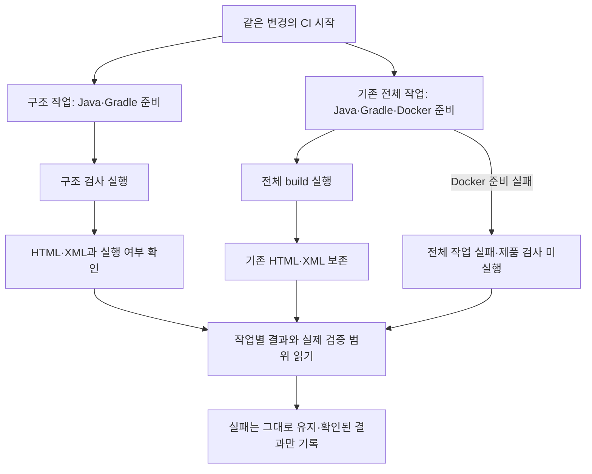

# CI 결과 읽기 — #25 최종 확인 상세 명세

**상태: 최종 단계 설계.** 이 절은 #24 병합 뒤의 현재 기준이며, 초기 설계·실행 기록은 하단에 보존한다. 이번 요청에서는 명세와 읽기 화면만 갱신한다. 구현·테스트 재실행·원격 이슈/보드 변경·완료 처리는 하지 않았다.

2026-10-03 · [이슈 #25](https://github.com/0Chord/coin-exchange/issues/25) · 상위 [#18](https://github.com/0Chord/coin-exchange/issues/18)

기준 통합 커밋: `433b07abbb199a925c9e7b05156a5317d76ae54e` · 브랜치 `feature/phase-2/integration`

명세 작업 폴더: `/Users/0chord/.codex/worktrees/issue25-final-spec/exchange-core` · 작업 브랜치 `docs/ci-final-verification/25`

## 먼저 볼 세 가지

1. **CI와 검사기는 이미 있다.** 현재 운영 검사 아홉 개의 적용표·실제 보고서·읽기 안내를 맞춘다.
2. **성공 숫자만으로 완료하지 않는다.** 같은 커밋의 필수 검사 실행, 실패/누락 여부, 구조·제품 결과와 보고서 전달을 각각 확인한다.
3. **이유 → 고칠 곳 → 재확인 순서로 읽는다.** 규칙 위반·검사 입력 누락·실행 환경 문제는 결과가 모두 실패여도 수정할 곳이 다르다.

이번 결과는 **다음 개발자가 기존 보고서에서 무엇이 검사됐고 왜 실패했는지 설명할 수 있는 최종 안내와 근거**다. 새 구조 검사·CI 플랫폼을 만드는 작업이 아니다.

## 현재 사실과 남은 일

| 소스에서 확인한 사실 | 이번 최종 단계에서 할 일 |
| --- | --- |
| [실제 운영 검사](https://github.com/0Chord/coin-exchange/blob/433b07abbb199a925c9e7b05156a5317d76ae54e/architecture-tests/src/test/kotlin/com/exchange/architecture/ProductionArchitectureTest.kt)는 P01~P09다 | 적용 규칙·검사 대상·한계를 현재 코드와 연결한다 |
| [보고서 확인기](https://github.com/0Chord/coin-exchange/blob/433b07abbb199a925c9e7b05156a5317d76ae54e/architecture-tests/src/test/kotlin/com/exchange/architecture/support/ArchitectureReportVerifier.kt)는 P01~P09 각각 한 번 실행과 성공을 요구한다 | 같은 실행의 실제 XML과 확인 단계 결과를 대조한다. 목록 재구현은 계획하지 않는다 |
| [기존 확인기 테스트](https://github.com/0Chord/coin-exchange/blob/433b07abbb199a925c9e7b05156a5317d76ae54e/architecture-tests/src/test/kotlin/com/exchange/architecture/ArchitectureReportVerifierTest.kt)는 P06~P09의 누락·중복·skip·실패·오류·잘못된 클래스·유사 이름을 이미 거절한다 | 같은 내용의 새 테스트를 추가하지 않는다. 발견한 실제 공백이 있을 때 필요한 사례만 정한다 |
| [workflow](https://github.com/0Chord/coin-exchange/blob/433b07abbb199a925c9e7b05156a5317d76ae54e/.github/workflows/build-and-test.yml)는 독립 구조 작업과 전체 build, 보고서 두 묶음을 제공한다 | 최신 통합 실행의 작업별 결과·실제 보고서·실패 전달을 확인한다 |
| README·공통 적용표는 P01~P09, #25 초기 구현 안내의 상단은 P01~P08이다 | 현재 안내를 맞추고 과거 P01~P05 실행·코드 발췌는 작성 시점의 기록으로 보존한다 |
| #20~24의 관련 PR #35~39는 병합됐다 | 각 구현 근거를 연결한다. 병합과 이슈·Projects 완료 상태를 구분한다 |

소스 대조에서 이번 범위 때문에 추가 코드 수정이 필요한 공백은 확인되지 않았다. 이 판단은 새로운 실행 검증 결과가 아니다.

## 범위와 유지할 계약

**포함:** 현재 적용표, 동일 커밋의 로컬/CI 증거 대조, 운영 XML의 필수 실행 확인, 실패 이유 읽기, 미적용·예외·검증 한계, #25 완료 근거.

**유지:** Kotlin/Gradle 확인기, 기존 HTML·XML, 구조/Docker 검증의 독립성, 실패 코드, 현재 CI 트리거·캐시·재실행·보고서 7일 보관, 제품 SQL·트랜잭션·API·실행 순서.

**후속 후보:** CI 중복 실행 제거와 Gradle 연동 테스트 속도 개선. 현재 시간 측정은 후보의 근거로 연결하되 이번 완료 조건에 성능 목표를 추가하지 않는다. PITEST·Trivy·SonarQube, 브랜치 보호, 새 보장/자동 복구도 이번 범위 밖이다.

원격 강제 Docker 장애 실험은 초기 명세의 추가 증거다. 초기 기록에서 미실행으로 남긴 업로드 실패·취소 강제 실험도 이번 단계의 새 필수 조건으로 추가하지 않는다. 하지 않은 실험은 미검증으로 남긴다. 문서 대조에서 실제 검사 결함이 발견되면 증상·반례·영향을 제시하고 필요한 보완 범위를 구분한다.

## 실제 검사와 설명의 대응

P 번호는 **운영 코드에 실행하는 테스트 식별자**, ARCH 번호는 **검사하려는 구조 규칙**이다. 번호 순서가 일치할 필요는 없다.

| 운영 검사 | 확인하는 것 | 이것만으로 보장하지 않는 것 |
| --- | --- | --- |
| P01 · ARCH-01 | 운영 출력/역할 준비 후 순수 도메인의 외부 기술 독립 | 금액 계산·업무 판단의 정확성 |
| P02 · ARCH-02 | 운영 코드와 Gradle의 직접 모듈 의존 방향 | 동적·전이 의존의 모든 실행 경로 |
| P03 · ARCH-06 | 저장·발행 포트의 공개 타입 계약 | 포트 구현의 실제 DB 저장·트랜잭션 |
| P04 · ARCH-08 | 운영 코드·main Gradle 선언의 테스트/벤치마크 역의존 | 모든 외부 라이브러리 의미·테스트 품질 |
| P05 · Bean 규칙 | 업무 자동 등록 금지와 허용 config의 Bean 선언 | 실제 Spring 주입·프록시 동작 |
| P06 · ARCH-03 | 실제 HTTP 코드의 허용·금지 직접 의존 | 모든 HTTP 입력·응답·DB 결과 |
| P07 · ARCH-04 | application 진입점·협력자의 구현 독립, config 조립 예외 | config 내부 업무 의미·실제 실행 순서 |
| P08 · ARCH-05 | 이름 17개 규칙, 전체 main 원본 폴더·package | 모든 클래스의 업무 역할·정확한 이름 자동 판정 |
| P09 · ARCH-07 일부 | app-api의 매칭 내부 상태 직접 참조와 config 밖 실행기 구현 참조 금지 | reflection·Java 등 모든 접근 차단, 콜백·timeout·DB 계약 |

구조 검사의 현재 활성화와 #22의 불변/DB 테스트, #23의 컴파일/실행 경계 테스트, #24의 의미·문서 대조를 분리한다. P09 하나를 ARCH-07 전체 완료 근거로 쓰지 않는다. 동작 범위는 [현재 주문 흐름](flow-and-scope-contract.md)과 [#22](immutable-db-contracts-review.md), [#23](state-access-boundaries-review.md)의 기록에 연결한다.

## 입력 → 판단 → 결과 읽기

1. **입력 선택:** PR head인지 통합 커밋인지, 실행 ID·시도 번호·검사 커밋을 고른다. 다른 실행에서 받은 XML을 섞지 않는다.
2. **첫 실패 확인:** 두 작업의 단계·오류 원문을 본다. 실패가 없더라도 실행 취소·skip·보고서 부재를 확인한다.
3. **구조 판정:** 운영 입력을 준비할 수 있어야 규칙을 평가한다. 입력이 빠지면 관련 규칙은 미평가다. 정상/위반 예제 테스트는 검사기의 탐지력을 확인하며 운영 준수 판정과 다르다.
4. **실행 증거 확인:** 구조 테스트가 성공해야 Gradle의 보고서 확인 단계로 간다. 올바른 ProductionArchitectureTest XML에 P01~P09가 각각 한 번 있고 skip·failure·error가 없어야 성공이다. XML 확인기는 커밋을 인증하지 않으므로 실행 출처·신선도는 별도로 대조한다.
5. **제품 결과 확인:** 전체 build의 제품·DB 테스트와 구조 결과를 각각 읽는다. 구조 성공만으로 제품을 성공 처리하지 않는다.
6. **전달 확인:** 생성된 HTML·XML 업로드와 실제 내려받기를 확인한다. 보고서 전달 실패와 테스트 실패는 다른 사실이다.
7. **기록:** 규칙/테스트, 실제 이유, 수정 대상, 재확인 명령, 실행 근거, 남은 한계를 같은 항목으로 남긴다. 불명확한 원인은 미분류로 기록한다.

### 실패 이유를 보고 고칠 곳 찾기

| 구체 상황 | 판단 | 먼저 볼 곳과 다음 행동 |
| --- | --- | --- |
| 도메인 타입을 정상 수집했는데 Spring 직접 의존을 발견 | **규칙 위반**. 코드를 읽고 허용 경계를 어겼다고 판단한 결과 | 실패한 운영 테스트의 규칙·타입·소스 근거 → 해당 의존 수정 → 구조 검사 |
| 운영 출력에서 필수 타입을 못 찾거나 파일이 손상됨 | **검사 입력 준비 오류**. 해당 규칙을 평가할 자료가 없음 | 모듈 출력·Gradle 전달·읽기 오류 → 입력 연결 복구. 위반 목록이 비었다고 통과하지 않음 |
| XML의 P09만 빠졌는데 다른 여덟 개는 성공 | **필수 검사 실행 근거 누락**. 위의 운영 클래스 누락과는 다른 단계 | 운영 테스트 선택·필터·skip·보고서 출처 → 필수 실행 복구. 예상 메시지에는 P09와 정확히 한 번 조건이 포함 |
| 구조는 성공했지만 Docker 준비에서 실패 | **구조 통과·제품 미실행·전체 실패** | Docker 원문 먼저 확인. 구조 코드를 원인 없이 바꾸지 않음 |
| 정상/위반 예제의 예상 결과가 다름 | **검사기 회귀 테스트 실패** | 예제 기대값·검사기 대조. 운영 코드 위반으로 자동 판단하지 않음 |
| Kotlin 컴파일 또는 Java/Gradle 준비 실패 | **평가 전 실패**. 컴파일 오류와 실행 환경 오류도 구분 | 실패한 단계와 실제 메시지. 수행하지 못한 검사 결과는 미실행 |
| 검사는 성공했는데 업로드 실패, 취소 또는 보고서 만료 | **전달/증거 한계** | 기존 로그와 남은 자료 확인. 다른 커밋의 보고서로 대신하지 않음 |

예를 들어 “위반 0개”와 “검사할 파일이 없어 위반을 찾지 못함”은 다르다. 문서에는 **실패 종류 → 왜 그런지 → 어떤 파일/환경을 고칠지**가 이어져야 한다. 발생하지 않은 오류 문자열을 실제 로그처럼 꾸미지 않고, 설명용 예시와 실행에서 확인한 메시지를 구분한다.

## 정상·위반·누락 수용 사례

아래는 최종 단계의 기대 조건이다. 기존 C01~C08을 이어받으며, [현재 수용 조건 대조 결과](ci-result-reading-review.md)는 실행 재사용·미실행·게시 후 확인을 구분한다.

| 사례 | 입력·조건 | 기대 결과·근거 | 사용할 확인 수단 |
| --- | --- | --- | --- |
| F01 같은 커밋의 정상 결과 | 두 작업 성공, 운영 XML 안에 필수 테스트 9개, 보고서 전달 성공 | 구조/제품 결과를 각각 기록하고 최종 실행 근거로 사용 | 최신 CI 작업·로그·artifact, 기존 로컬 기록과 소스 비교 |
| F02 규칙 위반 | 정상 입력 준비 뒤 금지 Spring 의존 | 해당 규칙·타입·근거를 남기며 실패. 정상적인 위반 예제 테스트 통과와 구분 | 기존 C02 격리 실패 기록·현재 규칙/회귀 테스트, 변경 시만 재현 |
| F03 검사 입력 누락 | 정상 형식의 출력에서 필수 타입 부재 | 준비 오류·관련 규칙 미평가. 위반 0건을 성공으로 인정하지 않음 | 기존 C03 기록·현재 수집/준비 테스트 |
| F04 실행 보고서 이상 | P09 누락/중복, skip/failure/error 또는 잘못된 suite/classname | 확인기 실패. 누락·중복·다른 classname이면 해당 식별자, 실행 이상이면 상태, suite 불일치면 보고서 종류 오류를 남김. 총 테스트 수만으로 통과하지 않음 | 기존 ArchitectureReportVerifierTest와 현재 XML. 실제 Gradle 실패 전달 기록도 별도 연결 |
| F05 구조 성공·Docker 실패 | 전체 작업은 준비에서 중단, 구조 작업은 실행 가능 | 구조 결과 유지·제품 미실행·전체 실패 | workflow 독립성·현재 두 작업 실행·기존 안내 검증. 강제 원격 장애는 미실행 명시 |
| F06 보고서 없음/생성 전 실패 | 컴파일·환경 실패, XML 부재·손상 | 원래 실패 유지, 실행/읽기 불가 구분 | 단계 로그·기존 읽기 거절 테스트·업로드 always 조건 |
| F07 전달 실패·취소·만료 | 테스트 결과와 전달 결과가 다름 | 확인된 검사 결과만 기록. 전달 완료나 최종 성공을 추측하지 않음 | 현재 업로드/보관 설정과 읽기 안내, 원격 강제 실험 여부 구분 |
| F08 다른 커밋/역사 결과 | PR 성공 자료만 있거나 예전 P01~P05 보고서 | 현재 통합 P01~P09 실행 증거로 치환하지 않음 | SHA·실행 ID·시도·보고서 출처 대조 |
| F09 구조와 동작 구분 | P09 성공, DB/실행기 테스트 여부 불명 | 직접 참조 경계만 통과. DB·시간 초과·불변 계약은 별도 근거 필요 | #22·23 테스트/실행 기록과 전체 build |
| F10 현재 안내 일치 | 현재 적용표/확인기/실제 보고서/README 연결 | 모두 현재 P01~P09를 가리킴. 초기 숫자·발췌는 날짜 있는 역사로 유지 | 문서·심볼·링크 대조, 새 동작 테스트 불필요 |

기존 거절 테스트는 거절을 기대하므로 그 테스트 자체는 통과한다. 바깥 Gradle 실행이 실제 실패 코드로 끝났다는 근거는 초기 C02·C03·C06의 별도 격리 기록으로 연결한다. 재사용하려면 관련 규칙·실행 경로가 동일한지 확인한다. 근거가 부족하거나 코드가 달라졌을 때만 임시 입력으로 해당 사례를 다시 확인하고, 고의 오류를 최종 브랜치에 남기지 않는다.

## 작은 구현 단위와 완료 기준

| 순서 | 만들 결과 | 편집/확인 대상 | 완료 기준 |
| --- | --- | --- | --- |
| 1. 현재 적용표 정리 | 무엇을 실제로 검사하는지 한 곳에서 확인 | 이 명세, ci-result-reading-review.md의 현재 안내, README, architecture-check-spec.md 상단 연결 | P01~P09·ARCH 대응·상태/동작 한계 일치. 초기 기록 보존 |
| 2. 실행 근거 대조 | 현재 커밋의 구조·제품·전달 결과와 실패 근거 | 기존 CI 로그/HTML/XML, 기존 실행 기록과 관련 소스 | 같은 실행 출처, 필수 9개·성공/누락·skip·미실행 구분, 보고서 직접 열람 근거 |
| 3. 이유 읽기와 종료 근거 | 실패를 보고 수정 위치·재검증 경로를 찾는 안내 | README의 읽기 절차, #25 구현 기록의 최종 확인 절 | F01~F10의 근거·미실행·한계 연결. 다음 변경에서도 같은 절차 재사용 |

최종 확인 기록은 기존 **ci-result-reading-review.md에 절을 추가**한다. 새 보고서 모델·도구·모듈을 만들지 않는다. 현재 명세만 갱신한 상태와 후속 구현/검증을 끝낸 상태를 구별한다. 첫 구현 단위는 1번이며 문서 수정 자체를 위해 TDD를 새로 만들지 않는다.

최종 완료에 필요한 것은 다음이다.

- [x] 운영 코드·확인기·적용표·현재 안내가 P01~P09와 같은 범위를 말한다.
- [ ] 최신 통합 기준과 이후 최종 PR의 검증 대상을 분리하고 두 CI 작업의 결과·보고서를 확인한다.
- [x] 동일한 실행의 필수 XML·전체 제품 결과·업로드를 각각 대조한다. 기대값을 명세와 별도 정상·거절 사례에 대조한다.
- [x] 규칙 위반·입력 누락·환경/컴파일·실행/전달 실패의 수정 위치와 기대 결과를 설명한다.
- [x] 초기 로컬/격리 실패 근거의 재사용 가능성을 확인하거나 필요한 최소 사례만 다시 확인한다.
- [x] 미적용·예외·의미 리뷰·동작/복구 한계를 명시한다. P09를 모든 상태 안전성 보장으로 확대하지 않는다.
- [ ] 링크·실제 실행 기준·새/과거 결과를 대조하고 최종 PR 리뷰·CI·통합 근거를 연결한다.

**현재 남은 게시 경계:** 통합 `433b07a`의 두 작업·실제 보고서는 대조했다. 위 미완료 두 항목에 포함된 이번 최종 PR의 리뷰·CI·병합 확인은 아직 게시 전이므로 남겨 둔다. 로컬 구현 대조와 티켓 전체 종료는 구분한다.

**종료 경계:** #25의 구현·검증 근거를 정리한 뒤 게시/종료 요청 범위에서 이슈와 Projects를 동기화한다. #20~24의 완료 정리와 #18 에픽 수용 조건 검토는 별도 상태 작업이며, 문서 작성이나 CI 초록색만으로 자동 종료하지 않는다.

## 검증 실행·재사용 계획

현재 명세 작업에서는 새 Gradle 실행을 하지 않았다. 후속 구현에서 문서만 바뀌고 소스·테스트·빌드·CI가 그대로라면, 비교한 커밋과 차이 범위를 남기고 기존 같은 소스의 유효한 실행 결과를 재사용한다. 새 커밋 자체를 실행했다고 표현하지 않는다. 게시 후 실제 PR/통합 CI는 해당 실행을 별도로 기록한다.

실행이 필요한 경우 현재 작업 폴더에서 다음 기존 경로를 쓴다.

```sh
cd /Users/0chord/.codex/worktrees/issue25-final-spec/exchange-core
./gradlew :architecture-tests:verifyArchitectureReport --rerun-tasks --no-daemon --console=plain
```

확인기 자체를 바꿔야 하는 근거가 생긴 경우에만 먼저 해당 테스트를 좁혀 실행한다.

```sh
cd /Users/0chord/.codex/worktrees/issue25-final-spec/exchange-core
./gradlew :architecture-tests:test --tests com.exchange.architecture.ArchitectureReportVerifierTest --no-daemon --console=plain
```

이 선택 실행은 전체 운영 검사를 모두 실행한 증거가 아니다. 전체 재실행이 필요한 경우 기존 CI 명령 `./gradlew build --no-daemon --continue --stacktrace --rerun-tasks`를 **같은 위 폴더에서** 실행하며 Docker가 필요하다. 바뀐 범위에 따라 필요한 검증만 고른다.

기록에는 커밋·실행 ID/시도·명령·환경·실제 결과·오류 요약·보고서 경로·남은 한계를 적는다. artifact는 7일 뒤 만료되므로 짧은 결과와 출처를 문서에 남기고 링크만으로 영구 보존됐다고 하지 않는다. 보고서 원본 전체를 저장소에 새로 넣는 것을 완료 기준으로 삼지 않는다.

## 설계 시점에 확인한 실행 상태

<!-- CI25_CURRENT_EVIDENCE -->
- [PR #39 CI](https://github.com/0Chord/coin-exchange/actions/runs/37091548157): 두 작업 성공을 확인했다. PR 검토 head는 `4d81f82`이며 실행 환경의 PR merge ref는 통합 push와 구분한다.
- [통합 433b07a 실행](https://github.com/0Chord/coin-exchange/actions/runs/37092221513): 2026-10-03 12:18 KST 조회에서 구조 작업 성공, 전체 build 진행 중이다. 구조 artifact `architecture-test-reports`(ID 11263666235)의 존재·미만료를 확인했으며 이번 설계에서는 내용은 아직 읽지 않았다. 최종 구현 시 두 작업의 완료 결과와 실제 HTML·XML을 대조한다.
- 이 절은 기존 실행의 조회 결과다. 후속 명세 구현 완료·새 테스트 실행·사용자의 이해 확인을 뜻하지 않는다.
<!-- CI25_CURRENT_EVIDENCE_END -->

## 문답·결정 상태

기존 합의를 유지한다.

- 구조 job을 별도로 두고 전체 build도 유지한다: 중복 실행 비용을 안내한 뒤 사용자가 선택한 기존 합의이며 이번 단계의 속도 개선 요구는 없다.
- Kotlin/Gradle 사용: 사용자 요청 “kotlin/gradle로 진행해 굳이 이종언어를 넣을 필요가 있나 싶어”.
- 실패 이유를 먼저 읽는다: 사용자 답변 “왜 실패했는지를 먼저 알고 싶지 실패한 이유들”.
- 위 내용은 초기 문답 원문에도 남아 있다. 원격 강제 장애 실험은 추가 증거라는 기존 명세를 유지한다.

**이번 선택적 Ask:** “최종 결과 읽기 안내에서 어느 부분을 더 자세히 보여줄까? 이미 합의한 대로 실패 이유를 먼저 보여주고, 아래 선택은 설명의 깊이에만 반영할게.”

- AI 추천: 규칙 위반과 검사 대상 누락의 차이. 둘 다 실패하지만 코드 수정과 입력 복구로 후속 행동이 다르기 때문이다.
- 대안: 구조 성공·전체 CI 실패의 구분을 더 자세히 읽기 / 현재 설명으로 충분함.
- 사용자 답변: 아직 없음. 이유·이해를 추측하지 않는다.
- 상태: 설명 깊이만 조정하는 비차단 질문. 현재 명세에는 두 구분을 모두 포함했으며 답변이 오면 해당 예시를 보완한다.

**구현을 막는 새 설계 선택은 현재 없다.** 기존 흐름·보장을 유지하는 최종 대조이며, 실제 결함 또는 새 보장 차이가 발견될 때만 해당 부분을 논의한다.

<!-- CI25_INITIAL_HISTORY_START -->

# CI 결과 읽기 — #25 초기 상세 명세 (2026-10-02 기록)

> **#20 이후 현재 기준:** 필수 운영 검사는 P01~P08이다. 아래 P01~P05·330개 실행·옛 소스 발췌는 #25 초기 구현 시점의 기록으로 보존한다. 이번에 추가한 P06~P08과 새 실행 근거는 [#20 구현 기록](order-usecases-review.md), 현재 실행 방법은 [README](../README.md)를 따른다.

2026-10-02 · 이슈 [#25](https://github.com/0Chord/coin-exchange/issues/25) · 상위 [#18](https://github.com/0Chord/coin-exchange/issues/18)

**게시 전 검증 상태:** 구조 CI 분리·보고서 실행 확인·읽기 안내를 로컬에서 구현·검증했다. 새 설정의 GitHub CI 실행·artifact 업로드는 같은 커밋의 PR checks와 Actions에서 별도로 확인한다. [구현 흐름과 근거](ci-result-reading-review.md)를 함께 읽는다.

## 먼저 읽을 세 가지

1. **구조 검사는 Docker 없이 따로 실행한다.** Docker 준비가 실패해도 이 작업을 건너뛰게 연결하지 않는다.
2. **기존 전체 빌드는 유지한다.** 구조 검사만 통과했다면 DB·거래 동작까지 통과했다고 말하지 않는다. 어느 작업이든 실패하면 전체 CI도 실패다.
3. **실패한 단계와 보고서를 함께 읽는다.** 규칙 위반, 검사 입력 누락, 실행 환경 실패는 고칠 곳이 다르다. 보고서가 없으면 검사 성공으로 해석하지 않는다.

작업(job)은 CI에서 별도로 실행하는 묶음이다. 보고서(artifact)는 실행 후 내려받는 HTML·XML 파일 묶음이다. 새 오류 분류 프로그램이나 검증 프레임워크를 만들지 않고 기존 보고서로 판단한다.

## 1. 이어받은 사실과 이번 범위

코드 기준은 최신 통합 브랜치 `feature/phase-2/integration`의 `18bed4f32ec05e12ec1a799d2f1aa06286016e5a`다. 명세 작성 당시 설정·검사 코드를 읽어 확인했다. 후속 로컬 구현·Gradle 재실행 결과는 8절에 별도로 기록한다.

| 현재 확인한 사실 | 근거와 의미 |
| --- | --- |
| CI는 이미 실행 중이다 | [기존 workflow](https://github.com/0Chord/coin-exchange/blob/18bed4f32ec05e12ec1a799d2f1aa06286016e5a/.github/workflows/build-and-test.yml). Docker 점검 다음 전체 build를 실행하는 하나의 작업이다 |
| 병합 후 실행과 보고서 업로드가 성공했다 | [PR #33 병합 후 실행](https://github.com/0Chord/coin-exchange/actions/runs/36876720572). `test-reports`가 존재하며 보관 기간은 7일이다. 이는 변경 전 CI의 근거다 |
| 구조 검사는 독립 명령이 있다 | [검증 모듈 설정](https://github.com/0Chord/coin-exchange/blob/18bed4f32ec05e12ec1a799d2f1aa06286016e5a/architecture-tests/build.gradle.kts). 운영 모듈의 main 클래스를 컴파일해 읽지만 제품 테스트·서버·DB를 시작하지 않는다 |
| 입력이 빠지면 준수를 판정하지 않는다 | [수집기](https://github.com/0Chord/coin-exchange/blob/18bed4f32ec05e12ec1a799d2f1aa06286016e5a/architecture-tests/src/test/kotlin/com/exchange/architecture/support/ProductionScopeImporter.kt), [모듈 준비 검사](https://github.com/0Chord/coin-exchange/blob/18bed4f32ec05e12ec1a799d2f1aa06286016e5a/architecture-tests/src/test/kotlin/com/exchange/architecture/support/ModuleRegistration.kt), [ARCH-02 준비·판정](https://github.com/0Chord/coin-exchange/blob/18bed4f32ec05e12ec1a799d2f1aa06286016e5a/architecture-tests/src/test/kotlin/com/exchange/architecture/rules/ModuleDependencyDirection.kt) |
| 운영 준수와 예제 검증은 다르다 | [운영 검사 P01~P05](https://github.com/0Chord/coin-exchange/blob/18bed4f32ec05e12ec1a799d2f1aa06286016e5a/architecture-tests/src/test/kotlin/com/exchange/architecture/ProductionArchitectureTest.kt)는 실제 운영 출력을 검사한다. 다른 정상·위반 예제 테스트는 검사 도구의 탐지력을 확인한다 |

**초기에 끝낼 것:** 기존 workflow 안에서 구조 작업을 분리하고, 보고서와 실패 코드를 보존하며, 아래 결과 읽기 절차를 제공·검증한다.

**후속으로 넘길 것:** #20~21에서 실제 HTTP·애플리케이션·이름/폴더 규칙을 활성화한다. #22~23에서 상태·DB·실행 경계를 검증한다. #24 이후 #25 최종 단계에서 적용표와 운영 안내를 다시 대조한다. 초기 단계만으로 #25 전체를 닫지 않는다.

**범위 밖:** 새 구조 규칙, 역할 추론·오류 문구 자동 분류기, 보고서 전용 데이터 모델, 브랜치 보호 변경, 배포, SonarQube·PITEST·Trivy 도입. 기존 SQL·트랜잭션·제품 동작은 바꾸지 않는다.

## 2. 합의한 CI 흐름

같은 변경에서 두 작업이 각각 시작된다. 구조 작업은 자기 실행 환경을 준비한 뒤 검사를 실행한다. 전체 작업은 기존대로 Docker를 확인하고 전체 build를 실행한다. 둘 사이에 선행 관계를 두지 않는다.



| 항목 | 구조 작업: 구현할 계약 | 기존 전체 작업: 유지할 계약 |
| --- | --- | --- |
| 작업 ID·화면 이름 | 구현: `architecture-checks` / `Architecture checks` | `build-and-test` / `Build and test` 유지 |
| 실행 명령 | `./gradlew :architecture-tests:test --no-daemon --console=plain --rerun-tasks` → `./gradlew :architecture-tests:verifyArchitectureReport --no-daemon --console=plain` | `./gradlew build --no-daemon --continue --stacktrace --rerun-tasks` |
| 실행 환경 | 현재 Java 25·Gradle 준비 방식 재사용. Docker 점검과 서비스 기동 없음 | 현재 Java·Gradle·Docker 점검 재사용 |
| 보고서 이름 | 구현: `architecture-test-reports` | `test-reports` 유지 |
| 보고서 원본 | `architecture-tests/build/reports/tests/test/`와 `architecture-tests/build/test-results/test/` | 현재 모듈별 HTML·XML 경로 유지 |
| 업로드 | 검사 실패 뒤에도 업로드를 시도한다. 원래 실패를 성공으로 바꾸지 않는다 | 현재 실패 후에도 업로드하는 조건과 7일 보관 유지 |
| 선행 관계 | 전체 작업에 `needs`를 걸지 않는다 | 구조 작업에 `needs`를 걸지 않는다 |

실행 트리거, 읽기 권한, 현재 runner·Java·action 고정 버전, 동시 실행 취소 정책은 유지한다. 전체 build 안의 구조 테스트도 유지하므로 두 작업에서 중복 실행된다. 중복 제거는 이번 초기 범위에 넣지 않는다.

각 작업은 자체 준비·컴파일·검사·보고서 전달 과정에서 실패할 수 있다. 분리는 **Docker 실패 때문에 구조 작업이 미실행되는 연결을 없애는 것**이며, 구조 작업의 모든 환경 실패를 없애는 보장은 아니다. 실패를 숨기는 `continue-on-error`, `|| true`, 임의의 성공 종료는 사용하지 않는다.

## 3. 입력 → 판단 → 결과를 읽는 순서

1. **실행과 기준점을 고른다.** PR 또는 통합 브랜치 실행인지, 어느 커밋을 검사했는지 확인한다. 다른 커밋의 보고서를 현재 결과로 쓰지 않는다.
2. **두 작업을 따로 본다.** 성공·실패·미실행·취소 상태를 확인하고, 실패한 첫 단계의 로그를 연다.
3. **실제로 테스트가 실행됐는지 확인한다.** 컴파일 이전 실패, `NO-SOURCE`, 전체 skip, 취소는 구조 준수 통과가 아니다. `--rerun-tasks`가 있어도 테스트 존재와 실행을 확인해야 한다.
4. **구조 HTML의 실패한 테스트를 연다.** 실제 운영 코드 문제인지, 입력 준비 문제인지, 검사기 예제 테스트 문제인지 아래 표와 비교한다. 필요한 경우 XML의 실패 메시지·표준 출력도 읽는다.
5. **수정 위치와 확인 범위를 적는다.** 규칙·출발/대상 타입·파일/행이 있으면 기록한다. 모르는 행 번호를 만들지 않는다. 준비 오류면 누락된 모듈·출력·입력 파일을 먼저 확인한다.
6. **수정 후 같은 수준에서 다시 확인한다.** 구조 문제는 독립 구조 명령부터 확인한다. Docker·DB 문제는 환경과 전체 검사 결과를 별도로 확인한다. 후속 PR의 실제 CI 결과까지 연결한다.

| 관측한 결과 | 판단과 첫 수정 위치 | 통과라고 말할 수 없는 것 |
| --- | --- | --- |
| P01~P05의 `ARCH-01/02/06/08 위반` 또는 Bean 규칙의 금지 참조 | **운영 규칙 위반.** 오류에 나온 운영 타입·직접 선언·Bean 조립부터 확인 | 전체 운영 구조 준수 |
| `검사 준비 실패`, `not evaluated`, `MISSING_MODULE`, `MISSING_REQUIRED_TYPE`, `READ_FAILURE` | **입력 준비 오류.** 누락된 입력·모듈 등록·출력 전달·손상 파일을 확인. 관련 규칙은 미평가 | ‘위반 0개이므로 통과’. 다른 독립 규칙의 결과와도 구분 |
| 정상·위반 fixture 테스트의 기대값과 실제 값이 다름 | **검사기 회귀 테스트 실패.** 예제·기대값·규칙 구현을 대조. 곧바로 운영 코드 위반이라고 단정하지 않음 | 검사 도구 전체가 정상이라는 판단 |
| Docker 점검 실패 또는 Testcontainers 기동 실패 | **제품 검사 환경 문제인지 확인.** Docker·소켓·컨테이너 준비 로그를 먼저 읽음 | 제품·DB 검사 통과. 구조 작업 결과는 별도로 유지 |
| Java/Gradle 준비·의존 다운로드 실패 | **실행 환경·준비 실패.** 해당 단계부터 해결 | 실행되지 않은 테스트의 결과 |
| Kotlin/Java 컴파일 오류 | **컴파일 실패.** 컴파일러가 가리킨 소스·의존 선언을 확인. 환경 문제로 자동 분류하지 않음 | ArchUnit 규칙 평가를 마쳤다는 판단 |
| 전체 작업의 제품 테스트 assertion 실패 | **제품 동작·테스트 실패.** 해당 모듈·테스트의 기대 동작을 확인 | 거래 동작·금액·DB 계약 통과 |
| 테스트는 성공했지만 보고서 업로드 실패 | **결과 전달 실패.** 업로드 로그를 확인하고 원래 검사 결과와 구분 | CI 전체 완료·보고서 보존 완료 |
| 테스트/보고서 없음, 전체 skip, 실행 취소·시간 제한 | **미실행 또는 불완전.** 첫 실패/취소 단계와 실제 남은 결과를 확인 | 빈 보고서·0개 실행을 성공으로 인정하는 것 |

오류의 Java 예외 타입만으로 분류하지 않는다. 현재 운영 준비 검사도 `assertTrue`로 실패하므로 규칙 위반과 같은 assertion 형태가 될 수 있다. **단계 → 테스트 이름 → 메시지 → 실제 입력** 순서로 근거를 읽는다. 원인이 모호하면 ‘미분류 실패’로 기록하고 다음 확인 지점을 남긴다.

### 바로 읽어볼 세 가지 예시

- **운영 Spring 의존 검출:** 입력을 정상 수집한 뒤 순수 도메인에서 Spring 의존을 발견하면 규칙 위반이다. 출발 타입·기술 타입·소스 근거를 따라 수정한다.
- **운영 클래스 누락:** 모듈 출력에서 필수 클래스를 못 찾으면 준비 오류다. ‘나쁜 의존을 발견하지 못했다’는 이유로 통과시키지 않고 출력·등록 연결부터 확인한다.
- **구조 성공 + Docker 실패:** 구조 결과는 통과로 남길 수 있다. 전체 작업과 전체 CI는 실패이고, 제품 테스트는 미실행이다. ‘전체 검증 통과’라고 표시하지 않는다.

위반 예제를 **제대로 거절해 fixture 테스트가 성공한 경우는 정상**이다. 예제 내부에서 위반을 발견한 것과 운영 준수 테스트 자체가 실패한 것을 혼동하지 않는다.

## 4. 사람이 볼 결과와 보고서 계약

현재 HTML·JUnit XML을 그대로 이용하고 README에 읽는 순서를 연결한다. CI 화면에 남길 짧은 안내는 실행 커밋, 작업/명령, 실제 실행 여부, 보고서 이름·위치, 실패 단계와 한계를 담는다. 오류 문구에서 업무 의미를 자동 추론하지 않는다.

**성공 판정:** 구조 명령이 정상 종료하고, 새 실행의 운영 검사 `ProductionArchitectureTest` 보고서가 존재하며, 현재 필수 운영 검사 P01~P05가 실제 실행되어 실패·오류·skip이 없어야 한다. 단순 전체 테스트 수나 artifact 업로드 성공만으로 판단하지 않는다. 후속 운영 검사가 추가·교체되면 이 확인 목록도 맞춘다.

**빈 결과 방지:** 구조 명령이 성공했는데 필수 보고서가 없거나 운영 검사가 실행되지 않았으면 해당 작업을 실패로 남긴다. `architecture-tests`의 Kotlin 확인 코드를 Gradle `verifyArchitectureReport` 작업에서 실행한다. 이 작업은 `test`에 의존하며, CI에서는 직전 재실행 결과를 재사용한다. 로컬에서 새 실행을 확인하려면 `verifyArchitectureReport --rerun-tasks`로 테스트와 확인을 함께 실행한다. 이는 기존 XML의 존재·실행 결과를 확인하는 작은 검사이며, 새 역할 등록표·메시지 분류기를 추가하는 계약이 아니다.

**실패 보존:** 이미 검사/환경 단계가 실패했다면 보고서가 없다는 별도 문제로 원래 원인을 덮지 않는다. 생성된 보고서는 보존하고, 생성되지 않았다면 ‘보고서 없음·로그 확인’으로 표시한다. 전체 작업은 Docker에서 중단돼 보고서가 없을 수 있다.

**받아서 읽기:** Actions의 해당 실행에서 작업과 artifact 이름을 확인하고 ZIP을 푼다. HTML의 `index.html`은 부속 CSS·JS와 함께 연다. 압축의 최상위 폴더는 업로드 경로에 따라 달라지므로 모듈명과 보고서 위치를 확인한다. HTML에 원인이 부족하면 같은 모듈의 `TEST-*.xml`과 단계 로그를 읽는다.

**보관:** 기존 7일 보관을 유지한다. 만료 전 필요한 실패·수정 결과를 커밋, 명령, 실제 오류의 짧은 인용/요약, 실행 링크와 함께 기록한다. artifact 링크만을 영구 증거로 삼지 않는다. 이미 만료된 보고서를 읽었다고 기록하지 않는다.

## 5. 수용 사례와 기대값의 근거

이 표는 **수용 계약**이다. 실제 실행 결과와 남은 원격 검증은 8절에서 구분한다. 오류 사례는 격리된 임시 사본/예제를 사용하며, 운영 코드의 고의 위반을 최종 브랜치에 남기지 않는다.

| 사례 | 입력·관측 조건 | 기대 결과와 근거 |
| --- | --- | --- |
| C01 정상 실행 | 준비가 정상이고 현재 코드가 규칙을 준수 | 구조 명령 정상 종료, 필수 운영 검사 실제 실행, HTML·XML 보존. 전체 작업도 별도로 실제 결과 확인 |
| C02 규칙 위반 | 정상 컴파일·입력 준비 후 기존 Spring 의존 위반 예제를 동일 규칙의 준수 assertion에 전달 | 해당 임시 실행은 실패 코드와 규칙·타입 근거를 남김. 컴파일 실패를 이 사례의 성공 증거로 사용하지 않음 |
| C03 필수 대상 누락 | 정상적으로 읽을 수 있는 fixture 출력에서 필수 타입 하나만 누락 | 준비 오류·관련 규칙 미평가·실패 종료. 빈 위반 목록을 정상으로 인정하지 않음 |
| C04 구조 결과와 Docker 실패 분리 | 전체 작업이 Docker 점검에서 중단되고 구조 작업은 자체 준비에 성공 | 전체 실패·제품 미실행. 구조 작업에는 Docker/선행 의존이 없어 별도 결과를 남길 수 있음 |
| C05 검사기 예제 기대값 불일치 | 기존 회귀 예제가 의도한 위반을 못 잡음 | 구조 작업 실패, 검사기/테스트 대조 안내. 자동으로 운영 코드 위반이라고 설명하지 않음 |
| C06 테스트 실행 없음 | 구조 명령은 정상 종료했지만 필수 XML 없음 또는 운영 검사가 skip됨 | 빈 결과 확인에서 실패. 업로드 성공이나 0 failures만으로 통과시키지 않음 |
| C07 보고서 생성 전 실패 | Java·Gradle 준비/컴파일/Docker 단계에서 실패 | 원래 실패 보존, 생성된 자료만 업로드. 보고서가 없다는 사실과 첫 실패 단계를 함께 표시 |
| C08 보고서 전달 실패·취소 | 업로드 실패 또는 새 push 때문에 실행 취소 | 검사 결과/전달 실패/미검증을 구분. 더 최신 실행의 결과가 확인되기 전 전체 성공으로 보고하지 않음 |

C02~C03은 기존 fixture 검출 테스트가 통과했다는 증거와 **바깥 Gradle 실행이 실패하고 보고서를 남기는 증거**를 구분한다. 기존 fixture 자체는 위반을 기대하므로 성공하는 것이 맞다. 임시 검증에서는 정상 컴파일과 준비가 끝났는지 먼저 확인한다.

C04의 필수 검증은 두 작업의 선행 관계 부재, 구조 작업의 Docker 사용 부재, 새 CI에서 각각 실제 실행됨을 대조하는 것이다. GitHub runner에서 강제로 Docker 장애를 만든 실험은 추가 실행 증거이며, 하지 않았다면 미검증으로 표시한다. 정적 연결 확인을 실제 장애 실험으로 쓰지 않는다.

## 6. 첫 구현 단위와 초기 완료 기준

첫 단위는 **기존 workflow에 독립 구조 작업을 추가하고 구조 보고서를 따로 보존하는 것**이다. 다음으로 빈 결과 방지와 결과 읽기 안내를 연결한다. 기존 구조 규칙·수집기·fixture를 재구현하지 않는다.

| 순서 | 작은 결과 | 확인 방법 |
| --- | --- | --- |
| 1 | 구조 작업 분리와 보고서 이름/경로 연결 | workflow의 트리거·권한·기존 전체 명령 보존, 두 작업 간 `needs` 없음, 구조 작업에 Docker 없음 |
| 2 | 실제 검사 여부·보고서 누락 확인 | 기존 XML로 P01~P05 실제 실행 확인. 정상·빈 결과 사례의 판단 대조 |
| 3 | 규칙·준비·환경 실패 읽기 안내 | C02~C03의 격리 실행과 기존 오류 문구 대조. 실패 코드·보고서·수정 위치 연결 |
| 4 | 새 CI 실행 근거와 후속 인계 | 새 변경 기준의 실제 CI 결과·artifact 확인. 기존 #33 성공을 새 분리안의 실행 근거로 사용하지 않음 |

초기 완료는 다음을 모두 확인한 상태다.

- [ ] 독립 구조 작업과 기존 전체 작업이 같은 변경에서 실제 실행됐다.
- [ ] 구조 명령·환경이 로컬과 CI에서 같은 범위이며 Docker를 요구하지 않는다.
- [ ] 실패 코드를 숨기지 않고 두 작업의 실제 상태를 따로 남긴다.
- [ ] 실제 운영 검사 실행·보고서 존재를 확인하고, 빈 결과/skip을 준수 통과로 처리하지 않는다.
- [ ] 정상과 규칙 위반·누락 사례의 기대값, 실제 실행 결과, 실패/미평가 의미가 연결된다.
- [ ] 생성된 HTML·XML의 전달·7일 보관과 미생성/업로드 실패의 한계를 설명한다.
- [ ] README에서 보고서 받기 → 실패 단계/테스트 확인 → 수정 위치 찾기 → 재검증 순서를 따라갈 수 있다.
- [ ] 실제 실행/정적 확인/미실행을 구분하고 현재 운영 미적용 규칙을 공개한다.

초기 결과를 #25에 기록한 뒤 #20으로 이어간다. #25 최종 종료는 후속 규칙의 실제 활성화와 결과 읽기 안내까지 다시 대조한 시점이다. 구조 성공은 금액·호출 순서·DB 원자성·복구를 증명하지 않으며 브랜치 보호 설정 변경도 포함하지 않는다.

## 7. Ask 문답과 확인 상태

**질문:** 현재 CI는 Docker 점검 → 전체 테스트 순서라서, Docker 준비가 실패하면 DB가 필요 없는 구조 검사도 실행되지 않는다. 기존 CI 안에 구조 검사 작업(job)을 따로 둘까? 전체 테스트 작업은 유지하고 구조 검사를 별도로 실행하면 각 결과를 남길 수 있지만 구조 테스트를 전체 build에서도 다시 실행한다.

**AI 추천·근거:** 구조 작업 분리. Docker 실패와 구조 준수의 결과를 분리할 수 있고, 기존 전체 검증 경로를 유지한다. 대안은 현재 단일 작업을 유지하고 Docker 실패 때 구조 검사 미실행을 명시하는 방식이다.

**사용자 실제 답변:** “구조 검사 작업을 분리한다 (추천): Docker 실패와 무관하게 구조 검사 결과를 확보”. 별도의 이유·추가 보장은 답변에 제시되지 않아 대신 작성하지 않는다.

**결정·반영:** 분리 합의. 2절의 독립 작업, C04의 Docker 실패 경계, 초기 완료 기준에 연결했다. 기본 준비 환경과 파일 경로·작업 이름은 위 구현 제안으로 구체화했으며 업무 의미를 바꾸는 새 규칙은 추가하지 않는다.

**게시 범위:** CI YAML·작은 보고서 확인 도구와 테스트·읽기 안내를 포함한다. 이 문서의 실행 근거는 로컬 검증이며, 새 원격 CI 결과는 별도로 확인한다. 이슈/작업판 변경이나 #25 자동 종료는 포함하지 않는다. 기존 CI 성공을 새 설정의 실행 근거로 쓰지 않는다.

관련 기존 기준: [#19 검사 상태·후속 책임](architecture-check-spec.md), [개발·주문 흐름의 검증 경계](flow-and-scope-contract.md). 작업 간 선행 관계의 공식 근거는 [GitHub Actions jobs 문서](https://docs.github.com/en/actions/how-tos/write-workflows/choose-what-workflows-do/use-jobs)를 따른다.


## 8. Kotlin/Gradle 전환과 실제 확인 결과

2026-10-02 · 브랜치 `ci/structure-checks/25` · 비교 기준 `18bed4f32ec05e12ec1a799d2f1aa06286016e5a`. [구현 안내](ci-result-reading-review.md)의 소스 해시와 아래 실제 실행 근거를 대조한다.

### 언어 선택 변경

사용자 요청: “kotlin/gradle로 진행해 굳이 이종언어를 넣을 필요가 있나 싶어”. 별도 Python 실행기와 테스트를 제거하고, 기존 `architecture-tests`의 Kotlin/JUnit과 Gradle 작업으로 옮겼다. 새 모듈·라이브러리·보고서 모델은 추가하지 않았다.

기존에는 보고서 확인 테스트와 확인 명령이 Python으로 별도 실행됐다. 지금은 Kotlin 테스트가 기존 구조 테스트에 포함되고, Gradle `verifyArchitectureReport`가 같은 모듈의 확인 코드 `main`을 실행한다. XML 경로는 Gradle의 실제 JUnit 보고서 위치에서 받는다. JDK 25와 기존 테스트 classpath를 재사용하며 제품 서버에서 실행되는 코드는 아니다.

`verifyArchitectureReport`는 `test`에 의존한다. 테스트가 실패하면 보고서 확인으로 진행하지 않는다. CI는 앞 단계에서 `test --rerun-tasks`를 실행하고, 다음 단계에서는 그 결과를 `UP-TO-DATE`로 재사용해 보고서를 확인한다. 재사용한 결과를 새 테스트 실행이라고 기록하지 않는다. 로컬에서는 이 변경을 포함한 저장소 루트로 이동한 뒤 다음 명령을 실행한다. 현재 컴퓨터의 정확한 실행 폴더는 [구현 안내](ci-result-reading-review.md#로컬에서는-이-폴더에서-실행한다)에 적었다.

```bash
./gradlew :architecture-tests:verifyArchitectureReport --no-daemon --console=plain --rerun-tasks
```

### 기대값과 테스트 검토

기대값은 4절의 ‘필수 운영 검사가 실제로 모두 실행돼야 한다’는 계약에서 이어받았다. 구현 함수를 정답 생성에 사용하지 않고 별도 XML을 준비해 정상 여부와 구체 거절 이유를 확인했다.

| Kotlin 테스트 입력 | 기대 결과·이유 |
| --- | --- |
| P01~P05 모두 성공, 순서 다름 | 통과. 순서는 계약이 아니다 |
| XML 없음 / 손상 | 읽기 실패. 실행 근거가 없다 |
| 빈 XML / 합계 5지만 P03 누락 | 실패. 합계만으로 실행을 증명할 수 없다 |
| P01 중복으로 합계 5 | 실패. 정확히 한 번씩 실행돼야 한다 |
| skipped / failure / error | 실패. 실제 실행·성공 계약을 충족하지 않는다 |
| suite의 실패 합계 1 | 실패. 성공했다고 보고할 수 없다 |
| 다른 suite / 다른 classname / P030 | 실패. 실제 운영 검사 P03을 대신하지 못한다 |

- **Kotlin TDD Red:** 판정이 비어 있는 scaffolding에서 13개 테스트를 실행했다. 정상 1개는 통과, 거절해야 할 12개는 `assertFailsWith`에서 예상 예외가 없어서 실패했다. 컴파일·환경 오류를 행동 수준 Red로 기록하지 않았다.
- **Kotlin 단위 Green:** `./gradlew :architecture-tests:test --tests com.exchange.architecture.ArchitectureReportVerifierTest --no-daemon --console=plain` — 13개 통과. skip·failure·error는 각각 별도 테스트다.
- **전체 구조 재실행:** `./gradlew :architecture-tests:test --no-daemon --console=plain --rerun-tasks` — 32개 suite, **330개 테스트 통과**, 실패·오류·skip 0. 기존 317개에 Kotlin 확인 테스트 13개가 포함됐다. 필수 운영 P01~P05도 실제 실행됐다.
- **실제 Gradle 확인:** `./gradlew :architecture-tests:verifyArchitectureReport --no-daemon --console=plain` — 정상 종료 0, 필수 운영 검사 실행·성공 메시지. `test UP-TO-DATE`로 직전 재실행 XML을 읽었다. 새 테스트 실행으로 계산하지 않았다.
- **작업 폴더 확인:** Desktop의 이전 초안에는 새 작업 정의가 없었다. Desktop에서 `-p /Users/0chord/.codex/worktrees/issue19-module-deps/exchange-core`로 #25 프로젝트를 지정한 실제 명령은 정상 종료 0이었다. 이 실행도 기존 테스트 결과를 재사용했으며, 문서에는 먼저 #25 폴더로 이동하는 명령을 추가했다.
- **실패 전달:** 임시 XML과 임시 init script로 위 Gradle 작업의 입력만 바꿨다. 보고서 없음·P03 누락·P03 skip 각각 실제 `verifyArchitectureReport` 작업 실패와 Gradle 종료 1을 확인했다. 이유도 각각 ‘보고서를 읽을 수 없음’·‘P03 정확히 한 번’·‘P03 skipped’와 대조했다. 운영 XML·소스는 수정하지 않았고, 임시 script/고의 실패 입력은 PR 범위 밖이다.
- **현재 CI 설정 확인:** actionlint 1.7.12 통과. 기존 트리거·권한·동시성·전체 작업 설정 보존, 선행 관계와 구조 Docker 호출 부재, Python 호출 제거, 두 업로드의 always/7일 보관을 대조했다. 변경된 실제 summary 셸도 구조 검사·필수 실행 확인·업로드·Docker 실패 상태 4개에서 첫 실패 단계와 원문 안내를 확인했다. shellcheck/pyflakes와 실제 GitHub 실행 엔진은 이 확인에 포함하지 않았다.

| 수용 사례 | 현재 실행/확인 근거 | 남은 확인 |
| --- | --- | --- |
| C01 정상 | 전환 후 330개, 운영 5개 실행, 실제 Gradle 보고서 확인 종료 0 | 새 GitHub 두 작업·artifact |
| C02 규칙 위반 | 전환 전 격리 Gradle 종료 1·규칙/타입 메시지·HTML/XML. 해당 규칙은 유지 | 원격 고의 위반 실험 미실행 |
| C03 필수 대상 누락 | 전환 전 격리 Gradle 종료 1·미평가/타입 누락 메시지·HTML/XML. 수집기는 유지 | 원격 고의 누락 실험 미실행 |
| C04 Docker 경계 | 선행 관계/Docker 부재 대조, 실제 summary 셸에 Docker 실패 상태를 입력 | 새 두 작업 실행·강제 Docker 장애는 원격 미검증 |
| C05 예제 기대 불일치 | 기존 회귀 테스트 재실행, 실패 XML을 Kotlin 테스트가 거절 | 별도 검사기 결함 주입 미실행 |
| C06 빈 결과 | Kotlin 13개, 실제 Gradle 보고서 없음/P03 누락/skip 모두 종료 1 | 새 원격 실행 확인 단계 |
| C07 생성 전 실패 | 보고서 없음 실제 실패, 원래 오류 보존 조건 확인 | 원격 준비/컴파일 실패 강제 실험 미실행 |
| C08 전달·취소 | 업로드 실패 안내 셸, 원래 실패 유지/보관 조건 확인 | 실제 업로드 API 실패·취소 미실행 |

**이 기록의 범위:** Kotlin/Gradle 구현과 로컬 검증까지다. 새 GitHub 실행·artifact는 게시한 PR의 같은 커밋에서 확인한다. 로컬 결과를 초기 원격 완료나 #25 전체 종료로 확대하지 않는다.

전환 전 격리 실험 C02·C03에서는 정상 컴파일·입력 읽기 후 의도한 assertion에서 실패해 Gradle 종료 1, HTML·XML을 남겼다. C02는 `ARCH-01`·`SpringAnnotatedDomain`·`org.springframework.stereotype.Component`, C03은 `not evaluated`·`MISSING_REQUIRED_TYPE`·`ScopeValue`를 확인했다. 이 규칙·수집기 코드는 전환에서 바꾸지 않았다. 고의 실패 코드는 최종 브랜치에 없다.

새 GitHub 두 작업 실행·실제 artifact·원격 강제 Docker 장애·업로드 실패·취소는 아직 확인하지 않았다. 기존 #33 실행을 이 변경의 CI 근거로 쓰지 않는다. #25 초기 구현과 #25 전체 종료를 구분한다.

### 구현 중 Ask: 실패 이유를 먼저 보기

- **질문:** 구조는 통과했지만 Docker 준비에서 전체 작업이 실패한 경우, CI 화면·보고서에서 가장 먼저 확인하고 싶은 정보는 무엇인가?
- **AI 설명:** 구조 통과, 제품 미실행, 전체 CI 실패는 각각 유지한다. 오류 업무 의미를 자동 추론하지 않고 첫 실패 단계에서 원문을 찾는다.
- **사용자 실제 답변:** “왜 실패했는지를 먼저 알고 싶지 실패한 이유들”. 별도 이유는 제시되지 않았다.
- **반영:** 두 작업의 실행 안내 상단에 ‘첫 실패 단계’와 ‘실제 이유를 읽을 위치’를 두고 README도 실패 이유 → 원문 → 수정 위치 → 재검증 순서로 작성했다. 로그·XML을 자동 분류하거나 원인을 대신 만들어내지 않는다. 화면이 생성됐다는 사실을 사용자 이해·검토 완료로 기록하지 않는다.
