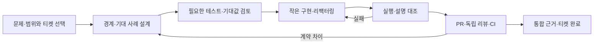

# 개발·주문 흐름과 검증 범위

> **#18 마무리 — 2026-10-03:** PR #40까지 병합한 `b574d9a`를 기준으로 [완료 정리 명세](#epic18-completion)와 [실제 처리·학습 기록](#epic18-implementation)을 연결한다. 아래 작업별 머리말·실행 기록은 당시 이력이다. 제품 코드는 그대로이며 완료 기록에서 이슈·보드 반영과 기존 CI 근거를 구분한다.

> **#24 현재 설명 갱신 — 2026-10-03:** PR #38 병합 기준 `9be6936`의 코드·테스트와 설명을 대조했다. 아래 #20·23 머리말은 각 작업 당시의 이행 기록이다. #24는 주석·문서 정리이며 거래 동작을 바꾸거나 기존 거래 테스트를 재실행한 기록이 아니다. [#24 명세와 구현 기록](comments-and-flow-spec.md)에서 변경·검증 상태를 확인한다.

> **#23 구현 연결 — 2026-10-02:** #36 병합 커밋 `59dfe6c`에서 내부 타입·잔량 직접 대입을 제한하고 내부 참조를 유지했다. before/engine/publisher/after 실패 분기, 3초 뒤 작업의 계속 실행, interrupt·close는 기존 정책대로 회귀를 보강했다. [상세 명세](state-access-boundaries-spec.md)와 [구현 읽기](state-access-boundaries-review.md)에 실제 흐름·실행 결과·남은 한계를 연결한다.

2026-10-02 #20 이행 반영. 기준 통합 커밋은 `2ccd425`, 로컬 구현은 `refactor/order-usecases/20`이다. 기존 처리 순서·트랜잭션·timeout 보장을 유지하면서 이름·폴더·Bean 연결을 정리했다. 이번 실행 결과와 코드 읽기 안내는 [#20 구현 기록](order-usecases-review.md)에 분리한다.

[공통 컨벤션](conventions-design.md)은 책임·이름·배치 기준, [#19 마무리 명세](architecture-check-spec.md)는 검사 적용 상태·실행 근거·후속 책임을 맡는다. 이 문서는 실제 처리 순서와 실패 후 남을 수 있는 상태를 설명한다.

## 개발할 때의 흐름



| 단계 | AI가 수행할 일 | 개발자가 판단할 근거 |
| --- | --- | --- |
| 문제·범위 | 현재 문제·코드·선행 티켓을 확인하고 포함/제외를 연결 | 해결할 문제, 사용자·학습 가치, 이번 결과 |
| 상세 설계 | 입력→판단→부수효과→결과와 정상·거절·실패를 정리 | 책임·트랜잭션·실패 후 보장과 중요한 미결정 |
| 테스트·기대값 | 필요한 실패 사례를 먼저 작성하고 기대값의 독립 근거를 검토 | 잘못된 구현이 왜 실패하는지, 무엇은 검사하지 않는지 |
| 구현·검증 | 작은 단위로 구현하고 실제 diff·실행·설명을 대조 | 핵심 판단과 실패 경로의 코드·테스트 연결 |
| PR·종료 | 별도 컨텍스트 리뷰와 CI 결과, 병합 기준·후속 책임을 기록 | 로컬 구현·실행·AI 리뷰·사람의 판단·원격 병합의 차이 |

범위를 합의한 뒤 테스트→검토→구현→검증은 연결해서 진행한다. 매 단계마다 스킬을 다시 호출하거나 이미 합의한 이동을 재승인하지 않는다. 새 보장·범위 변경은 Ask 문답에 남긴다. 문서·주석·단순 이름 이동에는 인위적인 TDD Red나 구현을 그대로 반복하는 새 테스트를 만들지 않는다.

## 실제 코드의 역할과 읽는 순서

제출·취소 UseCase가 업무를 조율하고, MatchingCoordinator가 실행기·발행·결과 대기를 연결한다. 내부 예약·정산·해제 작업은 각 Service가 담당한다.

| 현재 코드 | 맡은 역할 | 확인할 판단 |
| --- | --- | --- |
| [OrderController](../app-api/src/main/kotlin/com/exchange/core/api/order/api/OrderController.kt) | 요청을 값·명령으로 바꾸고 응답으로 변환 | 입력 오류와 업무 거절·시스템 실패의 구분 |
| [SubmitOrderUseCase](../app-api/src/main/kotlin/com/exchange/core/api/order/application/SubmitOrderUseCase.kt), [CancelOrderUseCase](../app-api/src/main/kotlin/com/exchange/core/api/order/application/CancelOrderUseCase.kt) | 제출·취소 조율 | 예약·정산·해제 콜백을 언제 넘기는지 |
| [MatchingCoordinator.process](../app-api/src/main/kotlin/com/exchange/core/api/matching/application/MatchingCoordinator.kt) | 실행기에 명령을 넘기고 발행·후속 작업과 응답 대기를 연결 | 발행 성공 전에는 후속 작업을 실행하지 않음 |
| [MarketWorker.submit](../domain-matching/src/main/kotlin/com/exchange/core/matching/MarketCommandProcessor.kt) | 같은 마켓의 큐·스레드·작업 순서와 실패 전달 | 사전 작업 실패와 엔진/후속 실패의 다른 처리 |
| [MatchingEngine](../domain-matching/src/main/kotlin/com/exchange/core/matching/MatchingEngine.kt) | 가격·수량·상대·취소 가능 여부와 메모리 주문장 판단 | 수수료·DB 저장은 직접 수행하지 않음 |
| [자금 예약](../app-api/src/main/kotlin/com/exchange/core/api/order/application/OrderFundingService.kt), [정산](../app-api/src/main/kotlin/com/exchange/core/api/order/application/TradeSettlementService.kt), [예약 해제](../app-api/src/main/kotlin/com/exchange/core/api/order/application/OrderReservationReleaseService.kt) | 도메인 계산과 포트 호출·트랜잭션을 연결 | 트랜잭션 안에서 함께 변경하는 DB 상태 |

HTTP가 받는 `userId`와 주문 소유자 비교를 완전한 사용자 인증으로 설명하지 않는다. 실행 호출 화살표가 모든 계층의 자유로운 의존을 허용한다는 뜻도 아니다.

## 제출 → 체결 → 정산

1. API가 요청을 도메인 값과 명령으로 변환한다. SubmitOrderUseCase가 설정된 마켓과 LIMIT/GTC 지원 조건을 확인한다. 현재 엔진도 LIMIT/GTC만 지원하며 MARKET/IOC를 상태 변경 전에 거절한다.
2. SubmitOrderUseCase는 자금 예약을 **사전 콜백**, 체결 정산을 **후속 콜백**으로 넘긴다. 실행기는 둘을 같은 마켓 작업 스레드에서 처리한다.
3. **예약 트랜잭션:** [OrderFundingService.reserve](../app-api/src/main/kotlin/com/exchange/core/api/order/application/OrderFundingService.kt)가 예약 요구량을 계산하고 주문별 예약을 저장한 뒤 `available → hold`를 갱신한다. BUY는 거래 대금과 최대 수수료, SELL은 base 자산 수량을 예약한다. 예약 실패면 엔진을 실행하지 않는다.
4. **메모리 변경:** 엔진이 체결 상대·가격·수량을 결정하고 주문장을 변경해 이벤트 목록을 반환한다. 미체결이면 주문은 주문장에 남고 체결별 정산은 없다.
5. **이벤트 저장 트랜잭션:** 영속화 설정이 활성화되면 [PersistentMatchingEventPublisher](../app-api/src/main/kotlin/com/exchange/core/api/matching/infrastructure/persistence/PersistentMatchingEventPublisher.kt)가 [JpaMatchingEventStore](../app-api/src/main/kotlin/com/exchange/core/api/matching/infrastructure/persistence/JpaMatchingEventStore.kt)에 목록을 저장한다. NoOp 설정은 저장하지 않는다. 두 설정에 같은 영속성 보장을 부여하지 않는다.
6. **체결 한 건의 정산 트랜잭션:** 각 `TradeExecuted`마다 maker/taker 예약을 잠금 조회하고 정산 계획을 계산한다. [TradeSettlementService.settle](../app-api/src/main/kotlin/com/exchange/core/api/order/application/TradeSettlementService.kt)이 자산별 균형을 확인하는 원장을 기록하고 양쪽 예약·잔고를 변경한다. 한 건은 함께 롤백하지만 한 명령의 여러 체결 전체가 같은 트랜잭션은 아니다.
7. 발행·후속 정산까지 성공해야 Future가 완료되고 API 응답으로 변환된다. 부분 체결의 미사용 예약과 수수료 나머지는 이후 체결·취소 계약으로 이어진다.

예약·이벤트 저장·각 체결 정산은 서로 다른 트랜잭션이다. 같은 스레드에서 순서대로 실행한다는 것만으로 요청 전체가 원자적이 되는 것은 아니다.

### BUY와 SELL 정산 계산

<details markdown="1">
<summary>예약 감소·hold 소비·반환·지급을 구분해서 읽기</summary>

[OrderFillSettlementCalculator](../domain-order/src/main/kotlin/com/exchange/core/order/OrderFillSettlementCalculator.kt)는 입력 예약을 변경하지 않고 한 주문의 정산 계획을 반환한다. DB 조회·저장·잔고 반영은 호출부의 책임이다. 아래 대금은 `가격 × 최소 단위 수량 ÷ 10^baseAssetScale`로 환산한다. [대금 계산](../domain-order/src/main/kotlin/com/exchange/core/order/QuoteAmountCalculator.kt)은 중간 곱셈에 BigInteger를 쓰며, 최소 단위로 정확히 나눠지지 않거나 최종 Long 범위를 넘으면 거절한다.

| 계산 | BUY | SELL |
| --- | --- | --- |
| 거래 예약 감소 | 지정가 기준 체결 수량의 quote 대금 | 체결 수량의 base 자산 |
| 실제 수수료 | 체결가 대금 × maker/taker 요율 + 이전 소수 나머지에서 최소 단위 미만 버림 | 같은 계산을 총 판매 대금에 적용 |
| 다음 수수료 예약 | 남은 지정가 대금 × 최대 요율 + 새 소수 나머지를 최소 단위로 올림. 전량 체결이면 0 | 별도 수수료 hold 없음 |
| 수수료 예약 감소 | 현재 수수료 예약 − 다음 수수료 예약 | 0 |
| hold 소비 | 체결가 대금 + 실제 수수료 | 체결 수량의 base 자산 |
| hold 반환 | 전체 예약 감소 − hold 소비. 가격 개선분과 불필요해진 수수료 예약을 포함 | 0 |
| 지급 | 체결 수량의 base 자산 | 판매 대금 − 실제 수수료인 quote 자산 |

두 방향 모두 새 소수 나머지를 예약에 보관해 다음 체결 계산으로 넘긴다. [TradingFeeCalculator](../domain-fee/src/main/kotlin/com/exchange/core/fee/TradingFeeCalculator.kt)는 `(이번 금액 × ppm + 이전 나머지 분자) ÷ 1,000,000`의 몫을 청구액으로, 나머지를 다음 분자로 반환한다. 이전 나머지에는 당시 요율이 이미 반영되어 있으므로 요율을 다시 곱하지 않는다. 최소 단위가 1원이면 분자 510,000은 0.51원이며 예약액·청구액이 아니다.

[OrderFillSettlementPlan](../domain-order/src/main/kotlin/com/exchange/core/order/OrderFillSettlementCalculator.kt)의 예약 감소·hold 소비·반환은 서로 다른 금액이다. 실제 수수료는 BUY 소비액 또는 SELL 지급액에 이미 반영되므로 호출부가 다시 차감하면 안 된다. [계산 테스트](../domain-order/src/test/kotlin/com/exchange/core/order/OrderFillSettlementCalculatorTest.kt)는 BUY/SELL·분할 체결·올림 경계·원본 예약 보존을 확인한다.

</details>

### 정산 순서와 원장 분개

<details markdown="1">
<summary>한 체결의 트랜잭션과 차변·대변을 읽기</summary>

[TradeSettlementService.settle](../app-api/src/main/kotlin/com/exchange/core/api/order/application/TradeSettlementService.kt)은 maker/taker 예약을 잠금 조회하고, 체결과 소유자·방향이 맞는지 검사한 뒤 두 정산 계획을 만든다. `TradeExecuted.side`는 taker 방향이며 maker는 반대 방향이어야 한다. 양쪽 분개를 하나의 원장 거래로 저장하고 maker → taker 순서로 예약·잔고를 반영한다. Spring Bean을 통해 호출할 때 이 DB 작업들은 한 체결의 트랜잭션에 참여한다.

거래소 관점에서 사용자 잔고는 부채다. hold 소비·반환은 사용자 HOLD 계정의 DEBIT, 반환금·체결 자산 지급은 AVAILABLE 계정의 CREDIT으로 기록한다. 실제 수수료는 `SYSTEM:{자산}:FEE_REVENUE`의 CREDIT이다. 분개 생성은 계획을 기록으로 변환할 뿐 잔고를 추가 변경하지 않으며, 금액이 0인 분개는 제외한다.

한 주문만으로 자산별 균형이 맞는 것은 아니다. 양쪽 분개를 합친 [LedgerTransaction](../domain-ledger/src/main/kotlin/com/exchange/core/ledger/LedgerTransaction.kt)이 각 자산의 차변·대변 합계를 검증한다. KRW 차이를 BTC로 상쇄할 수 없다. `sourceEventId`는 마켓 ID와 엔진 순번이며 `occurredAt`은 매칭 시각이 아닌 정산 처리 시각이다.

뒤쪽 지급이 실패하면 먼저 저장한 원장과 양쪽 예약·잔고도 그 체결의 트랜잭션에서 롤백된다. 앞선 체결의 커밋·이벤트 저장·메모리 주문장까지 되돌리는 것은 아니다. [정산 테스트](../app-api/src/test/kotlin/com/exchange/core/api/order/application/TradeSettlementServiceTest.kt)는 뒤쪽 지급 실패와 hold 부족 시 롤백을 확인한다.

</details>

## 취소 → 남은 예약 해제

1. API → CancelOrderUseCase → MatchingCoordinator → 마켓 실행기 → 엔진으로 명령이 전달된다.
2. 주문이 없거나 소유자가 다르면 취소 거절 이벤트를 반환한다. `OrderCancelled`가 아니므로 예약 해제를 호출하지 않는다.
3. 취소 가능하면 엔진이 주문을 메모리 주문장에서 제거하고 취소 이벤트를 반환한다.
4. 설정된 publisher가 성공한 뒤에 후속 콜백이 예약 해제를 호출한다. NoOp이면 이벤트 저장은 생략된다.
5. **해제 트랜잭션:** [OrderReservationReleaseService.release](../app-api/src/main/kotlin/com/exchange/core/api/order/application/OrderReservationReleaseService.kt)가 예약을 잠금 조회한다. 이미 RELEASED이면 추가 잔고 반환 없이 종료한다. 그렇지 않으면 도메인 전이로 새 예약 객체를 만들고 예약 저장·`hold → available`을 함께 처리한다. 잔고 반환 실패면 이 트랜잭션의 예약 갱신도 롤백한다.
6. 후속 처리까지 성공하면 API가 이벤트 결과를 반환한다. 부분 체결 뒤 취소는 이미 정산한 체결·수수료를 되돌리지 않고 남은 예약만 해제한다.

해제 서비스의 중복 반환 방지와 HTTP 취소의 동일 응답 재생은 다르다. 두 번째 HTTP 취소는 주문장에 주문이 없어 거절될 수 있다.

## 거절·부분 실패·시간 초과

아래에서 ‘롤백’은 지정한 DB 트랜잭션의 범위다. 이미 완료된 다른 트랜잭션과 메모리 변경까지 되돌린다는 뜻이 아니다.

| 발생 지점 | 실행하지 않는 후속 작업 | 남을 수 있는 상태·현재 처리 | 검증 책임 |
| --- | --- | --- | --- |
| 값·마켓·지원 조건 오류 | 예약·엔진·이벤트·정산 | 해당 처리의 상태 변경 전 거절 | #20 |
| 자금 예약 실패 | 엔진·이벤트·정산 | 예약 insert와 잔고 갱신은 예약 트랜잭션에서 롤백. 실행기는 해당 요청만 실패 처리 | #22, #23 |
| 예약 성공 후 엔진 실패 | 이벤트·정산 | 먼저 커밋된 예약이 남을 수 있음. 사전 작업이 있었으므로 해당 마켓을 실패 상태로 전환 | #23 |
| 이벤트 저장 실패 | 정산 또는 예약 해제 | 실패한 이벤트 트랜잭션만 롤백. 엔진 변경·먼저 커밋한 예약은 남을 수 있고 해당 마켓 후속 작업은 거부 | #21, #23 |
| 뒤쪽 체결의 정산 실패 | 그 뒤 체결의 정산 | 실패한 체결만 롤백. 앞선 체결 커밋·엔진 변경·이벤트 기록은 남을 수 있음 | #22, #23 |
| 예약 해제 실패 | 정상 완료 응답 | 해제 DB 작업은 롤백하지만 앞선 주문장 제거·이벤트 저장은 남을 수 있음 | #22, #23 |
| HTTP 결과 대기 3초 초과 | 호출자의 결과 대기 | worker를 취소하거나 DB를 롤백하지 않음. 계속 진행할 수 있어 결과 미확정 | #20, #23 |

마켓 실패 전환의 코드 조건은 `beforeMatching != null || matchingCompleted`다. 사전 작업 실패는 별도 catch에서 요청만 실패시킨다. 사전 작업 없이 엔진이 거절한 경우까지 무조건 마켓을 중단한다고 일반화하지 않는다. 실패한 마켓의 후속 큐 작업도 거부하지만 다른 마켓은 독립적으로 처리한다.

현재 자동 보상·재처리·재시작 복구를 제공한다는 근거는 없다. 필요한 보장 변경은 별도 범위로 정하며 이 문서 정리에서 추가하지 않는다.

### 실행기의 종료와 현재 한계

[MarketCommandProcessor](../domain-matching/src/main/kotlin/com/exchange/core/matching/MarketCommandProcessor.kt)는 같은 마켓의 사전 작업 → 엔진 → 후속 작업을 하나의 worker에서 직렬 처리한다. 사전 작업의 실제 금전 부작용을 관측하는 것이 아니라, 사전 콜백의 존재·정상 반환과 매칭 완료 여부로 중단을 판단한다. 빈 사전 콜백도 존재하면 사전 작업 없는 호출과 다른 실패 분기를 탄다. 실패한 마켓의 대기·신규 명령은 콜백 실행 전에 거절하며 원인을 이어 전달한다.

호출자의 timeout이나 interrupt는 worker 취소가 아니다. interrupt에서는 호출자 스레드의 interrupt flag를 복구한다. `close()`는 신규 접수를 막고 executor의 `shutdown()`을 호출하며, 이미 접수한 작업은 계속 처리한다. 종료 완료를 기다리지는 않는다.

<details markdown="1">
<summary>아직 구현하지 않은 실행 방식·용량·종료 개선</summary>

현재 구현은 JVM 메모리의 마켓별 worker다. 큐 크기와 역압력(backpressure), worker 수 제한, 종료 완료 대기 시간, 큐 깊이 지표는 제공하지 않는다. Kafka partition·coroutine channel·bounded queue는 향후 검토할 대안이며 현재 사용 중인 기술이 아니다. 이 문서로 새 개선 작업의 착수나 특정 대안 채택을 결정하지 않는다.

</details>

## 저장과 상태 판단의 경계

[Balance](../domain-ledger/src/main/kotlin/com/exchange/core/ledger/Balance.kt)와 [OrderReservation](../domain-order/src/main/kotlin/com/exchange/core/order/OrderReservation.kt)의 도메인 전이는 불변식을 확인하고 새 상태를 반환한다. 도메인 객체의 불변성과 DB에서의 동시 갱신은 같은 검증이 아니다.

[PostgresBalanceStore](../app-api/src/main/kotlin/com/exchange/core/api/ledger/infrastructure/persistence/PostgresBalanceStore.kt)는 잔고 조건을 만족한 행만 변경하고 PostgreSQL `RETURNING`으로 변경 후 값을 받는다. [PostgresOrderReservationStore](../app-api/src/main/kotlin/com/exchange/core/api/order/infrastructure/persistence/PostgresOrderReservationStore.kt)는 예약 잠금·생성·갱신을 수행한다. 이 저장 계약은 #21~22에서 보존·검증한다.

[MatchingPersistenceConfig](../app-api/src/main/kotlin/com/exchange/core/api/config/MatchingPersistenceConfig.kt)는 영속 발행 설정을 조립한다. `@Bean`·`@Transactional` 선언 검사와 실제 Spring 프록시·DB 트랜잭션 실행은 구분한다.

### 영속화 설정과 후속 처리

| `exchange.matching.persistence.enabled` | config가 선택하는 Bean | publisher 결과 → 후속 작업 |
| --- | --- | --- |
| `false` 또는 미지정 | [MatchingConfig](../app-api/src/main/kotlin/com/exchange/core/api/config/MatchingConfig.kt)의 NoOpMatchingEventPublisher | 저장·전송 없이 성공 → 체결 정산 또는 예약 해제 진행 |
| `true` | MatchingPersistenceConfig의 PersistentMatchingEventPublisher | 저장 성공 → 후속 작업. 저장 실패 → 오류 전달·후속 작업 생략·같은 마켓 후속 요청 거절 |

NoOp는 저장 장애 시 선택하는 fallback이 아니다. ledger 활성화는 별도 설정이며, 이 표는 matching 이벤트 영속화와 후속 콜백의 관계를 설명한다. [설정 테스트](../app-api/src/test/kotlin/com/exchange/core/api/config/MatchingPublisherConfigurationTest.kt)는 세 설정의 Bean 선택과 콜백을 확인하고, [실제 저장 실패 테스트](../app-api/src/test/kotlin/com/exchange/core/api/matching/application/MatchingCoordinatorPersistenceFailureTest.kt)는 DB 실패 경계를 확인한다.

조건부 잔고 갱신은 read-then-write 경쟁을 피하도록 조건과 변경을 `UPDATE … RETURNING` 한 문장에 묶는다. 미갱신 후 원인 분류를 위한 조회는 조회 시점의 잔고이며, 실패 순간의 값을 고정한 snapshot은 아니다. 예약 행의 잠금은 반환 객체가 아닌 DB 트랜잭션에 속하므로 잠금 조회 → 판단 → 갱신을 같은 트랜잭션에서 해야 한다.

### 내부 주문장의 구조와 공유 참조

<details markdown="1">
<summary>가격 우선·FIFO와 같은 주문 객체의 잔량 변경</summary>

[OrderBook](../domain-matching/src/main/kotlin/com/exchange/core/matching/OrderBook.kt)은 매수 가격을 내림차순, 매도 가격을 오름차순으로 정렬한다. 같은 가격의 [PriceLevel](../domain-matching/src/main/kotlin/com/exchange/core/matching/PriceLevel.kt)은 입력 순서(FIFO)를 유지한다.

```text
bids: 101 → order-a, order-b
      100 → order-c
asks: 102 → order-d
```

매도 주문은 매수 101 레벨부터 만나며, 같은 가격이면 order-a → order-b 순서다. 매수 주문은 가장 낮은 매도 102 레벨부터 만난다. `orderIndex`는 orderId로 side·price를 찾아 가격 레벨을 검색하는 인덱스다. 외부 취소 명령은 marketId·orderId·userId를 포함하며, 인덱스의 검색 키와 명령 필드를 혼동하지 않는다.

`firstOrder/get/find`는 복사본이 아닌 같은 내부 BookOrder 참조를 반환한다. `fill(4)`를 호출하면 원수량 10은 유지되고 같은 객체의 잔량만 10 → 6으로 바뀐다. Kotlin `internal`과 잔량의 private setter는 외부 접근·직접 대입을 제한하며, 내부 객체를 불변으로 만드는 것은 아니다. Java·reflection까지 차단한다고 해석하지 않는다. 과거 `snapshot()`은 #23에서 제거됐으며 새 외부 조회 API를 제공한 것은 아니다.

[상태 소유 테스트](../domain-matching/src/test/kotlin/com/exchange/core/matching/MatchingStateOwnershipTest.kt)의 동일 참조·잔량·원수량 확인과 [매칭 엔진 테스트](../domain-matching/src/test/kotlin/com/exchange/core/matching/MatchingEngineTest.kt)의 가격 우선·FIFO를 각각 근거로 읽는다.

</details>

## 어떤 검사로 무엇을 확인하는가

| 검증 수준 | 확인하는 것 | 이것만으로 확인하지 못하는 것 | 근거 |
| --- | --- | --- | --- |
| 구조 | 기술·직접 의존·포트 타입·테스트 역의존·Bean 선언 | 금액, 호출 순서, DB 원자성, 실제 DI 성공 | [운영 구조 검사](../architecture-tests/src/test/kotlin/com/exchange/architecture/ProductionArchitectureTest.kt), [현재 적용표](architecture-check-spec.md) |
| 순수 도메인 | 값·계산·불변 상태 전이·원본 유지 | SQL 경쟁·Spring 프록시 | [BalanceTest](../domain-ledger/src/test/kotlin/com/exchange/core/ledger/BalanceTest.kt), [OrderReservationTest](../domain-order/src/test/kotlin/com/exchange/core/order/OrderReservationTest.kt) |
| DB 통합 | 실제 SQL/JPA·잠금·트랜잭션 안의 원자성 | HTTP 전체 연결·요청 전체 롤백 | 아래 예약·정산·해제 테스트 |
| 실행기·콜백 | 순서·호출/미호출·실패 후 진행 | 재시작 복구 | [MarketCommandProcessorTest](../domain-matching/src/test/kotlin/com/exchange/core/matching/MarketCommandProcessorTest.kt), 저장 실패 테스트 |
| API 연결 | HTTP→실제 Bean→도메인→DB의 대표 흐름 | 모든 금액·실패 조합 | [OrderLifecycleE2ETest](../app-api/src/test/kotlin/com/exchange/core/api/order/application/OrderLifecycleE2ETest.kt) |
| 의미 리뷰 | 이름·책임·설명이 업무 의도와 맞는지 | 기계적인 무결함 증명 | 개발자 판단과 독립 PR 리뷰 |

### 기존 테스트에서 찾을 대표 사례

이 표는 테스트 소스에서 확인한 사례다. 이번 문서 작업에서 재실행했다는 뜻은 아니다. 기존 실행 시점과 결과는 [#19 검증 근거](architecture-check-spec.md), 각 `architecture-*-verification.json` 및 PR/CI 기록에 구분해 남긴다.

| 기대 사례 | 실제 테스트 |
| --- | --- |
| 예약 잔고 부족이면 예약 insert도 롤백 | [OrderFundingServiceTest](../app-api/src/test/kotlin/com/exchange/core/api/order/application/OrderFundingServiceTest.kt)의 `잔고가 부족하면 주문 예약 저장도 롤백한다` |
| 해제 실패 롤백·중복 잔고 반환 방지·동시 해제 | [OrderReservationReleaseServiceTest](../app-api/src/test/kotlin/com/exchange/core/api/order/application/OrderReservationReleaseServiceTest.kt) |
| 한 체결의 양쪽 롤백·수수료 나머지·부분 체결 후 미사용 금액 반환 | [TradeSettlementServiceTest](../app-api/src/test/kotlin/com/exchange/core/api/order/application/TradeSettlementServiceTest.kt) |
| 실제 이벤트 저장 실패·같은 마켓 거부·다른 마켓 독립 | [MatchingCoordinatorPersistenceFailureTest](../app-api/src/test/kotlin/com/exchange/core/api/matching/application/MatchingCoordinatorPersistenceFailureTest.kt) |
| 전량 체결·미체결 BUY/SELL 취소 | [OrderLifecycleE2ETest](../app-api/src/test/kotlin/com/exchange/core/api/order/application/OrderLifecycleE2ETest.kt) |
| 같은 마켓 순서·동시 요청·후속 큐 실패 전달 | [MarketCommandProcessorTest](../domain-matching/src/test/kotlin/com/exchange/core/matching/MarketCommandProcessorTest.kt) |

| #22·23에서 보강한 사례 | 근거와 확인 수준 |
| --- | --- |
| BUY 3개 중 1개 체결 뒤 2개 취소 | [OrderLifecycleE2ETest](../app-api/src/test/kotlin/com/exchange/core/api/order/application/OrderLifecycleE2ETest.kt): 실제 HTTP·DB에서 남은 예약 202,000만 반환, 구매자 현금 909,100/hold 0·BTC 1 및 기존 원장 보존 |
| timeout 뒤 작업 계속·interrupt·close | [MatchingCoordinatorContractTest](../app-api/src/test/kotlin/com/exchange/core/api/matching/application/MatchingCoordinatorContractTest.kt), MarketCommandProcessorTest: 실제 메모리 worker와 조율자 수준. HTTP·DB timeout 전체 검증은 아님 |
| 앞선 정산 성공 뒤 다음 정산 실패 | [TradeSettlementServiceTest](../app-api/src/test/kotlin/com/exchange/core/api/order/application/TradeSettlementServiceTest.kt)의 `분할 정산 실패는 나머지와 수수료 원장도 롤백하고 재시도에서 한 번만 청구한다`: 실제 DB에서 첫 정산 상태 보존·다음 정산 롤백·재시도 확인. 한 HTTP 명령이 여러 체결을 만들고 후반에 실패하는 전체 경로를 실행한 것은 아님 |

이 사례의 기존 실행 기록은 [#22](immutable-db-contracts-review.md)와 [#23](state-access-boundaries-review.md)에 있다. 소스에서 확인한 범위와 각 기록의 실제 실행 시점을 구분하며, #24에서 거래 테스트를 다시 실행했다고 표시하지 않는다.

## 로컬 구조 검사와 전체 검증

**구조만 확인:** JDK 25와 Gradle Wrapper를 사용한다. 운영 클래스를 컴파일해 읽지만 서버·DB·Docker를 시작하지 않는다.

```bash
./gradlew :architecture-tests:test --no-daemon --console=plain
```

결과: `architecture-tests/build/reports/tests/test/index.html`, `architecture-tests/build/test-results/test/TEST-*.xml`. 실제 재실행이 필요한 비교에서는 `--rerun-tasks`를 붙이고, `UP-TO-DATE`와 이번 실행을 구분한다.

**전체 확인:** Docker가 필요하다. PostgreSQL은 Testcontainers가 시작·종료한다. 현재 [GitHub Actions](../.github/workflows/build-and-test.yml)와 같은 명령이다.

```bash
./gradlew build --no-daemon --continue --stacktrace --rerun-tasks
```

CI는 성공·실패와 관계없이 `test-reports`를 업로드하며 보관은 7일이다. 영구 근거에는 실행 커밋·명령·결과·미실행 범위를 저장소 기록으로 남긴다. 설정 파일만 있거나 위반 0개가 출력됐다는 이유로 수집 실패·미평가를 통과로 인정하지 않는다.

## #24 당시의 후속 범위와 완료의 뜻

#19는 검사 기반·현재 적용 결과·이 문서와 공통 기준을 제공한다. #20은 주문·HTTP·application 배치와 운영 검사를 연결했고 #21은 저장·발행 이름·위치와 남은 규칙을 이행했다. 적용과 검증은 [저장 경계 구현 기록](storage-boundaries-review.md)에서 확인한다. #22는 [불변 상태·DB 계약](immutable-db-contracts-review.md)의 경계·경쟁·실패 사례와 HTTP 부분 체결 후 취소를 보강했다. #23은 [가변 주문장·실행 경계](state-access-boundaries-review.md)를 제한·검증했다. #24는 주석·학습 설명을 정리하고, #25에는 CI 결과 읽기·최종 적용 상태 대조가 남는다. 관련 PR 병합과 이슈/보드 종료 상태는 구분한다.

기존 진행 순서는 **#19 → #25 초기 → #20 → #21 → #23 → #22 → #24 → #25 최종**이다. 각 티켓의 입력·완료 결과는 [후속 책임표](architecture-check-spec.md)에 연결한다. #25의 실행·보고서 업로드는 이미 연결돼 있으며, 초기 결과 읽기 절차는 PR #34에서 연결됐고, #20 이후에도 최종 적용 상태 확인은 별도로 남는다.

문서 작성·로컬 검사·독립 AI 리뷰·사람의 이해·PR/CI·병합은 각각 기록한다. #19 완료는 위 후속 흐름 전부의 검증 완료가 아니다. Projects 현재 상태를 이번 작업에서 확인하거나 변경한 것으로 기록하지 않는다.

<!-- EPIC18_COMPLETION_SPEC_START -->
<a id="epic18-completion"></a>

# #18 공통 컨벤션·검증 체계 마무리 명세

**결과:** #20~25의 변경·검증·한계를 기존 근거에 연결하고, 이슈와 Projects 상태를 실제 완료 상태에 맞춘다. 마지막으로 #18의 학습·설명 조건을 확인한다. 새 검사나 제품 코드를 만드는 작업은 아니다.

2026-10-03 · 기준: `feature/phase-2/integration` / `b574d9ad7902c0776e181f9eb55132b17474140f` · 설계 브랜치: `docs/convention-completion/18`. 이 절이 마무리 명세의 원본이며 HTML은 같은 내용을 표시한다.

## 1. 명세 작성 당시 확인한 사실과 다음 결과

아래 표는 구현 전 상태다. 이후 처리와 현재 상태는 [완료 기록](#epic18-implementation)에 남긴다.

| 대상 | 확인한 사실 | 완료 처리 전에 연결할 근거 |
| --- | --- | --- |
| [#19](https://github.com/0Chord/coin-exchange/issues/19) | Closed · Projects Done | 기존 완료 기록 유지. 다시 검사 기반을 만들지 않음 |
| [#20](https://github.com/0Chord/coin-exchange/issues/20) | [PR #35](https://github.com/0Chord/coin-exchange/pull/35) 병합 · 이슈 Open / Todo | [유즈케이스·HTTP·Bean 검증](order-usecases-review.md)과 실제 CI |
| [#21](https://github.com/0Chord/coin-exchange/issues/21) | [PR #36](https://github.com/0Chord/coin-exchange/pull/36) 병합 · Open / Todo | [저장 포트·구현·설정 검증](storage-boundaries-review.md), SQL·트랜잭션 유지 |
| [#22](https://github.com/0Chord/coin-exchange/issues/22) | [PR #38](https://github.com/0Chord/coin-exchange/pull/38) 병합 · Open / Todo | [불변 상태·DB 계약](immutable-db-contracts-review.md), 부분 체결 후 취소 |
| [#23](https://github.com/0Chord/coin-exchange/issues/23) | [PR #37](https://github.com/0Chord/coin-exchange/pull/37) 병합 · Open / Todo | [내부 상태·실행 경계](state-access-boundaries-review.md), timeout·실패 후 처리 |
| [#24](https://github.com/0Chord/coin-exchange/issues/24) | [PR #39](https://github.com/0Chord/coin-exchange/pull/39) 병합 · Open / Todo | [대표 주석 전후·흐름·링크 검증](comments-and-flow-spec.md). 새 제품 테스트를 만들지 않은 이유 포함 |
| [#25](https://github.com/0Chord/coin-exchange/issues/25) | [PR #34](https://github.com/0Chord/coin-exchange/pull/34)·[PR #40](https://github.com/0Chord/coin-exchange/pull/40) 병합 · Open / Todo | [최종 결과 읽기 기록](ci-result-reading-review.md) + 이번 병합 CI의 실제 결과 |
| [#18](https://github.com/0Chord/coin-exchange/issues/18) | Open · Projects Todo | 위 하위 조건 + 학습 문답·미해결 사항 |

**명세 작성 당시 병합 CI는 실행 중이었다.** [run 37095258240](https://github.com/0Chord/coin-exchange/actions/runs/37095258240)의 `Architecture checks`와 `Build and test`를 후속 실행에서 다시 조회하고 실제 보고서를 대조한다. 이전 PR의 성공·이전 통합의 검사 개수를 이 실행의 결과로 복사하지 않는다.

위 표는 이슈·PR·Projects 조회 및 기존 기록의 연결이다. 각 이슈의 모든 수용 조건을 새 실행으로 검증했다는 표가 아니다.

## 2. 범위와 보존할 계약

- 포함: 티켓별 완료 조건과 근거 대조, 같은 병합 커밋의 CI·보고서 확인, 현재와 다른 옛 진행 문구 정리, 실제 학습 문답, 이슈·Projects 완료 처리와 재조회 절차.
- 유지: API·SQL·트랜잭션·순서·실패 경계, 현재 P01~P09 검사, 기존 우선순위와 설계 선택 이력.
- 제외: 새 테스트 프레임워크·검사 규칙, CI 성능 개선, PITEST·Trivy·SonarQube, 자동 복구·보상·재시도, 전 클래스 역할 등록표, 모든 실패 조합의 재실행.
- 이 명세만으로 원격 수정·댓글·이슈 종료를 실행하지 않는다. 후속으로 완료 정리 실행을 요청받으면 같은 범위 안에서 이어가며 티켓마다 승인을 반복하지 않는다.

## 3. 입력 → 판단 → 반영 → 확인

1. **입력 고정:** 통합 HEAD, PR별 병합 커밋·리뷰, 이슈 최신 본문, Projects 실제 필드, 실행 ID·시도 번호를 읽는다. 지금 기준 뒤에 다른 변경이 들어왔다면 차이를 확인하고 완료 기준 커밋을 기록한다.
2. **근거 대조:** 이슈의 각 완료 조건을 기존 문서·코드·테스트/리뷰·실행 결과와 연결한다. 테스트가 소스에 있다는 사실과 실제 실행된 결과를 구분한다. 구조 검사는 업무 금액·DB 원자성·실행 순서의 증거로 대신 쓰지 않는다.
3. **CI 판단:** 두 작업의 결론·실패 단계·업로드 상태를 확인하고, 같은 실행의 보고서에서 필수 운영 P01~P09와 필요한 제품 테스트를 확인한다. 기존 [#25 읽기 절차](ci-result-reading-spec.md)를 재사용한다.
4. **완료 기록 작성:** 이슈마다 변경 결과 / 병합 PR·커밋 / 검증 근거 / 미실행·한계 / 남은 필수 작업 유무를 한 번 정리한다. 옛 기록은 날짜가 있는 이력으로 보존한다.
5. **하위 상태 반영:** 필수 조건이 충족된 이슈만 완료 사유로 Close하고 Projects를 Done으로 맞춘다. #20~24는 자신의 증거가 충분하면 먼저 처리할 수 있다. #25는 최종 통합·보고서 조건 충족 후 처리한다.
6. **상위 마무리:** 하위 완료, 현재 기준과 문서 일치, 실제 학습 기록을 확인한 뒤 #18 체크리스트와 완료 기록을 정리한다. 충족하지 못한 조건은 미확인 또는 미완료로 남긴다.
7. **재조회:** 이슈 state/stateReason, 체크리스트, Projects Status를 각각 다시 읽는다. 한쪽만 바뀌었으면 부분 완료로 보고하고 남은 변경만 이어간다.

GitHub 이슈 종료와 Projects 변경은 별개의 작업이다. 작업은 완료됐지만 보드 갱신에 실패했다면 이슈는 완료 상태로 유지하고 보드 상태만 다시 갱신한다. 이 경우를 완료 기록에 구분한다. 중복 완료 댓글·중복 카드·새 상태 필드는 만들지 않는다.

## 4. 어떤 문구를 현재 상태에 맞출까

| 기존 표현 | 반영할 현재 기준 | 근거 |
| --- | --- | --- |
| 다음은 #25 초기 단계 | 초기 PR #34와 최종 PR #40은 병합. 최종 통합 증거·상태 정리 단계 | 두 PR와 #25 기록 |
| UseCase·Coordinator는 목표 이름 | 현재 실제 이름·배치로 이행됨 | #20 및 #21 기록 |
| 모든 운영 클래스의 역할·배치 목록 | 전체 운영 수집과 원본 폴더 검사 + 식별 가능한 역할별 규칙. 일반 클래스의 업무 역할·정확한 이름은 리뷰 | [현재 공통 컨벤션](conventions-design.md). 클래스마다 등록하는 과거 설계를 복원하지 않음 |
| 공개 잔량 setter·snapshot이 현재 문제 | #23에서 internal·private setter·snapshot 제거로 제한. 내부 공유 참조는 유지 | #23 기록. Java/reflection 전체 차단은 아님 |
| 부분 체결 취소·timeout은 추가 확인 후보 | #22 HTTP/DB 부분 체결 취소, #23 메모리 worker timeout 사례와 실행 근거 연결 | 모든 장애 조합·HTTP/DB timeout까지 검증했다는 의미는 아님 |
| #22~23에서 복구 보강 | 해당 티켓이 검증한 롤백·실패 후 요청 경계로 설명 | 자동 복구·보상 신설은 최종 명세에서 제외 |

범위 변경을 새로 결정하는 표가 아니다. 후속 작업에서 이미 합의·병합된 기준을 상위의 오래된 설명과 맞추는 작업이다. 기존 실제 문답은 원문이나 요약 표시를 유지하고, AI 제안을 사용자 답변으로 바꾸지 않는다.

## 5. 수용 사례 — 마무리 과정 자체의 판정

새 자동화나 테스트 코드를 만들기 위한 사례가 아니라, 사람이 완료 기록을 검토할 때 사용할 입력·기대 결과다.

| 사례 | 입력 | 기대 결과·이유 |
| --- | --- | --- |
| 정상 완료 | 관련 PR 병합, 완료 조건별 근거 있음, 필요한 CI·보고서 일치 | 해당 하위 이슈 Close·Done 후 재조회. 상위는 별도 조건 확인 |
| CI 실행 중 | 병합됨, 두 작업 중 하나라도 아직 실행 중 | #25 최종 통합은 대기. 문서/근거 대조는 진행 가능 |
| 규칙 위반 | 현재 운영 구조 검사에서 위반 | 해당 완료 조건 미충족. 위반 규칙·위치·영향 티켓 기록 후 수정 범위 판단 |
| 입력/실행 근거 누락 | 운영 코드 수집 실패 또는 필수 운영 P09 XML 없음·skip | 통과로 간주하지 않음. 전자는 수집/컴파일 경로, 후자는 필수 실행/보고서 경로 확인 |
| 환경 실패 | 구조 통과, Docker 준비 실패 | 구조는 통과·제품 검사는 미실행·전체 CI 실패로 구분. 제품 코드 결함이라고 단정하지 않음 |
| 과거 자료 혼합 | PR HEAD 보고서를 병합 커밋 결과로 기재 | 잘못된 출처로 거절. 재사용할 때도 원래 커밋·시점과 코드 동일성 근거를 명시 |
| 보고서 만료/손상 | CI는 성공이나 필요한 원문을 읽을 수 없음 | 이미 보존한 근거의 충족 여부 확인. 부족하면 필요한 검사만 재실행; 성공 색만으로 항목 완료 금지 |
| 학습 근거 미확인 | HTML 열람 또는 AI 리뷰만 있음 | 사용자 이해 완료로 기록하지 않음. 기술적 완료와 #18 학습 조건을 분리 |
| 일부 반영 실패 | 이슈 Close 성공, Projects 갱신 실패 | 이슈 완료·보드 미반영으로 표시. 재시도는 실패한 작업에 한정 |
| 동시 변경·중복 실행 | 본문이 바뀌었거나 이미 Closed·Done | 최신 편집을 보존하고 관련 절만 갱신. 중복 댓글/카드 없이 기존 반영을 확인 |

## 6. 개발자가 볼 대표 흐름 — 제안, 아직 이해 확인 전

각 사례는 **입력 → 어디서 판단 → 무엇이 남음 → 어느 검사로 확인 → 자동 검증의 한계** 순서로 함께 읽는다. 자연어 설명 뒤 필요한 메서드만 펼친다. 이미 합의한 규칙에 다시 승인을 요구하는 절차가 아니다.

| 상황 | 코드·기대 흐름과 확인할 경계 |
| --- | --- |
| 컨트롤러가 저장 구현을 직접 참조 | [운영 검사 P06](../architecture-tests/src/test/kotlin/com/exchange/architecture/ProductionArchitectureTest.kt)과 [HttpEntryBoundaryContractTest](../architecture-tests/src/test/kotlin/com/exchange/architecture/HttpEntryBoundaryContractTest.kt). 허용 UseCase 진입과 직접 저장 참조를 구분한다. 일반 클래스 업무 이름의 적절성·실제 금액은 이 구조 규칙으로 증명하지 않는다 |
| BUY 3개 중 1개 체결 후 2개 취소 | [OrderLifecycleE2ETest](../app-api/src/test/kotlin/com/exchange/core/api/order/application/OrderLifecycleE2ETest.kt). 이 예제는 구매자 초기 1,000,000원, 지정가 100,000원, 체결가 90,000원, 구매 수수료 900원이다. 남은 예약 202,000원만 반환해 최종 현금 909,100원·hold 0·BTC 1이 된다. 기존 체결·원장은 유지한다. MockMvc와 실제 PostgreSQL이며 외부 TCP 부하 검사는 아니다 |
| 응답을 3초 기다렸는데 끝나지 않음 | [MatchingCoordinator](../app-api/src/main/kotlin/com/exchange/core/api/matching/application/MatchingCoordinator.kt)의 대기와 [MatchingCoordinatorContractTest](../app-api/src/test/kotlin/com/exchange/core/api/matching/application/MatchingCoordinatorContractTest.kt)의 worker 계속 실행 사례. 호출자의 대기 종료는 작업 취소·롤백이 아니다. 그 순간 결과는 미확정이며 무조건 재시도가 안전하다고 결론 내리지 않는다 |

기록은 질문 / 실제 사용자 답변 또는 답변 요약 / 혼동을 풀어 준 설명 / 남은 질문 / 연결 근거만 남긴다. AI가 작성한 정답을 사용자 발언처럼 채우거나 이해도를 점수화하지 않는다. 남은 질문이 기존 보장의 오해라면 설명 후 실제 응답을 확인하고, 이번 범위 밖 기능이면 제외 이유·재검토 조건을 기록한다.

### Ask 결정 기록

- 질문: “#18을 마무리할 때 학습 기록을 어떻게 남길까?”
- AI 추천·이유: 대표 상황 3개를 문답으로 확인한다. 코드 전체 재독 없이 구조·정상 동작·실패 경계의 차이를 드러낼 수 있다.
- 대안: 전체 흐름 시연 문답 / 기존 문답에서 확인된 이해만 모으고 부족한 부분은 미확인으로 표시.
- 사용자 답변·이유: 이 선택지 자체에는 **미답**이다. 대표 세 상황 시연을 채택하거나 수행했다고 기록하지 않는다.
- 후속: 사용자가 구현을 요청했고, 이후 사람의 판단 범위에 관한 별도 Ask에 실제 답변했다. [완료 기록](#epic18-implementation)에 그 답변과 확인된 이해 범위만 남긴다. 미답인 학습 방식 선택을 반복 승인 조건으로 삼지 않는다.

## 7. 작게 이어갈 실행 단위와 완료 기준

| 단위 | 첫 결과 | 완료 기준 |
| --- | --- | --- |
| A. 근거 맞추기 | #20~25의 완료 조건 → PR/리뷰/실행/한계 대응표 | 관련 없는 이전 실패·다른 커밋 결과가 섞이지 않고, 필수 누락과 제외 범위가 구분됨 |
| B. 하위 상태 정리 | 이슈별 완료 기록 및 상태·보드 동기화 | 각각 재조회로 확인. 실행 중 CI·누락 조건이 있는 이슈는 사유와 함께 보류 |
| C. 상위 학습·마무리 | 선택한 방식의 실제 문답과 #18 완료 조건 대조 | 하위 완료, 현행 기준 일치, 근거 링크, 확인한 이해·남은 질문 기록. 조건 충족 시에만 #18 종료·Done |

**이번 명세 작성의 완료:** 범위·정상/실패 처리·작은 실행 순서와 남은 선택이 설명돼 있고 HTML에서 읽을 수 있다. 원격 종료나 학습 답변을 이미 수행한 것으로 표시하지 않는다.

**후속 실행의 종료:** A~C 충족 및 GitHub 재조회. 이슈에는 로컬 HTML만 연결하지 않고 접근 가능한 PR·고정 커밋 문서·CI 링크와 완료 근거 요약을 남긴다. 완료 정리만을 위한 새 이슈나 새 검사기를 요구하지 않는다.

별도 문서 PR을 발행한다면 그 PR의 리뷰·CI·병합 상태도 사실대로 기록한다. 문서만 바뀌는 단계에 인위적인 TDD Red나 전체 제품 테스트 재실행을 추가하지 않는다. 이 절은 설계 당시 기록이며, 이후 사용자의 구현 요청으로 진행한 원격 변경은 아래 완료 기록에서 확인한다.
<!-- EPIC18_COMPLETION_SPEC_END -->

<!-- EPIC18_IMPLEMENTATION_START -->
<a id="epic18-implementation"></a>

# #18 완료 정리 — 결과와 학습

**바뀐 결과:** 병합된 작업의 근거를 이슈마다 연결하고, #20~25와 상위 #18을 Closed · Projects Done으로 맞췄다. #19는 기존 완료 상태를 유지했다. 제품 코드·검사 정책은 이번에 바꾸지 않았다.

2026-10-03 · 기준 통합 `b574d9ad7902c0776e181f9eb55132b17474140f` · 로컬 문서 브랜치 `docs/convention-completion/18`.

## 1. 무엇을 완료했나

입력은 각 이슈의 수용 조건과 병합 PR이다. 조건에 연결되는 코드·검사·한계를 대조하고, 최종 통합 CI의 보고서 원문을 확인했다. 실제 답변으로 학습 기록을 남긴 뒤 이슈와 보드를 각각 갱신·재조회했다.

| 대상 | 확인한 결과 | 원격 상태 |
| --- | --- | --- |
| [#19](https://github.com/0Chord/coin-exchange/issues/19) | 기존 검사 기반 완료 기록 유지 | Closed · Done |
| [#20](https://github.com/0Chord/coin-exchange/issues/20) | UseCase·HTTP·Coordinator·Bean 배치 | Closed · Done |
| [#21](https://github.com/0Chord/coin-exchange/issues/21) | 저장 포트·기술 구현·설정에 따른 Bean 연결 | Closed · Done |
| [#22](https://github.com/0Chord/coin-exchange/issues/22) | 불변 전이·원자적 DB 갱신·부분 체결 뒤 취소 | Closed · Done |
| [#23](https://github.com/0Chord/coin-exchange/issues/23) | 내부 상태 접근·공유 참조·콜백·timeout 경계 | Closed · Done |
| [#24](https://github.com/0Chord/coin-exchange/issues/24) | 판단 이유와 실패 경계를 보존한 주석 정리 | Closed · Done |
| [#25](https://github.com/0Chord/coin-exchange/issues/25) | CI 실행·보고서·실패 이유 읽기 | Closed · Done |
| [#18](https://github.com/0Chord/coin-exchange/issues/18) | 하위 근거·현재 기준·실제 학습 문답 연결 | Closed · Done |

[GitHub Projects](https://github.com/users/0Chord/projects/2)에서도 기존 카드의 Status를 재조회했다. 제목·라벨·담당자·마일스톤·우선순위와 과거 진행 기록을 보존했다. 완료 섹션을 이슈 본문에 한 번만 추가했고 중복 카드나 댓글은 만들지 않았다.

## 2. 무엇을 근거로 완료했나

[최종 통합 CI](https://github.com/0Chord/coin-exchange/actions/runs/37095258240)는 위 통합 커밋의 push 실행, attempt 1이다. 2026-10-03 13:14:50 KST에 성공으로 끝났고 두 작업과 보고서 업로드가 모두 성공했다.

| 확인 수준 | 실제 결과 | 읽을 때 주의할 점 |
| --- | --- | --- |
| 구조 검사 보고서 | 368개, 실패·오류·skip 0 | 모듈·직접 참조·식별 가능한 역할·이름·폴더 등 구조 범위 |
| 전체 빌드 보고서 | 647개, 실패·오류·skip 0 | 제품 279 + 구조 368. 두 보고서 숫자를 더해 고유 테스트 수로 말하지 않음 |
| 필수 운영 검사 | 두 보고서의 정확한 ProductionArchitectureTest에서 P01~P09 각각 1회 | 예제 검사만 통과하거나 운영 검사를 누락한 경우와 구분 |
| 제품별 실행 | API 95 / fee 37 / ledger 21 / matching 74 / order 52 | domain-common·benchmark-jmh의 test는 NO-SOURCE이며 실행 수에 넣지 않음 |

CI 제목의 초록 표시만 읽지 않았다. run·attempt·checkout SHA, artifact 출처·ZIP digest와 업로드 로그, 실제 HTML/XML 결과를 대조했다. 이번 변경은 문서·상태 정리라서 제품 테스트를 로컬에서 다시 실행하거나 인위적인 실패를 만들지 않았다.

<details><summary>보고서 출처와 이슈별 상세 근거</summary>

- 구조 artifact `11263369752`: SHA-256 `914aab29ee75edc9d163bdddfb34d1f079bd0662b697f79ccd2af16f7a1f95c6`.
- 전체 artifact `11264147009`: SHA-256 `a636cbefb6b158e4c5fc20e1045c775cb77b4bccce437b2abb26c0c5c32d1785`.
- 보고서는 7일 보관 정책이다. 이 기록과 이슈 요약은 원본 artifact의 영구 보관을 보장하지 않는다.

| 이슈 | 병합 | 상세 변경·검증·한계 |
| --- | --- | --- |
| #20 | [PR #35](https://github.com/0Chord/coin-exchange/pull/35) | [상세 기록](order-usecases-review.md) |
| #21 | [PR #36](https://github.com/0Chord/coin-exchange/pull/36) | [상세 기록](storage-boundaries-review.md) |
| #22 | [PR #38](https://github.com/0Chord/coin-exchange/pull/38) | [상세 기록](immutable-db-contracts-review.md) |
| #23 | [PR #37](https://github.com/0Chord/coin-exchange/pull/37) | [상세 기록](state-access-boundaries-review.md) |
| #24 | [PR #39](https://github.com/0Chord/coin-exchange/pull/39) | [상세 기록](comments-and-flow-spec.md) |
| #25 | [PR #40](https://github.com/0Chord/coin-exchange/pull/40) | [상세 기록](ci-result-reading-review.md) |

</details>

## 3. 사람이 계속 판단할 부분

**질문:** 구조 검사와 테스트가 모두 통과한 뒤에도, 사람이 직접 판단해야 하는 것은 무엇이라고 생각하는가?

**실제 사용자 답변:**

> 이제는 사람이 비즈니스 로직 판단을 위주나 컨벤션들 예를 들어, 도메인 객체를 사용했는지 트랜잭션 스크립트 패턴을 사용했는지 아니면 네이밍이나 그런것들을 보면 되지 않을까 싶어

**설명과 반영:** 업무 판단이 도메인에 있는지, 유즈케이스는 조율 역할을 지키는지, 이름이 실제 책임을 설명하는지를 리뷰 대상으로 남겼다. `Service`라는 이름이나 트랜잭션 스크립트라는 패턴 이름만으로 위반이라고 결론 내리지는 않는다. 이 프로젝트가 도메인에 맡기기로 한 판단이 어디에 있는지가 기준이다.

예를 들어 이름·폴더·호출 방향이 모두 맞더라도, 유즈케이스 안에서 잔고 부족 판단을 따로 복제했다면 사람이 책임 배치를 확인해야 한다. 반대로 조건부 UPDATE RETURNING은 DB 경쟁을 처리하려고 유지한 계약이므로, SQL이 있다는 이유만으로 제거하지 않는다. 테스트의 기대값·빠진 사례·실패 뒤 남을 상태도 함께 판단한다.

**확인한 이해 범위:** 사용자가 비즈니스 로직·도메인 사용·책임 배치·네이밍을 사람의 검토 대상으로 구분했다. 모든 코드 문법을 이해했다거나 AI 보충 설명까지 이해·승인했다고 표시하지 않는다. 초기의 대표 세 상황 전체 시연은 수행하지 않았다. 미답인 방식 선택과 이번 실제 답변을 구분해, 기존 선택 기록과 함께 학습 조건의 근거로 남겼다.

실제 검출 사례는 #25 기록의 초기 SpringAnnotatedDomain 위반·ScopeValue 누락·실패 XML/skip 거절에 연결했다. 이번 정상 통합에서 다시 운영 위반이 생겼다는 뜻은 아니다. 클래스별 역할 등록을 공통 선택 규칙으로 줄인 이유는 관리 비용이며, 정확한 업무 이름·책임은 리뷰에 남긴다.

## 4. 실패하거나 근거가 부족하면

| 상황 | 처리 | 이번 결과 |
| --- | --- | --- |
| 필수 조건 누락·CI 실패·실행 중 | 통과로 바꾸지 않고 필요한 항목만 남김 | 해당 없음. 현재 통합 결과를 확인함 |
| 이슈는 종료됐지만 보드 갱신 실패 | 완료 이슈는 유지하고 보드만 재시도 | 해당 없음. 기존 카드 Done 재조회 |
| 다른 편집이 들어옴 | 새 내용을 덮어쓰지 않고 차이를 확인 | 하위 이슈 종료에 따른 GitHub의 #18 체크리스트 자동 갱신만 확인해 보존 |
| 사람의 답변이 없음 | AI 설명을 사람의 이해로 기록하지 않음 | 초기 방식 선택은 미답, 후속 실제 답변만 기록 |

## 5. 완료의 범위와 남는 한계

이번에는 공통 컨벤션·검증 체계의 합의한 묶음을 끝냈다. 제품 전체가 무결함이거나 AI가 업무 의미를 자동 판단한다는 결론은 아니다. 내부 공유 참조, 체결별 트랜잭션, timeout 이후 worker 계속 실행 등 기존 계약은 유지된다.

자동 복구·보상·안전한 재시도, 요청 전체 원자성, 모든 경쟁/HTTP 장애 조합, Java/reflection 전체 차단, 원격 강제 Docker·업로드 장애 실험, PITEST·Trivy·SonarQube·CI 속도 개선은 이번 범위에 추가하지 않았다.

완료 정리 실행 당시의 원격 산출물은 이슈의 완료 근거와 상태·보드 반영이다. 이 기록을 저장소에 보존하는 문서 PR의 게시·검증·병합 상태는 해당 PR에서 별도로 확인한다.

<!-- EPIC18_IMPLEMENTATION_END -->
