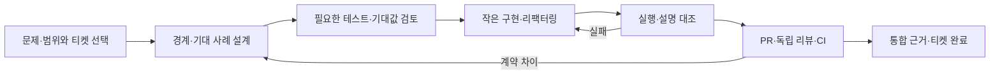

# 개발·주문 흐름과 검증 범위

2026-10-01 확인. 현재 코드 기준은 통합 브랜치 `feature/phase-2/integration`의 `4e3fa45`다. 이번 마무리 작업은 문서·링크 정리이며 주문·DB·Spring을 새로 실행하지 않았다. 아래는 소스와 기존 테스트를 대조한 흐름이고, 새 실행 결과와 구분한다.

[공통 컨벤션](conventions-design.md)은 책임·이름·배치 기준, [#19 마무리 명세](architecture-check-spec.md)는 검사 적용 상태·실행 근거·후속 책임을 맡는다. 이 문서는 실제 처리 순서와 실패 후 남을 수 있는 상태를 설명한다.

## 개발할 때의 흐름



| 단계 | AI가 수행할 일 | 개발자가 판단할 근거 |
| --- | --- | --- |
| 문제·범위 | 현재 문제·코드·선행 티켓을 확인하고 포함/제외를 연결 | 해결할 문제, 사용자·학습 가치, 이번 결과 |
| 상세 설계 | 입력→판단→부수효과→결과와 정상·거절·실패를 정리 | 책임·트랜잭션·실패 후 보장과 중요한 미결정 |
| 테스트·기대값 | 필요한 실패 사례를 먼저 작성하고 기대값의 독립 근거를 검토 | 잘못된 구현이 왜 실패하는지, 무엇은 검사하지 않는지 |
| 구현·검증 | 작은 단위로 구현하고 실제 diff·실행·설명을 대조 | 핵심 판단과 실패 경로의 코드·테스트 연결 |
| PR·종료 | 별도 컨텍스트 리뷰와 CI 결과, 병합 기준·후속 책임을 기록 | 로컬 구현·실행·AI 리뷰·사람의 판단·원격 병합의 차이 |

범위를 합의한 뒤 테스트→검토→구현→검증은 연결해서 진행한다. 매 단계마다 스킬을 다시 호출하거나 이미 합의한 이동을 재승인하지 않는다. 새 보장·범위 변경은 Ask 문답에 남긴다. 문서·주석·단순 이름 이동에는 인위적인 TDD Red나 구현을 그대로 반복하는 새 테스트를 만들지 않는다.

## 실제 코드의 역할과 읽는 순서

현재 제출·취소 진입점은 Service라는 이름이다. 목표 UseCase/Coordinator 이름과 실제 구현을 섞지 않는다.

| 현재 코드 | 맡은 역할 | 확인할 판단 |
| --- | --- | --- |
| [MatchingController](../app-api/src/main/kotlin/com/exchange/core/api/matching/MatchingController.kt) | 요청을 값·명령으로 바꾸고 응답으로 변환 | 입력 오류와 업무 거절·시스템 실패의 구분 |
| [OrderSubmissionService](../app-api/src/main/kotlin/com/exchange/core/api/order/OrderSubmissionService.kt), [OrderCancellationService](../app-api/src/main/kotlin/com/exchange/core/api/order/OrderCancellationService.kt) | 제출·취소 조율 | 예약·정산·해제 콜백을 언제 넘기는지 |
| [MatchingApplicationService.process](../app-api/src/main/kotlin/com/exchange/core/api/matching/MatchingApplicationService.kt) | 실행기에 명령을 넘기고 발행·후속 작업과 응답 대기를 연결 | 발행 성공 전에는 후속 작업을 실행하지 않음 |
| [MarketWorker.submit](../domain-matching/src/main/kotlin/com/exchange/core/matching/MarketCommandProcessor.kt) | 같은 마켓의 큐·스레드·작업 순서와 실패 전달 | 사전 작업 실패와 엔진/후속 실패의 다른 처리 |
| [MatchingEngine](../domain-matching/src/main/kotlin/com/exchange/core/matching/MatchingEngine.kt) | 가격·수량·상대·취소 가능 여부와 메모리 주문장 판단 | 수수료·DB 저장은 직접 수행하지 않음 |
| [자금 예약](../app-api/src/main/kotlin/com/exchange/core/api/order/OrderFundingService.kt), [정산](../app-api/src/main/kotlin/com/exchange/core/api/order/TradeSettlementService.kt), [예약 해제](../app-api/src/main/kotlin/com/exchange/core/api/order/OrderReservationReleaseService.kt) | 도메인 계산과 포트 호출·트랜잭션을 연결 | 트랜잭션 안에서 함께 변경하는 DB 상태 |

HTTP가 받는 `userId`와 주문 소유자 비교를 완전한 사용자 인증으로 설명하지 않는다. 실행 호출 화살표가 모든 계층의 자유로운 의존을 허용한다는 뜻도 아니다.

## 제출 → 체결 → 정산

1. API가 요청을 도메인 값과 명령으로 변환한다. 제출 서비스가 설정된 마켓과 LIMIT/GTC 지원 조건을 확인한다.
2. 제출 서비스는 자금 예약을 **사전 콜백**, 체결 정산을 **후속 콜백**으로 넘긴다. 실행기는 둘을 같은 마켓 작업 스레드에서 처리한다.
3. **예약 트랜잭션:** [OrderFundingService.reserve](../app-api/src/main/kotlin/com/exchange/core/api/order/OrderFundingService.kt)가 예약 요구량을 계산하고 주문별 예약을 저장한 뒤 `available → hold`를 갱신한다. BUY는 거래 대금과 최대 수수료, SELL은 base 자산 수량을 예약한다. 예약 실패면 엔진을 실행하지 않는다.
4. **메모리 변경:** 엔진이 체결 상대·가격·수량을 결정하고 주문장을 변경해 이벤트 목록을 반환한다. 미체결이면 주문은 주문장에 남고 체결별 정산은 없다.
5. **이벤트 저장 트랜잭션:** 영속화 설정이 활성화되면 [PersistentMatchingEventPublisher](../app-api/src/main/kotlin/com/exchange/core/api/matching/persistence/PersistentMatchingEventPublisher.kt)가 [JpaMatchingEventStore](../app-api/src/main/kotlin/com/exchange/core/api/matching/persistence/JpaMatchingEventStore.kt)에 목록을 저장한다. NoOp 설정은 저장하지 않는다. 두 설정에 같은 영속성 보장을 부여하지 않는다.
6. **체결 한 건의 정산 트랜잭션:** 각 `TradeExecuted`마다 maker/taker 예약을 잠금 조회하고 정산 계획을 계산한다. [TradeSettlementService.settle](../app-api/src/main/kotlin/com/exchange/core/api/order/TradeSettlementService.kt)이 자산별 균형을 확인하는 원장을 기록하고 양쪽 예약·잔고를 변경한다. 한 건은 함께 롤백하지만 한 명령의 여러 체결 전체가 같은 트랜잭션은 아니다.
7. 발행·후속 정산까지 성공해야 Future가 완료되고 API 응답으로 변환된다. 부분 체결의 미사용 예약과 수수료 나머지는 이후 체결·취소 계약으로 이어진다.

예약·이벤트 저장·각 체결 정산은 서로 다른 트랜잭션이다. 같은 스레드에서 순서대로 실행한다는 것만으로 요청 전체가 원자적이 되는 것은 아니다.

## 취소 → 남은 예약 해제

1. API → 취소 서비스 → 매칭 연결 → 마켓 실행기 → 엔진으로 명령이 전달된다.
2. 주문이 없거나 소유자가 다르면 취소 거절 이벤트를 반환한다. `OrderCancelled`가 아니므로 예약 해제를 호출하지 않는다.
3. 취소 가능하면 엔진이 주문을 메모리 주문장에서 제거하고 취소 이벤트를 반환한다.
4. 이벤트 발행·저장이 성공한 뒤에 후속 콜백이 예약 해제를 호출한다.
5. **해제 트랜잭션:** [OrderReservationReleaseService.release](../app-api/src/main/kotlin/com/exchange/core/api/order/OrderReservationReleaseService.kt)가 예약을 잠금 조회한다. 이미 RELEASED이면 추가 잔고 반환 없이 종료한다. 그렇지 않으면 도메인 전이로 새 예약 객체를 만들고 예약 저장·`hold → available`을 함께 처리한다. 잔고 반환 실패면 이 트랜잭션의 예약 갱신도 롤백한다.
6. 후속 처리까지 성공하면 API가 이벤트 결과를 반환한다. 부분 체결 뒤 취소는 이미 정산한 체결·수수료를 되돌리지 않고 남은 예약만 해제한다.

해제 서비스의 중복 반환 방지와 HTTP 취소의 동일 응답 재생은 다르다. 두 번째 HTTP 취소는 주문장에 주문이 없어 거절될 수 있다.

## 거절·부분 실패·시간 초과

아래에서 ‘롤백’은 지정한 DB 트랜잭션의 범위다. 이미 완료된 다른 트랜잭션과 메모리 변경까지 되돌린다는 뜻이 아니다.

| 발생 지점 | 실행하지 않는 후속 작업 | 남을 수 있는 상태·현재 처리 | 검증 책임 |
| --- | --- | --- | --- |
| 값·마켓·지원 조건 오류 | 예약·엔진·이벤트·정산 | 해당 처리의 상태 변경 전 거절 | #20 |
| 자금 예약 실패 | 엔진·이벤트·정산 | 예약 insert와 잔고 갱신은 예약 트랜잭션에서 롤백. 실행기는 해당 요청만 실패 처리 | #22, #23 |
| 예약 성공 후 엔진 실패 | 이벤트·정산 | 먼저 커밋된 예약이 남을 수 있음. 사전 작업이 있었으므로 해당 마켓을 실패 상태로 전환 | #23 |
| 이벤트 저장 실패 | 정산 또는 예약 해제 | 실패한 이벤트 트랜잭션만 롤백. 엔진 변경·먼저 커밋한 예약은 남을 수 있고 해당 마켓 후속 작업은 거부 | #21, #23 |
| 뒤쪽 체결의 정산 실패 | 그 뒤 체결의 정산 | 실패한 체결만 롤백. 앞선 체결 커밋·엔진 변경·이벤트 기록은 남을 수 있음 | #22, #23 |
| 예약 해제 실패 | 정상 완료 응답 | 해제 DB 작업은 롤백하지만 앞선 주문장 제거·이벤트 저장은 남을 수 있음 | #22, #23 |
| HTTP 결과 대기 3초 초과 | 호출자의 결과 대기 | worker를 취소하거나 DB를 롤백하지 않음. 계속 진행할 수 있어 결과 미확정 | #20, #23 |

마켓 실패 전환의 코드 조건은 `beforeMatching != null || matchingCompleted`다. 사전 작업 실패는 별도 catch에서 요청만 실패시킨다. 사전 작업 없이 엔진이 거절한 경우까지 무조건 마켓을 중단한다고 일반화하지 않는다. 실패한 마켓의 후속 큐 작업도 거부하지만 다른 마켓은 독립적으로 처리한다.

현재 자동 보상·재처리·재시작 복구를 제공한다는 근거는 없다. 필요한 보장 변경은 별도 범위로 정하며 이 문서 정리에서 추가하지 않는다.

## 저장과 상태 판단의 경계

[Balance](../domain-ledger/src/main/kotlin/com/exchange/core/ledger/Balance.kt)와 [OrderReservation](../domain-order/src/main/kotlin/com/exchange/core/order/OrderReservation.kt)의 도메인 전이는 불변식을 확인하고 새 상태를 반환한다. 도메인 객체의 불변성과 DB에서의 동시 갱신은 같은 검증이 아니다.

[PostgresBalanceStore](../app-api/src/main/kotlin/com/exchange/core/api/ledger/persistence/PostgresBalanceStore.kt)는 잔고 조건을 만족한 행만 변경하고 PostgreSQL `RETURNING`으로 변경 후 값을 받는다. [PostgresOrderReservationStore](../app-api/src/main/kotlin/com/exchange/core/api/order/persistence/PostgresOrderReservationStore.kt)는 예약 잠금·생성·갱신을 수행한다. 이 저장 계약은 #21~22에서 보존·검증한다.

[MatchingPersistenceConfig](../app-api/src/main/kotlin/com/exchange/core/api/config/MatchingPersistenceConfig.kt)는 영속 발행 설정을 조립한다. `@Bean`·`@Transactional` 선언 검사와 실제 Spring 프록시·DB 트랜잭션 실행은 구분한다.

## 어떤 검사로 무엇을 확인하는가

| 검증 수준 | 확인하는 것 | 이것만으로 확인하지 못하는 것 | 근거 |
| --- | --- | --- | --- |
| 구조 | 기술·직접 의존·포트 타입·테스트 역의존·Bean 선언 | 금액, 호출 순서, DB 원자성, 실제 DI 성공 | [운영 구조 검사](../architecture-tests/src/test/kotlin/com/exchange/architecture/ProductionArchitectureTest.kt), [현재 적용표](architecture-check-spec.md) |
| 순수 도메인 | 값·계산·불변 상태 전이·원본 유지 | SQL 경쟁·Spring 프록시 | [BalanceTest](../domain-ledger/src/test/kotlin/com/exchange/core/ledger/BalanceTest.kt), [OrderReservationTest](../domain-order/src/test/kotlin/com/exchange/core/order/OrderReservationTest.kt) |
| DB 통합 | 실제 SQL/JPA·잠금·트랜잭션 안의 원자성 | HTTP 전체 연결·요청 전체 롤백 | 아래 예약·정산·해제 테스트 |
| 실행기·콜백 | 순서·호출/미호출·실패 후 진행 | 재시작 복구 | [MarketCommandProcessorTest](../domain-matching/src/test/kotlin/com/exchange/core/matching/MarketCommandProcessorTest.kt), 저장 실패 테스트 |
| API 연결 | HTTP→실제 Bean→도메인→DB의 대표 흐름 | 모든 금액·실패 조합 | [OrderLifecycleE2ETest](../app-api/src/test/kotlin/com/exchange/core/api/order/OrderLifecycleE2ETest.kt) |
| 의미 리뷰 | 이름·책임·설명이 업무 의도와 맞는지 | 기계적인 무결함 증명 | 개발자 판단과 독립 PR 리뷰 |

### 기존 테스트에서 찾을 대표 사례

이 표는 테스트 소스에서 확인한 사례다. 이번 문서 작업에서 재실행했다는 뜻은 아니다. 기존 실행 시점과 결과는 [#19 검증 근거](architecture-check-spec.md), 각 `architecture-*-verification.json` 및 PR/CI 기록에 구분해 남긴다.

| 기대 사례 | 실제 테스트 |
| --- | --- |
| 예약 잔고 부족이면 예약 insert도 롤백 | [OrderFundingServiceTest](../app-api/src/test/kotlin/com/exchange/core/api/order/OrderFundingServiceTest.kt)의 `잔고가 부족하면 주문 예약 저장도 롤백한다` |
| 해제 실패 롤백·중복 잔고 반환 방지·동시 해제 | [OrderReservationReleaseServiceTest](../app-api/src/test/kotlin/com/exchange/core/api/order/OrderReservationReleaseServiceTest.kt) |
| 한 체결의 양쪽 롤백·수수료 나머지·부분 체결 후 미사용 금액 반환 | [TradeSettlementServiceTest](../app-api/src/test/kotlin/com/exchange/core/api/order/TradeSettlementServiceTest.kt) |
| 실제 이벤트 저장 실패·같은 마켓 거부·다른 마켓 독립 | [MatchingApplicationServicePersistenceFailureTest](../app-api/src/test/kotlin/com/exchange/core/api/matching/MatchingApplicationServicePersistenceFailureTest.kt) |
| 전량 체결·미체결 BUY/SELL 취소 | [OrderLifecycleE2ETest](../app-api/src/test/kotlin/com/exchange/core/api/order/OrderLifecycleE2ETest.kt) |
| 같은 마켓 순서·동시 요청·후속 큐 실패 전달 | [MarketCommandProcessorTest](../domain-matching/src/test/kotlin/com/exchange/core/matching/MarketCommandProcessorTest.kt) |

후속에서 대조할 후보는 HTTP 부분 체결 후 취소, timeout 뒤 실제 결과, 여러 체결 중 후반 정산 실패다. 기존 테스트의 실질 범위를 먼저 확인하고 빈틈만 필요한 검증 수준에서 보강한다. 모두를 E2E로 중복 작성하지 않는다.

## 로컬 구조 검사와 전체 검증

**구조만 확인:** JDK 25와 Gradle Wrapper를 사용한다. 운영 클래스를 컴파일해 읽지만 서버·DB·Docker를 시작하지 않는다.

```bash
./gradlew :architecture-tests:test --no-daemon --console=plain
```

결과: `architecture-tests/build/reports/tests/test/index.html`, `architecture-tests/build/test-results/test/TEST-*.xml`. 실제 재실행이 필요한 비교에서는 `--rerun-tasks`를 붙이고, `UP-TO-DATE`와 이번 실행을 구분한다.

**전체 확인:** Docker가 필요하다. PostgreSQL은 Testcontainers가 시작·종료한다. 현재 [GitHub Actions](../.github/workflows/build-and-test.yml)와 같은 명령이다.

```bash
./gradlew build --no-daemon --continue --stacktrace --rerun-tasks
```

CI는 성공·실패와 관계없이 `test-reports`를 업로드하며 보관은 7일이다. 영구 근거에는 실행 커밋·명령·결과·미실행 범위를 저장소 기록으로 남긴다. 설정 파일만 있거나 위반 0개가 출력됐다는 이유로 수집 실패·미평가를 통과로 인정하지 않는다.

## 후속 범위와 완료의 뜻

#19는 검사 기반·현재 적용 결과·이 문서와 공통 기준을 제공한다. #20~21이 실제 이름·폴더·HTTP/애플리케이션·저장 경계를 정리하며 관련 검사를 활성화한다. #22는 불변 상태·DB 계약, #23은 가변 주문장·실행 경계를 확인한다. #24는 주석·학습 설명, #25는 CI 결과 읽기·최종 적용 상태를 정리한다.

기존 진행 순서는 **#19 → #25 초기 → #20 → #21 → #23 → #22 → #24 → #25 최종**이다. 각 티켓의 입력·완료 결과는 [후속 책임표](architecture-check-spec.md)에 연결한다. #25의 실행·보고서 업로드는 이미 연결돼 있으며, 초기 결과 읽기 절차와 최종 상태 확인이 남아 있다.

문서 작성·로컬 검사·독립 AI 리뷰·사람의 이해·PR/CI·병합은 각각 기록한다. #19 완료는 위 후속 흐름 전부의 검증 완료가 아니다. Projects 현재 상태를 이번 작업에서 확인하거나 변경한 것으로 기록하지 않는다.
