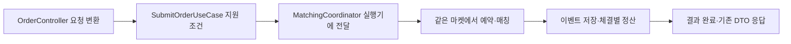

# #20 주문 진입점·매칭 조율 — 구현과 검증

**합의한 세 단위의 로컬 구현·검증을 마쳤다. 구조 352개와 제품·DB 243개가 통과했고 필수 운영 P01~P08을 확인했다.** 작업 폴더는 `/Users/0chord/.codex/worktrees/issue19-module-deps/exchange-core`, 브랜치는 `refactor/order-usecases/20`이다. 구현 기준은 통합 커밋 `2ccd425`다. 아래 집계는 PR 게시 전 로컬 검증 시점의 기록이며, 게시 이후 PR·CI·병합 상태는 GitHub에서 별도로 확인한다. [상세 명세](order-usecases-spec.md)를 따른다.

## 먼저 볼 결과

| 작은 단위 | 바뀐 결과 | 지금 확인한 근거 |
| --- | --- | --- |
| 1. 매칭 연결 | MatchingApplicationService → matching.application.MatchingCoordinator | 새 타입 기대 Red → Green, 실제 이벤트 저장 실패 3개 통과 |
| 2. 주문·HTTP | SubmitOrderUseCase·CancelOrderUseCase·OrderController. 내부 Service·DTO·매퍼 이동, config Bean 연결 | app-api 75개 재실행 통과. 기존 HTTP·금액 기대값 유지 |
| 3. 실제 운영 규칙 | P06 HTTP, P07 application, P08 이번 이름·전체 원본 폴더. 보고서 확인은 P01~P08 | 구조 전체 352개 통과. 이 중 운영 8개·입력 연결 14개·XML 확인 18개. 필수 P01~P08 성공 확인 |

새 거래 기능을 추가한 작업이 아니다. **주문 업무는 유즈케이스에서 시작하고, 실행 순서 연결은 Coordinator, DB 작업은 내부 Service와 저장 구현이 맡는 관계를 이름·폴더에 드러냈다.** #19에서 만든 경계 규칙을 실제 운영 코드에 연결했다.

## 실패 후에는 무엇이 남고 다음 요청은 어떻게 될까

예약·이벤트 저장·체결별 정산/예약 해제는 서로 다른 DB 경계다. 뒤 단계가 실패했다고 앞선 커밋이나 메모리 주문장이 함께 돌아가지는 않는다. 아래 ‘테스트 근거’는 개별 보장을 검증한 범위를 적었으며 모든 조합의 장애 주입을 새로 했다는 뜻은 아니다.

| 실패한 지점 | 남을 수 있는 상태 | 요청 결과·다음 요청 | 근거와 한계 |
| --- | --- | --- | --- |
| HTTP 값 변환·LIMIT/GTC 지원 조건 | 예약·매칭을 아직 하지 않음 | 기존 400·메시지. 마켓 중단 단계에 들어가지 않음 | OrderControllerTest의 가격·MARKET 거절과 코드 대조 |
| 사전 자금 예약 | 실패한 예약 트랜잭션의 예약·hold 변경은 롤백. 매칭 엔진은 미실행 | 원인 오류 전달. 사전 작업 실패만으로 마켓을 장애 상태로 만들지 않음 | OrderFundingServiceTest의 실제 rollback과 MarketCommandProcessorTest. 전체 HTTP 장애 조합을 새로 추가하지 않음 |
| 매칭 후 이벤트 저장 | 예약을 먼저 성공했다면 그 예약이 남을 수 있고, 메모리 매칭은 이미 반영됐을 수 있음. 정산/해제는 아직 호출하지 않음 | 원인 오류 전달. 같은 마켓 후속 명령 거절, 다른 마켓은 계속 동작 | Coordinator DB 충돌 테스트 3개. 이 테스트는 자금 예약을 생략하므로 ‘예약 잔액까지 동시에 확인했다’고 주장하지 않음 |
| 체결 정산 | 실패한 한 체결의 DB 변경은 롤백. 이전 체결·예약·이벤트·메모리 변경은 남을 수 있음 | 성공 응답을 만들지 않음. 실패 마켓의 후속 명령을 막음 | TradeSettlementServiceTest의 한 체결 rollback. 여러 체결 중 후반 실패의 복구·자동 보상은 #22~23 |
| 취소 이벤트 저장 후 예약 해제 | 해제 DB 작업은 롤백될 수 있지만 엔진의 취소·이벤트 저장은 남을 수 있음 | 정상 응답을 먼저 보내지 않음. 후속 명령 거절 경로 | CancelOrderUseCase·worker 코드와 해제 Service rollback 테스트 대조. 엔진/DB 동시 복구는 이번 검증 범위 아님 |
| HTTP의 3초 대기 시간 초과 | worker가 계속 실행할 수 있음. 완료·취소·롤백 중 무엇인지 timeout만으로 확정하지 못함 | 대기 오류 전달. 같은 마켓 중단 여부는 worker의 실제 성공/실패에 달림 | `.get(3, TimeUnit.SECONDS)`와 기존 코드 본문 보존. 실제 timeout 이후 상태에 대한 새 실험은 하지 않음 |

**같은 요청을 다시 보내면 자동 복구되는 구조도 아니다.** 이벤트 저장의 DB 충돌 원인을 제거해도 장애 마켓은 이후 명령을 거절하는 기존 테스트가 있다. 다른 마켓은 별도 worker라 계속 처리한다. 새 복구·보상·재시도 정책은 추가하지 않았다.

## 정상 제출을 여섯 단계로 읽기



1. **HTTP:** 기존 URL·입력 필드로 명령을 만든다. 값의 오류는 여기서 거절될 수 있다.
2. **SubmitOrderUseCase:** 마켓·LIMIT·GTC 지원 여부를 확인하고 예약·정산 콜백을 준비한다.
3. **MatchingCoordinator:** 실행기에 명령을 보내고 완료 결과를 최대 3초 기다린다. 먼저 완료되면 즉시 반환한다. 3초는 큐 대기·예약·매칭·이벤트 저장·후속 작업의 결과 대기 상한이며 이번에 검증해 정한 성능 목표가 아니다. 기존 스레드·큐·매칭 규칙을 사용한다.
4. **마켓 worker:** 사전 예약 → 매칭 엔진을 순서대로 실행한다. 이 실행기의 코드는 이번에 변경하지 않았다.
5. **발행과 정산:** 이벤트 발행이 성공한 뒤에만 체결별 정산을 실행한다. 한 체결의 DB 트랜잭션과 전체 주문 처리는 다르다.
6. **응답:** 모든 후속 작업이 끝난 이벤트를 기존 MatchingResponse·MatchingEventResponse로 변환한다. DTO 이름·JSON 필드·순서·HTTP 계약을 유지한다.

취소도 같은 Coordinator를 사용한다. 엔진이 `OrderCancelled`를 반환하면 이벤트 발행 후 예약을 해제한다. `OrderCancelRejected`이면 응답으로 거절을 알리고 자금을 해제하지 않는다. 없는 주문·다른 사용자·반복 취소의 기존 HTTP 사례가 이를 확인한다.

## Bean 연결에서 보존한 것

| 조립 위치 | 새 연결 | 유지한 계약 |
| --- | --- | --- |
| OrderApplicationConfig | submitOrderUseCase / cancelOrderUseCase | 마켓·정책 Bean 주입, 기존 내부 Service 연결 |
| MatchingConfig | matchingCoordinator → MarketCommandProcessor·MatchingEventPublisher | 단일 마켓 실행기 Bean의 close, NoOp 발행 조건 |
| LedgerPersistenceConfig | 이동한 세 Service의 import·생성 타입 | ledger persistence 활성화 조건, 실제 트랜잭션 경계 |
| MatchingPersistenceConfig | 코드 유지 | 영속 발행 조건과 실제 JPA 저장 연결 |

업무 객체에 `@Service`·`@Component`·`@Repository`를 추가하지 않았다. HTTP `@RestController`·`@RestControllerAdvice`는 유지한다. 실제 Spring 구성과 PostgreSQL을 사용하는 테스트에서 주입·예약/해제/정산 rollback 효과를 확인했다. 테스트 마켓·정책을 사용하므로 배포 환경의 마켓 설정 검증은 아니다.

<details markdown="1">
<summary>구조 검사는 어떤 입력을 어떤 이유로 판단하는지</summary>

## 새 검사기를 만들지 않고 기존 규칙에 연결하기

**입력:** Gradle의 전체 운영 컴파일 출력과 main 원본. 기존 수집기·원본 전달·보고서를 그대로 사용한다.

**입력 연결:** ProductionBoundaryInputs는 실제 수집된 타입의 패키지·표준/메타 어노테이션·현재 포트 구현 관계를 기존 ARCH-03·04의 입력 map으로 연결한다. 새 클래스마다 이름을 등록하지 않는다. 포트 인터페이스는 허용 계약, 구현체는 금지 구현이다. `MarketCommandProcessor` 인터페이스와 InMemory 구현도 구분한다.

핵심 네 타입의 존재만 최소 기대에 둔다. OrderController·두 UseCase·Coordinator가 통째로 사라지는 경우를 잡기 위한 것이며 전체 클래스 목록이 아니다. AmendOrderUseCase와 새 Controller는 전체 출력에서 자동 포함된다. OrderManager도 application 폴더에 있으면 ARCH-04를 받지만 이름 자체를 거절하지 않는다.

**판단과 결과:**

| 실제 운영 기록 | 이번 실행에서 평가한 대상 | 통과·실패의 의미 |
| --- | --- | --- |
| P06 ARCH-03 | HTTP 타입 7개, 실제 Kotlin 최상위 매퍼 포함 | Controller의 UseCase 호출·데이터 변환 허용. Store·엔진·협력자 직접 참조 금지 |
| P07 ARCH-04 | application 6개, 일반 보조 코드도 동일 범위 | 포트·코어·실행기 계약 사용 허용. HTTP·DB·발행 구현·컨테이너 접근 금지. config의 구현 조립은 별도 |
| P08 ARCH-05 | 이름 대상 17개와 전체 main 원본 64개 | 선택한 9개 이름 규칙과 정확한 폴더·package 일치 확인. 일반 이름의 의미는 리뷰 |
| 보고서 확인 | 운영 P01~P08 | 각 기록이 실제로 한 번 성공했는지 확인. 누락·중복·skip·실패·다른 클래스·비슷한 이름은 거절 |

참조 수는 컴파일된 코드의 직접 타입 참조 수다. 요청 횟수나 런타임 실행 경로 수가 아니다. 코드 의존 검사로 금액·JSON·트랜잭션·동시성을 증명하지 않는다.

**#21 이행 경계:** 네 기존 order/persistence·ledger/persistence·matching/persistence·matching/publish 폴더만 원본 위치로 임시 허용한다. 이전 api/order·api/matching 업무 루트나 임의 하위 폴더는 허용하지 않는다. 이 네 폴더의 파일·package 읽기와 금지 구현 참조 검사는 계속 받는다. Store·Publisher·Repository·Entity 및 나머지 이름 규칙 활성화는 #21로 남으며 최종 target 정책은 바꾸지 않았다.

</details>

<details markdown="1">
<summary>테스트 기대값·Red와 Green·확인하지 않은 부분</summary>

## 테스트 작성과 기대값 검토

| 기대 | 구현 전 실패 | 구현 후 근거 |
| --- | --- | --- |
| 새 위치에 MatchingCoordinator, 이전 타입 중복 없음 | 컴파일·수집 성공 후 ‘매칭 조율자가 운영 출력에 없음’으로 1개 실패 | 새 타입 존재 Green과 기존 저장 실패 3개 재사용. 최종 P07은 핵심 타입 준비·의존 규칙으로 확장 |
| 전체 HTTP·application 입력, 새 타입 자동 포함·금지 참조 탐지 | 입력 연결 전 역할이 없어 4개 준비 기대 실패 | 기존 규칙에 연결 후 정상·위반·누락 14개 통과 |
| XML에서 P06~P08이 실제로 실행돼야 함 | 기존 확인 코드가 새 검사 누락·중복 등을 허용해 4개 기대 실패 | 확인 목록을 P01~P08로 확장한 18개 테스트 통과 |

입력 연결 테스트 준비 중 잘못 사용한 필드명, 운영 보고 메시지에서 없는 함수 사용으로 발생한 컴파일 오류는 수정했다. 이를 TDD Red 근거로 사용하지 않았다. 위 Red는 컴파일 후의 기대값 실패다.

정상 반대 사례는 실제 DTO/명령 변환, 잔고·실행기 인터페이스 사용, config의 구현 생성, 금지 참조 없는 일반 OrderManager다. 위반 사례는 HTTP의 Store·Coordinator·엔진 참조, 일반 보조 코드의 DB/HTTP/컨테이너/실행기 구현 참조, UseCase로 이름을 바꾼 포트 구현, 잘못 배치한 Controller다. 준비 누락은 핵심 타입·내부 참조 정의 누락이며, ‘새 클래스 이름 등록 안 함’을 오류로 삼지 않는다.

임시 Java 예제는 검사 규칙을 시험하기 위해 테스트 안에서 컴파일한다. 운영 Kotlin 소스나 실제 운영 출력 파일을 덮어쓰지 않는다. 이 예제들은 제품 기능이나 Bean으로 추가된 것이 아니다. 실제 운영 준수 P06~P08과 탐지력 예제를 구분한다.

기존 거래·테스트 20개 파일은 이름·package·import·주석을 제외한 본문이 기준 커밋과 같음을 대조했다. 기존 금액·JSON·오류 기대값을 줄이거나 skip·넓은 제외로 통과시키지 않았다. 이 텍스트 대조는 동작 테스트를 대신하지 않는다.

## 실제 실행 기록

실행 폴더는 모두 `/Users/0chord/.codex/worktrees/issue19-module-deps/exchange-core`다.

| 단위 | 실행·결과 | 확인 범위 |
| --- | --- | --- |
| 1 Red | P07 첫 기대 1개 실패, `/tmp/issue20-coordinator-red.log` | 실제 목표 타입 누락 |
| 1 Green | P07 1개 + Coordinator DB 실패 3개 통과 | 이름·위치와 기존 실패 격리 |
| 2 Green | `:app-api:test` 75개 통과 | 기존 9개 HTTP·3개 E2E·컨텍스트·예약/정산/해제 및 저장 회귀 |
| 3 Green | 실제 운영 8개 + 입력 연결 14개 + XML 확인 18개, 총 40개 통과 | 이번 운영 연결·누락·우회·보고서 계약 |
| 전체 첫 실행 | 제품 243개 통과, 구조 352개 중 1개 실패 | 원본 전달 테스트가 이전 OrderSubmissionService.kt 이름을 기대. 필수 XML 확인은 실행되지 않음 |
| 구조 재검증 | 기대 경로를 SubmitOrderUseCase.kt로 고친 뒤 구조 352개 통과, P01~P08 확인 성공 | `:architecture-tests:verifyArchitectureReport --rerun-tasks`. 기존 검사도 실제 재실행 |
| 최종 build 연결 | `build :architecture-tests:verifyArchitectureReport` 성공 | 앞서 성공한 테스트 30개 작업은 UP-TO-DATE 재사용, 필수 XML 확인은 다시 실행. 595개를 이 마지막 명령에서 모두 새로 실행했다고 세지 않음 |

최종 XML 집계는 구조 352 + 제품·DB 243 = **595개**, 실패·오류·skip 0개다. 제품·DB 243개는 전체 첫 재실행, 구조 352개는 경로 보완 후 재실행의 결과다. 도메인별 50(order)·37(fee)·16(ledger)·65(matching), app-api 75개다. domain-common은 테스트 코드가 없어 0개이며 통과 사례를 만들어 세지 않았다.

[실행 근거와 코드 해시](order-usecases-verification.json)에 명령·로그·집계·보장 한계를 저장했다.

현재 테스트 기대값 검토·구현 검증은 같은 작성 세션에서 수행했다. 별도 컨텍스트의 독립 PR 리뷰는 아직 아니다. HTML을 읽은 사실·테스트 성공·사용자 이해·승인을 같게 기록하지 않는다.

</details>

## 흐름 판단에 필요한 실제 코드만 보기

아래는 설명용 가짜 코드가 아니라 현재 작업 파일의 일부다. 코드 전체를 읽기 전에 호출 순서와 실패 후 다음 줄이 실행되는지부터 확인한다. 전체 원문은 파일 지도로 연결한다.

### 제출: 예약 콜백과 정산 콜백을 함께 전달한다

이 함수에서 예약을 즉시 호출하는 대신 콜백을 준비한다. 실제 호출은 마켓 worker에서 한다. TradeExecuted에 대해서만 체결 정산을 실행한다.

[실제 파일](../app-api/src/main/kotlin/com/exchange/core/api/order/application/SubmitOrderUseCase.kt) · 59~82행 · 파일 SHA256 `526d93de46b2` · 기준 2ccd425 위의 현재 원문

<details markdown="1">
<summary>판단에 쓰는 실제 코드 펼치기</summary>

```kotlin
        return matchingCoordinator.process(
            command = command,
            beforeMatching = {
                fundingService.reserve(
                    market = market,
                    orderId = command.orderId,
                    userId = command.userId,
                    side = command.side,
                    limitPrice = command.price,
                    quantity = command.quantity,
                    feePolicySnapshot = feePolicySnapshot,
                )
            },
            afterMatching = { events ->
                events.forEach { event ->
                    if (event is TradeExecuted) {
                        tradeSettlementService.settle(
                            market = market,
                            trade = event,
                        )
                    }
                }
            },
        )
```

</details>

### 이벤트 저장에 성공해야 후속 작업을 호출한다

publish가 예외를 던지면 다음 줄의 afterMatching을 실행하지 않는다. get이 받은 비동기 오류는 원인으로 풀어 호출자에게 전달한다. 여기에는 앞선 상태를 되돌리는 코드가 없다.

[실제 파일](../app-api/src/main/kotlin/com/exchange/core/api/matching/application/MatchingCoordinator.kt) · 47~57행 · 파일 SHA256 `bd2a8ae25a69` · 기준 2ccd425 위의 현재 원문

<details markdown="1">
<summary>판단에 쓰는 실제 코드 펼치기</summary>

```kotlin
            processor
                .submit(
                    command = command,
                    beforeMatching = beforeMatching,
                    eventHandler = { events ->
                        publisher.publish(events)
                        afterMatching(events)
                    },
                ).get(3, TimeUnit.SECONDS)
        } catch (error: ExecutionException) {
            throw error.cause ?: error
```

</details>

### 유지한 실행기: 후속 실패를 기록하고 다음 요청을 막는다

엔진이 먼저 실행되고 eventHandler가 뒤따른다. 성공한 사전 작업 또는 엔진 변경이 있을 수 있는 실패는 마켓의 failure에 기록한다. 이 파일은 이번에 수정하지 않았다.

[실제 파일](../domain-matching/src/main/kotlin/com/exchange/core/matching/MarketCommandProcessor.kt) · 218~230행 · 파일 SHA256 `db4bb3870094` · 기준 2ccd425 위의 현재 원문

<details markdown="1">
<summary>판단에 쓰는 실제 코드 펼치기</summary>

```kotlin
                try {
                    val events = engine.process(command)
                    matchingCompleted = true

                    eventHandler(events)
                    future.complete(events)
                } catch (error: Throwable) {
                    // 성공한 사전 작업이나 엔진 변경이 남을 수 있으면 다음 명령을 받지 않는다.
                    if (beforeMatching != null || matchingCompleted) {
                        failure.compareAndSet(null, error)
                    }

                    future.completeExceptionally(error)
```

</details>

### 유지한 실행기: 이미 실패한 마켓은 재진입을 거절한다

다음 제출에서 같은 worker의 failure를 확인하고 실패한 결과를 돌려준다. 큐에서 기다리던 요청도 실행 직전에 다시 확인한다. 오류 원인을 제거해도 자동으로 failure를 지우는 복구는 없다.

[실제 파일](../domain-matching/src/main/kotlin/com/exchange/core/matching/MarketCommandProcessor.kt) · 187~190행 · 파일 SHA256 `db4bb3870094` · 기준 2ccd425 위의 현재 원문

<details markdown="1">
<summary>판단에 쓰는 실제 코드 펼치기</summary>

```kotlin
        // 앞선 처리 실패로 중단한 마켓에서는 복구 전까지 새 작업을 실행하지 않는다.
        failure.get()?.let { cause ->
            return failedFuture(marketUnavailable(cause))
        }
```

</details>

## 문답 반영

- **질문:** 이번 이동에서도 각 DB 경계를 유지한다는 전제에서, 실패 후 상태·Bean/프록시·정상 HTTP 흐름 중 더 자세히 볼 부분은 무엇인가.
- **사용자 답변:** “실패했을 때 남는 상태와 다음 요청 처리”. 별도 이유 답변은 없었다.
- **반영:** 문서 앞에 실패 지점별 남는 상태·다음 요청 표를 두고 실제 테스트 범위와 코드 대조를 나눴다. 복구·전체 rollback 보장은 확대하지 않았다. 설명을 읽고 이해했다는 답변은 아직 없다.

<details markdown="1">
<summary>변경 파일 전체 지도 — 거래 코드·검증 도구·테스트를 구분</summary>

## 변경 파일과 실제 코드

아래 링크는 이 문서에서 연결한 실제 작업 파일이다. HTML에서는 색과 줄 번호가 있는 원문을 펼쳐 본다. 삭제한 이전 파일은 이행한 새 파일에 대응하며 기능을 중복으로 남기지 않았다. 생성된 build 출력과 기존 HTML 읽기 화면은 제품 변경에 포함하지 않는다.

| 파일 | 역할과 바뀐 점 |
| --- | --- |
| [README.md](../README.md) | 문서. 현재 이름·흐름·운영 적용 상태 또는 실행 근거 |
| [app-api/src/main/kotlin/com/exchange/core/api/config/LedgerPersistenceConfig.kt](../app-api/src/main/kotlin/com/exchange/core/api/config/LedgerPersistenceConfig.kt) | 거래 Bean 조립. 이동한 타입·팩토리 연결 |
| [app-api/src/main/kotlin/com/exchange/core/api/config/MatchingConfig.kt](../app-api/src/main/kotlin/com/exchange/core/api/config/MatchingConfig.kt) | 거래 Bean 조립. 이동한 타입·팩토리 연결 |
| [app-api/src/main/kotlin/com/exchange/core/api/config/OrderApplicationConfig.kt](../app-api/src/main/kotlin/com/exchange/core/api/config/OrderApplicationConfig.kt) | 거래 Bean 조립. 이동한 타입·팩토리 연결 |
| [app-api/src/main/kotlin/com/exchange/core/api/matching/application/MatchingCoordinator.kt](../app-api/src/main/kotlin/com/exchange/core/api/matching/application/MatchingCoordinator.kt) | 거래 실행 코드. 역할에 따른 이름·폴더 이동 |
| [app-api/src/main/kotlin/com/exchange/core/api/order/api/MatchingDtos.kt](../app-api/src/main/kotlin/com/exchange/core/api/order/api/MatchingDtos.kt) | 거래 실행 코드. 역할에 따른 이름·폴더 이동 |
| [app-api/src/main/kotlin/com/exchange/core/api/order/api/MatchingEventResponseMapper.kt](../app-api/src/main/kotlin/com/exchange/core/api/order/api/MatchingEventResponseMapper.kt) | 거래 실행 코드. 역할에 따른 이름·폴더 이동 |
| [app-api/src/main/kotlin/com/exchange/core/api/order/api/OrderController.kt](../app-api/src/main/kotlin/com/exchange/core/api/order/api/OrderController.kt) | 거래 실행 코드. 역할에 따른 이름·폴더 이동 |
| [app-api/src/main/kotlin/com/exchange/core/api/order/application/CancelOrderUseCase.kt](../app-api/src/main/kotlin/com/exchange/core/api/order/application/CancelOrderUseCase.kt) | 거래 실행 코드. 역할에 따른 이름·폴더 이동 |
| [app-api/src/main/kotlin/com/exchange/core/api/order/application/OrderFundingService.kt](../app-api/src/main/kotlin/com/exchange/core/api/order/application/OrderFundingService.kt) | 거래 실행 코드. 역할에 따른 이름·폴더 이동 |
| [app-api/src/main/kotlin/com/exchange/core/api/order/application/OrderReservationReleaseService.kt](../app-api/src/main/kotlin/com/exchange/core/api/order/application/OrderReservationReleaseService.kt) | 거래 실행 코드. 역할에 따른 이름·폴더 이동 |
| [app-api/src/main/kotlin/com/exchange/core/api/order/application/SubmitOrderUseCase.kt](../app-api/src/main/kotlin/com/exchange/core/api/order/application/SubmitOrderUseCase.kt) | 거래 실행 코드. 역할에 따른 이름·폴더 이동 |
| [app-api/src/main/kotlin/com/exchange/core/api/order/application/TradeSettlementService.kt](../app-api/src/main/kotlin/com/exchange/core/api/order/application/TradeSettlementService.kt) | 거래 실행 코드. 역할에 따른 이름·폴더 이동 |
| [app-api/src/test/kotlin/com/exchange/core/ExchangeCoreApplicationTests.kt](../app-api/src/test/kotlin/com/exchange/core/ExchangeCoreApplicationTests.kt) | 실제 API·DB 회귀. 기존 본문·기대값 유지, 이름·참조 동기화 |
| [app-api/src/test/kotlin/com/exchange/core/api/matching/application/MatchingCoordinatorPersistenceFailureTest.kt](../app-api/src/test/kotlin/com/exchange/core/api/matching/application/MatchingCoordinatorPersistenceFailureTest.kt) | 실제 API·DB 회귀. 기존 본문·기대값 유지, 이름·참조 동기화 |
| [app-api/src/test/kotlin/com/exchange/core/api/matching/persistence/MatchingPersistenceIntegrationTest.kt](../app-api/src/test/kotlin/com/exchange/core/api/matching/persistence/MatchingPersistenceIntegrationTest.kt) | 실제 API·DB 회귀. 기존 본문·기대값 유지, 이름·참조 동기화 |
| [app-api/src/test/kotlin/com/exchange/core/api/order/api/OrderControllerTest.kt](../app-api/src/test/kotlin/com/exchange/core/api/order/api/OrderControllerTest.kt) | 실제 API·DB 회귀. 기존 본문·기대값 유지, 이름·참조 동기화 |
| [app-api/src/test/kotlin/com/exchange/core/api/order/application/OrderFundingServiceTest.kt](../app-api/src/test/kotlin/com/exchange/core/api/order/application/OrderFundingServiceTest.kt) | 실제 API·DB 회귀. 기존 본문·기대값 유지, 이름·참조 동기화 |
| [app-api/src/test/kotlin/com/exchange/core/api/order/application/OrderLifecycleE2ETest.kt](../app-api/src/test/kotlin/com/exchange/core/api/order/application/OrderLifecycleE2ETest.kt) | 실제 API·DB 회귀. 기존 본문·기대값 유지, 이름·참조 동기화 |
| [app-api/src/test/kotlin/com/exchange/core/api/order/application/OrderReservationReleaseServiceTest.kt](../app-api/src/test/kotlin/com/exchange/core/api/order/application/OrderReservationReleaseServiceTest.kt) | 실제 API·DB 회귀. 기존 본문·기대값 유지, 이름·참조 동기화 |
| [app-api/src/test/kotlin/com/exchange/core/api/order/application/TradeSettlementServiceTest.kt](../app-api/src/test/kotlin/com/exchange/core/api/order/application/TradeSettlementServiceTest.kt) | 실제 API·DB 회귀. 기존 본문·기대값 유지, 이름·참조 동기화 |
| [architecture-tests/build.gradle.kts](../architecture-tests/build.gradle.kts) | 검증 도구/설정. 전체 수집을 기존 규칙에 연결·선택 활성화·필수 XML 확인 |
| [architecture-tests/src/test/kotlin/com/exchange/architecture/ArchitectureReportVerifierTest.kt](../architecture-tests/src/test/kotlin/com/exchange/architecture/ArchitectureReportVerifierTest.kt) | 검증 도구 예제. 필수 운영 8개와 누락·중복·skip·실패 계약 |
| [architecture-tests/src/test/kotlin/com/exchange/architecture/ProductionArchitectureTest.kt](../architecture-tests/src/test/kotlin/com/exchange/architecture/ProductionArchitectureTest.kt) | 검증 도구. 실제 운영 P06~P08 연결·평가 목록 보고 |
| [architecture-tests/src/test/kotlin/com/exchange/architecture/NamingPlacementGradleWiringTest.kt](../architecture-tests/src/test/kotlin/com/exchange/architecture/NamingPlacementGradleWiringTest.kt) | 기존 원본 전달 검증. 새 SubmitOrderUseCase.kt 파일을 기대하고 수집·모듈·test 제외 검증은 유지 |
| [architecture-tests/src/test/kotlin/com/exchange/architecture/ProductionBoundaryInputsTest.kt](../architecture-tests/src/test/kotlin/com/exchange/architecture/ProductionBoundaryInputsTest.kt) | 검증 도구 예제. 새 타입·금지 참조·충돌·누락·이행 폴더 14개 |
| [architecture-tests/src/test/kotlin/com/exchange/architecture/policy/ProjectLayoutPolicy.kt](../architecture-tests/src/test/kotlin/com/exchange/architecture/policy/ProjectLayoutPolicy.kt) | 검증 도구/설정. 전체 수집을 기존 규칙에 연결·선택 활성화·필수 XML 확인 |
| [architecture-tests/src/test/kotlin/com/exchange/architecture/rules/NamingRules.kt](../architecture-tests/src/test/kotlin/com/exchange/architecture/rules/NamingRules.kt) | 검증 도구/설정. 전체 수집을 기존 규칙에 연결·선택 활성화·필수 XML 확인 |
| [architecture-tests/src/test/kotlin/com/exchange/architecture/support/ArchitectureReportVerifier.kt](../architecture-tests/src/test/kotlin/com/exchange/architecture/support/ArchitectureReportVerifier.kt) | 검증 도구/설정. 전체 수집을 기존 규칙에 연결·선택 활성화·필수 XML 확인 |
| [architecture-tests/src/test/kotlin/com/exchange/architecture/support/ProductionBoundaryInputs.kt](../architecture-tests/src/test/kotlin/com/exchange/architecture/support/ProductionBoundaryInputs.kt) | 검증 도구/설정. 전체 수집을 기존 규칙에 연결·선택 활성화·필수 XML 확인 |
| [engineering/architecture-check-spec.md](../engineering/architecture-check-spec.md) | 문서. 현재 이름·흐름·운영 적용 상태 또는 실행 근거 |
| [engineering/ci-result-reading-review.md](../engineering/ci-result-reading-review.md) | 문서. 현재 이름·흐름·운영 적용 상태 또는 실행 근거 |
| [engineering/ci-result-reading-spec.md](../engineering/ci-result-reading-spec.md) | 문서. 현재 이름·흐름·운영 적용 상태 또는 실행 근거 |
| [engineering/conventions-design.md](../engineering/conventions-design.md) | 문서. 현재 이름·흐름·운영 적용 상태 또는 실행 근거 |
| [engineering/flow-and-scope-contract.md](../engineering/flow-and-scope-contract.md) | 문서. 현재 이름·흐름·운영 적용 상태 또는 실행 근거 |
| [engineering/order-usecases-review.md](../engineering/order-usecases-review.md) | 문서. 현재 이름·흐름·운영 적용 상태 또는 실행 근거 |
| [engineering/order-usecases-verification.json](order-usecases-verification.json) | 실행 근거. 전체 첫 실패·경로 보완·최종 통과, 실제 코드 해시와 남은 범위 |
| [engineering/order-usecases-spec.md](../engineering/order-usecases-spec.md) | 문서. 현재 이름·흐름·운영 적용 상태 또는 실행 근거 |

</details>

## 다시 실행할 때

현재 채팅 기본 폴더인 Desktop의 옛 검증 초안과 이 구현 폴더는 다르다. 아래 명령의 폴더와 브랜치를 먼저 확인한다.

```bash
cd /Users/0chord/.codex/worktrees/issue19-module-deps/exchange-core
./gradlew :architecture-tests:verifyArchitectureReport --no-daemon --console=plain --rerun-tasks
```

이 명령은 구조 검사와 필수 운영 XML 확인이며 Docker가 필요 없다. 전체 제품·DB까지 새로 확인하려면 Docker를 실행한 상태에서 다음 명령을 사용한다.

```bash
cd /Users/0chord/.codex/worktrees/issue19-module-deps/exchange-core
./gradlew build :architecture-tests:verifyArchitectureReport --no-daemon --continue --stacktrace --rerun-tasks --console=plain
```

이 기록의 로컬 테스트 성공은 PR의 독립 리뷰·원격 CI 성공·병합·#20 종료를 뜻하지 않는다. 게시 후 상태는 해당 PR에서 확인한다. 저장 이행 #21과 상태·복구 보장 #22~23, 주석 일괄 정리 #24까지 완료했다고 확대하지 않는다.
